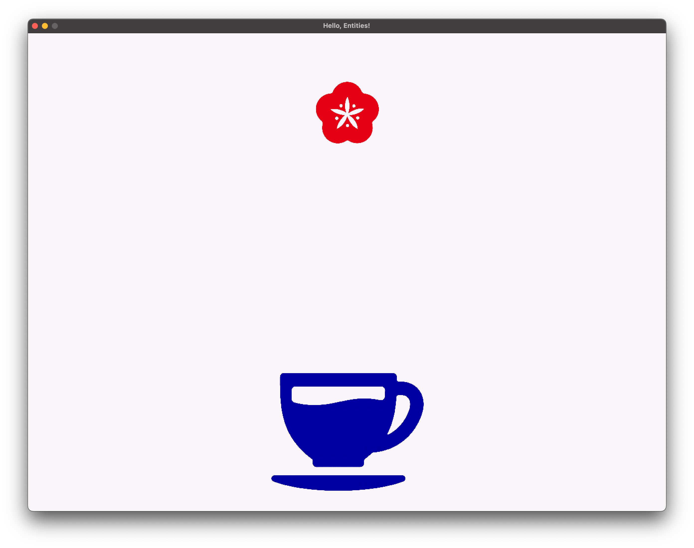
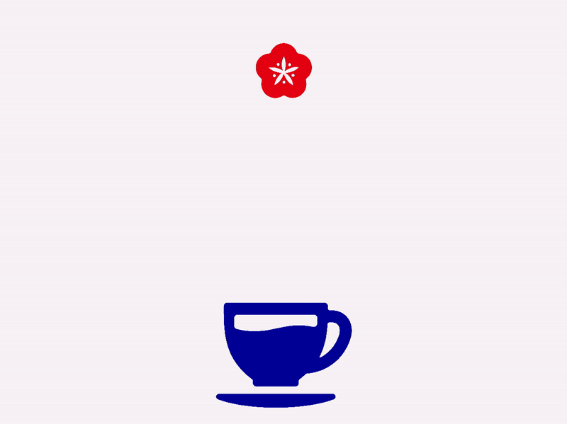

<!-- <h2 align=center>Week 08: Day 1</h2>

<h1 align=center>Exercise: <em>Collision Detection</em></h1>

<h3 align=center>9 Blue Sea Moon, Imperial Year CCXXIV</h3>

### Instructions

If you run the [**following `main.cpp`**](SDLProject/main.cpp) file, you will see the following animated sprites (which you can download [**here**](SDLProject/assets/flower.png) and [**here**](SDLProject/assets/cup.png)):

**Figure 1**: Starting behaviour.

Our goal is to add a gameplay mechanic to our scene whereby **the flower will shrink into non-existence _if_ it touches the cup**. The exact point of collision doesn't really matter for this exercise, as long you see something like this happening:

**Figure 2**: Desired behaviour.

We will achieve this through the following steps:

#### STEP 1: _Add A Dropping Mechanism_

Collisions are all set up from our [**last lecture**](https://github.com/sebastianromerocruz/CS3113-material/tree/main/lectures/physics_2#collision-flags), so you don't need to worry about that. However, you'll notice that the flower is not automatically dropping when we start our game. Your first goal is to let the flower drop according to some _acceleration_ of gravity when the player presses the `Space` key.

#### STEP 2: _"Alert" The Program Of A Collision And Shrink_

Once you do this, modify `Entity` so that, when the flower registers a collision with the teacup (i.e. a _bottom collision_), the size of the flower will continuously shrink every frame _until_ the dimensions of frame are equal to or under 0.

Perform this shrinking across several frames (i.e. don't shrink the flower entirely in a single frame, otherwise we won't be able to see it disappear). -->