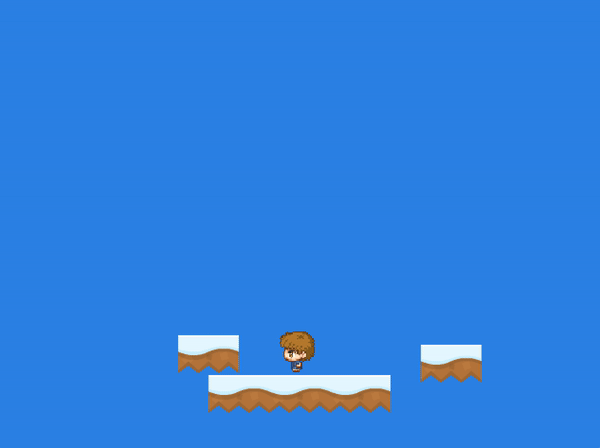

<!-- <h2 align=center>Week 8</h2>

<h1 align=center>Exercise: <em>Entity Types</em></h1>

<h3 align=center>18 Blue Sea Moon, Imperial Year CCXXIV</h3>

### Instructions

Using the enum [**`EntityType`**](SDLProject/Entity.h) and the `Entity` class's `m_is_active` and `m_type` attributes, write code that will make a random platform disappear when our player steps on it:



<sub>**Figure 1**: Desired behaviour.</sub>

Note that you'll have to copy the code from not just [**`main.cpp`**](SDLProject/main.cpp), but also [**`Entity.h`**](SDLProject/Entity.h) and [**`Entity.cpp`**](SDLProject/Entity.cpp) to be in the same starting point as me. Also, in order to generate a random integer from 0 to `limit - 1` in C++, one needs to do the following:

```cpp
#include <cstdlib>

int main()
{
    int limit = 100;
    int random_int = rand() % limit;  // range [0, 100)

    return 0;
}
```

Hints:

1. [**Entity types**](https://github.com/sebastianromerocruz/CS3113-material/tree/main/lectures/enemy-ai#part-2-enemy-states-ai-types-and-ai-states)
2. [**`is_active` and collision logic**](https://github.com/sebastianromerocruz/CS3113-material/tree/main/lectures/physics_2#part-3-is_active-collision-flags-and-entity-types) -->