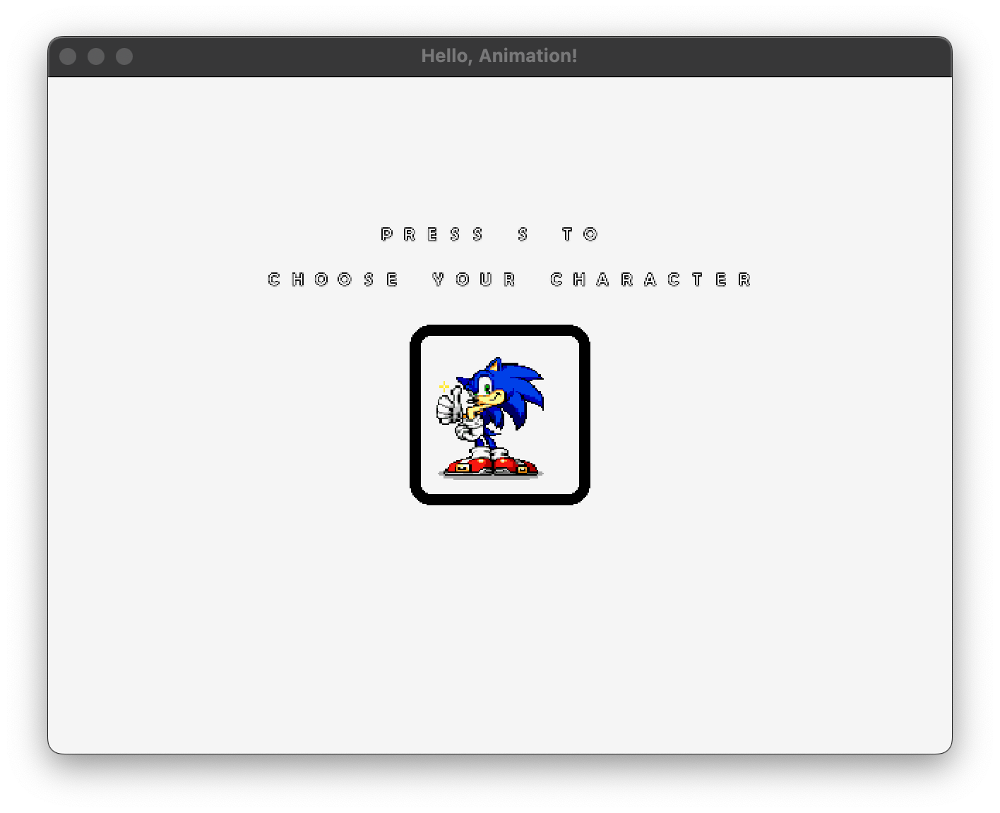
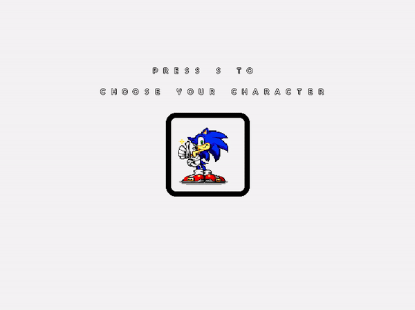

<!-- <h2 align=center>Lecture 07: <em>In-Class Exercise</em></h2>

<h1 align=center>Exercise: <em>Animation</em></h1>

<h3 align=center>1 Blue Sea Moon, Imperial Year CCXXIV<h3>

### Instructions

If you run the [**following `main.cpp`**](SDLProject/main.cpp) file, you will see the following scene (whose assets you can downloaded [**here**](SDLProject/sprites/sonic.png), [**here**](SDLProject/sprites/frame.png), and [**here**](SDLProject/sprites/font1.png)):




<sub>**Figure 1**: Starting behaviour. Note that there is no animation or user interactivity.</sub>

Our goal is for the user to have the character sprite rotate through [**the four possible characters**](SDLProject/sprites/sonic.png) over and over again until the user presses the `s` key, at which point the sprite being currently rendered will be stay on the screen, as the following gif illustrates:



<sub>**Figure 2**: Desired behaviour. Here, the user pressed the `s` key when the yellow-orange character, Tails, was being rendered on the screen.</sub>

We will achieve this through the following three steps:

#### STEP 1: _Set up the necessary global variables_

As the [**notes**](https://github.com/sebastianromerocruz/CS3113-material/tree/main/lectures/sprites-and-text#part-4-animation) from two weeks ago explain, animation is basically a "selection" of a specific area from a sprite sheet. The function that allows us to select a specific area from a spritesheet to render (**`draw_sprite_from_texture_atlas`**) is already included in the [**`main.cpp`**](SDLProject/main.cpp) file, (you can see it being used in `update).

The trick to circulating through all these character sprites is to keep track of:

1. **A boolean determining whether the user has pressed the `s` key or not**. Animation through all possible character sprites should not stop until this boolean is `false`.
2. **A value keeping track of which of the four characters we are currently rendering on the screen**. Since we have four characters in our spritesheet, the first character would be represented by a `0`, while the last woudl be represented by a `3`.
3. **A value that keeps track of how much time has transpired from frame to frame**. Since animation is based on frames-per-second, we need to keep track of how many fractions of a second pass between frames so that we know when to update the sprite.

In the space provided for part 1 (lines 79 - 81):

```c++
// ———————————————— PART 1 ———————————————— //

// ———————————————— PART 1 ———————————————— //
```

Create the above global variables to set us up for the next step.

#### STEP 2: _Register when the user presses the `s` key to select their character_

For step 2, we simply wanted to add functionality to our file so that, if the user presses the `s` key, the animation will stop at whichever character sprite is being displayed on screen. Using the relevant [**user input notes**](https://github.com/sebastianromerocruz/CS3113-material/tree/main/lectures/player-input#keystrokes) and the appropriate value that you created in step 1, write the necessary C++ code to record whether the user has selected a character.

```cpp
    // ———————————————— PART 2 ———————————————— //
    
    // ———————————————— PART 2 ———————————————— //
```

#### STEP 3: _Circulate through the sprite indices_

Since selecting the correct sprite is just a matter of [**selecting the correct index in a sprite sheet**](https://github.com/sebastianromerocruz/CS3113-material/tree/main/lectures/sprites-and-text#part-3-texture-atlases-and-sprite-sheets) (figure 11), we need to update this index every time our a frame-per-second unit has passed (that is, value #2 in part 1).

In the `update` function, adapt [**code block 5**](https://github.com/sebastianromerocruz/CS3113-material/tree/main/lectures/sprites-and-text#part-4-animation) from our notes from last class to achieve this circulation. Remember that this animation should only happen **is the user has not pressed the `s` key**.

```c++
    // ———————————————— PART 3 ———————————————— //
    
    // ———————————————— PART 3 ———————————————— //
```

#### STEP 4: _Render the correct sprite_

The last step is simple. Change the following line in the `render` function so that the appropriate character is rendered onto the screen:

```c++
// ———— PART 4 ———— //
draw_sprite_from_texture_atlas(&g_character_program, g_character_texture_id, 0, CHARACTER_SHEET_ROWS, CHARACTER_SHEET_COLS);
// ———— PART 4 ———— //
```

You can find the solutions [**here**](SDLProject/solution/solution.cpp), though you should of course give it a shot before you look at it! -->
