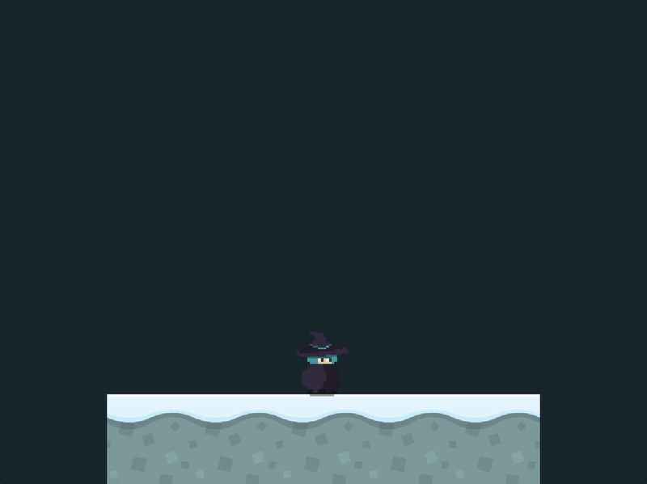

<h2 align=center>Week 10</h2>

<h1 align=center>Exercise: <em>Special Effects</em></h1>

<h3 align=center>8 Red Wolf Moon, Imperial Year MMXXIV</h3>

_Download [**this zip file**](exercises/effects/SDLProject.zip) for the starter code._

### Instructions

If you run the starter code provided to you, you will see this little witch standing on the scene. If you press and hold the `C` key on your keyboard, she will switch animations to charging her attack:

<p align=center></img></p>

<p align=center><sub><strong>Figure 1</strong>: Starting situation</sub></p>

Now our goal is to use the [**`Effects`**](exercises/effects/SDLProject/Effects.h) [**class**](exercises/effects/SDLProject/Effects.cpp) to make it so that, when the player holds the `C` key, the camera also shakes a little bit, giving a more dramatic effect:

<p align=center></img></p>

<p align=center><sub><strong>Figure 2</strong>: Our goal</sub></p>

The strategy to doing this involves having the `Effects` class interact with _that which controls the camera in the game_ in order to shake it _some random amount_. It would help to review how the `Effects` class actually works by looking at the [**notes**](https://github.com/sebastianromerocruz/CS3113-material/tree/main/lectures/fx).

In order to generate a random float from 0 to `max_value` in C++, one needs to do the following:

```cpp
#include <cstdlib>

int main()
{
    float max_value = 0.025f;

    float random_float = ((float) rand() / RAND_MAX) * (0.0f - max_value) + max_value;

    return 0;
}
```

This exercise involves only the [**`Effects.h`**](exercises/effects/SDLProject/Effects.h), [**`Effects.cpp`**](exercises/effects/SDLProject/Effects.cpp), and [**`main.cpp`**](exercises/effects/SDLProject/main.cpp) files.