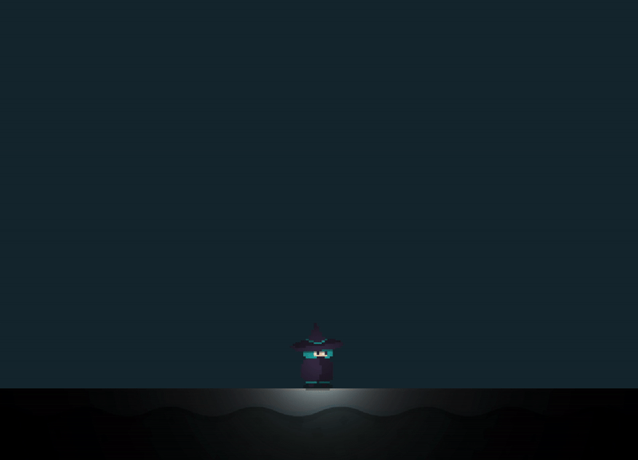
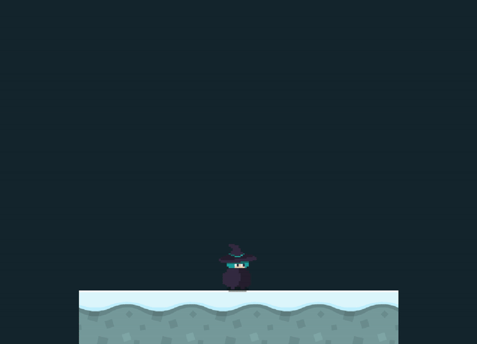

<h2 align=center>Week 11</h2>

<h1 align=center>Exercise: <em>Shaders</em></h1>

<h3 align=center>15 Red Wolf Moon, Imperial Year MMXXIV</h3>

_Download [**this zip file**](assets/shaders.zip) for the starter code._

### Instructions

If you run the starter code provided to you, you will see a scene similar the final result from last week's exercise. That is: if you press and hold the `C` key on your keyboard, she will switch animations to charging her attack and the screen will shake along with it:

</img>

<strong>Figure 1</strong>: Starting situation

Added to it, as you can see, is the sort of [**"spotlight" shader effect**](https://github.com/sebastianromerocruz/CS3113-material/tree/main/lectures/shaders#part-3-2d-lighting) that we did in class last.

This time, our goal is to use the [**`ShaderProgram`**](SDLProject/ShaderProgram.cpp) [**class**](SDLProject/ShaderProgram.h) to make it so that this spotlight effect will _only happen when the player holds the `C` key_. In other words, not holding `C` would have our shaders behave like a regular `fragment_textured` shader. Additionally, holding `C` should turn the background's colour to [**black**](https://html-color.codes/color-names/black), and return to its original colour when unpressed:

</img>

<strong>Figure 2</strong>: Our goal. Note that I created this gif <em>before</em> I filled out the ground with floor tiles.

The strategy to doing this involves having `main.cpp` communicate with the shader program that the current state of the character is either `IDLE` or `CHARGING` and act accordingly depending on the situation.

As a little hint, `.glsl` files cannot accept `bool` values from OpenGL. If you need to do anything logic based, I suggest instead using an `int` flag with the values `0` for `false` and `1` for `true`.

 

This exercise involves changes to [**`ShaderProgram.h`**](SDLProject/ShaderProgram.h), [**`ShaderProgram.cpp`**](SDLProject/ShaderProgram.cpp), [**`main.cpp`**](SDLProject/main.cpp) and, of course, the [**`fragment_exercise.glsl`**](SDLProject/shaders/fragment_exercise.glsl) shader file.