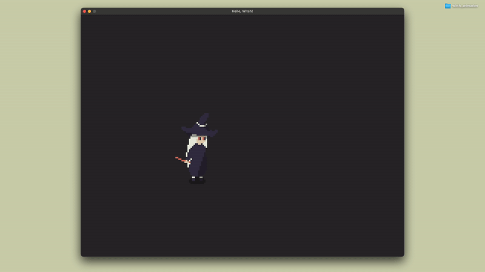
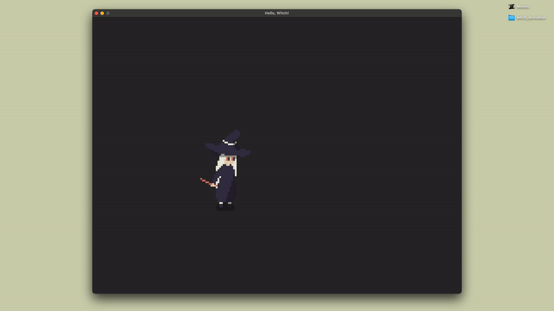
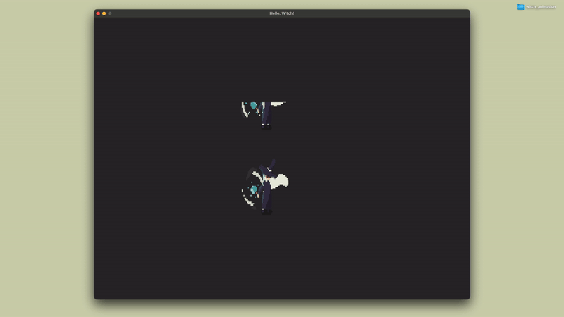

<h2 align=center>Week 06</h2>

<h1 align=center>Exercise: <em>The <code>Entity</code> Class, Animation, and Witches</em></h1>

---

## Sections

[**Goal**](#goal)
1. [**Adapting To Each Sprite Sheet**](#sprite)
2. [**Changing Animation States**](#input)

All assets are from the super cute [**Witches Pack**](https://9e0.itch.io/witches-pack) by [**9e0**](https://9e0.itch.io/) (for which I paid for, so make sure you don't use them outside of this class without paying for it yourself unless you wanna get sued :))

---

<a id="goal"></a>

## Goal

It's spooky season ya'll and you know what that means. Our goal this week is to create a witch entity that changes from her "idle" animation to her "charging attack" animation when the player holds the `A` key down:

<a id="result"></a>

<p align=center>
    </img>
</p>

<sub>**Figure 1**: This exercise's desired behaviour. The witch only switches to her charging attack animation when the `A` key is being held down, after which it returns to her idle animation.</sub>

You can find the starter code [**here**](SDLProject/main.cpp), [**here**](SDLProject/Entity.cpp), and [**here**](SDLProject/Entity.h)—and the sprite _sheets_ [**here**](SDLProject/assets). This starter code renders the following scene, where our witch only has her idle animation, and holding `A` will have no effect:

<p align=center>
    </img>
</p>

<sub>**Figure 2**: Your starting situation.</sub>

Note, too, that the `Entity` class's instantiation has changed a little bit to reflect the fact that,
now, we have two different sprite sheets of differing lengths:

```c++
// ————— WITCH ————— //
std::vector<GLuint> witch_textures_ids = {
    load_texture("assets/idle.png", NEAREST),   // IDLE spritesheet
    load_texture("assets/attack.png", NEAREST)  // ATTACK spritesheet
};

std::vector<std::vector<int>> witch_animations = {
    {0, 1, 2, 3, 4, 5},       // IDLE animation frames
    {0, 1, 2, 3, 4, 5, 6, 7}  // ATTACK animation frames
};

g_game_state.witch = new Entity(
    witch_textures_ids,  // a list of texture IDs
    1.0f,                // translation speed; irrelevant in this problem
    witch_animations,    // list of animation frames for each type of animation
    0.0f,                // animation time
    6,                   // number of frames for idle animation
    0,                   // current frame index
    1,                   // current animation col amount
    6,                   // current animation row amount
    IDLE                 // current animation
);
```

Now, internally, the animations are changed by a method in the `Entity` class called **`set_animation_state(Animation new_animation)`**, where you will be able to switch from your idle animation to the attack animation. For example:

```cpp
// Entity.h
enum Animation { IDLE, ATTACK };
```
```cpp
// main.cpp
g_game_state.witch->set_animation_state(ATTACK);
g_game_state.witch->set_animation_state(IDLE);
```

Your goal for today is to make sure that this method does the animation switch exactly like [**figure 1 does**](#result).

<br>

<a id="sprite"></a>

### Part 1: _Adapting To Each Sprite Sheet_

_**Note**: The entirety of part 1 is done within the `Entity.cpp` file._

First order of business is to make sure that our witch animates correctly both in `IDLE` mode and `ATTACK` mode. Right now, if I instantiate my witch `Entity` object with the `ATTACK` enum instead, I'll get the following behaviour:

```cpp
g_game_state.witch = new Entity(
    witch_textures_ids,  
    1.0f,                
    witch_animations,    
    0.0f,                
    6,                   
    0,                   
    1,                   
    6,                   
    ATTACK  // instead of IDLE as above
);
```

<p align=center>
    </img>
</p>

<sub>**Figure 3**: ...which is clearly not what we want.</sub>

Analyse how [**`main.cpp`**](exercises/witch_animation/SDLProject/main.cpp), [**`Entity.cpp`**](SDLProject/Entity.cpp), and [**`Entity.h`**](SDLProject/Entity.h) work in relation to each other, and make the necessary changes so that the witch's `ATTACK` mode animation looks [**like it's supposed to**](#result).

<br>

<a id="input"></a>

### Part 2: _Changing Animation States_

_**Note**: The entirety of the rest of the exercise is done within the `main.cpp` function._

Now that you've gotten your `ATTACK` animation correct, your last step is to ensure that:

- If the player is holding down the `A` key, the witch should be in `ATTACK` mode.
- Otherwise, the witch should be in `IDLE` mode.

No other functionality is necessary.