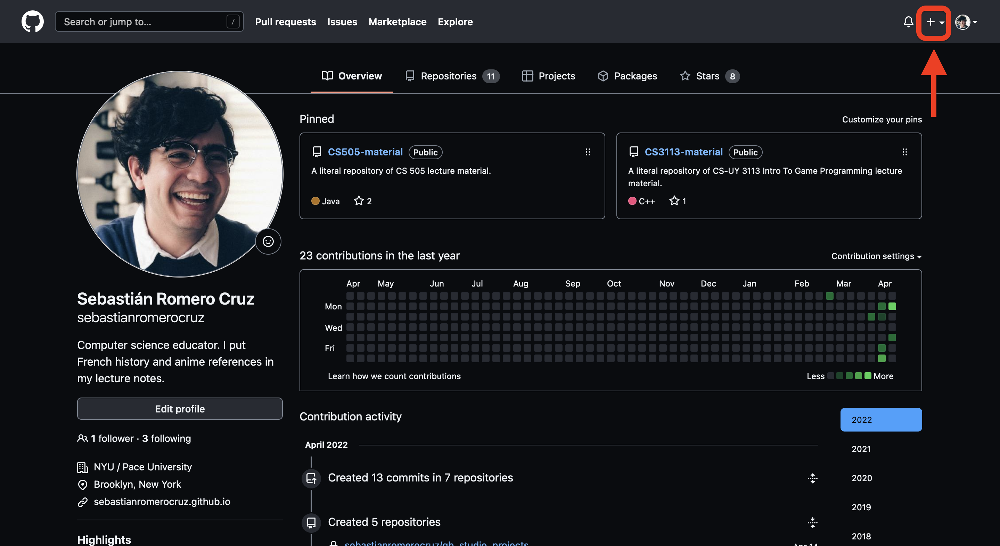
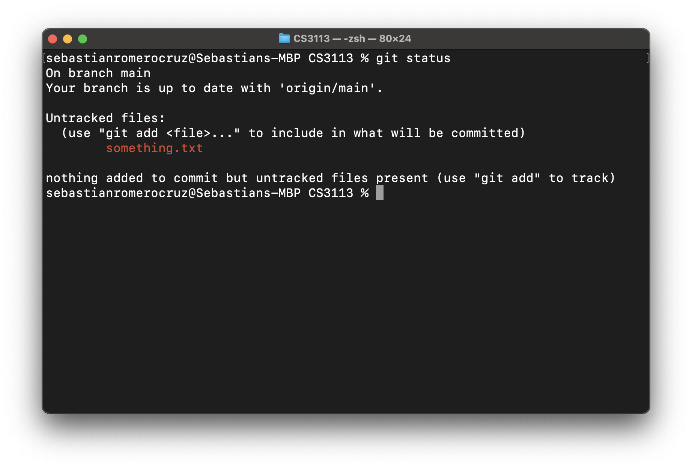
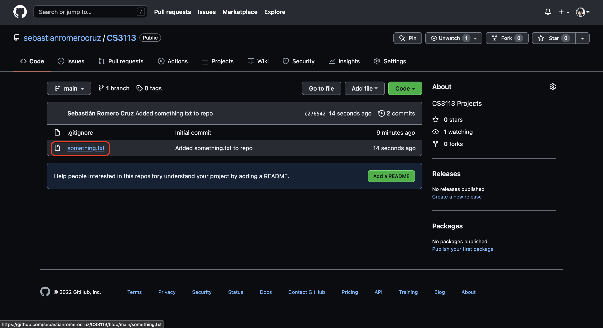

## Lecture 01

# Introduction

### 5 Prairial, Year CCXXX

***Song of the day***: _[****]() by  ()._

---

Hey, my name is Sebastián, and my last names are Romero Cruz. I teach about programming for a living and, incredibly, 
sometimes even enjoy programming itself.

I'm actually very excited to teach this class; I love 
Java, and haven't had the chance to use it for a while, so this is the perfect opportunity for both you and I to learn 
together.

Here's how you can reach me if you have any questions:

| **Email**                                                 | **Office Hours**                                                      |
|-----------------------------------------------------------|-----------------------------------------------------------------------|
| [**sebastian.romerocruz@nyu.edu**](mailto:src402@nyu.edu) | [**calendly.com/profromerocruz**](http://calendly.com/profromerocruz) |

_**Figure 1**: Prof. Romero Cruz's contact information._

Unless you have a super trivial question, **I much prefer you scheduling office hours with me to ask me questions about
the course**. Even if we only spend 5 minutes on a Zoom call, it is a lot easier for me to keep track of my calendar 
this way, and a lot harder for me to lose track of your e-mail (something I am unfortunately wont to do).

Anyway, other things I enjoy are:

- **Slice of life anime**: my favourite is [***Hibike! Euphonium***](https://youtu.be/Cb9OAuquKaI)
- **French history**: anything starting with the French Revolution of 1789 to the end of the de Gaulle presidency in 1969. 
- **Literature**: my current favourite is [***Paris is a Party, Paris is a Ghost***](https://us.macmillan.com/books/9780374722494).
- **Playing music**: I play a [**Rickenbacker 4001C64**](http://www.rickenbacker.com/model.asp?model=4001C64).

That's all I want to flex at the present moment. Let's talk about the course (see syllabus).

---

### Part 1: _Working with GitHub_

The way we're going to be managing our work in this class via [**GitHub**](https://github.com/). Follow [**these instructions**](https://github.com/git-guides/install-git#install-git) to
install Git onto your computer.

If you have never used this site before, it's essentially a way for us to do our work on our own computer, and then asking 
GitHub to keep track of those changes.

The reason why this is helpful is because, as you're making progress in, say, one of your projects, you can ask GitHub to upload
those changes onto your account. This way, if you have a question for me, I can take a look at your latest "upload," download it
myself, and suggest some changes.

Moreover, **all of your finished projects must be successfully uploaded to GitHub to be considered on-time**. So let's spend some
time in learning how to this. I'm going to show you an easy method to creating a GitHub repository that you do in order to get 
youself set up for the rest of the summer:

**Note**: If you already know how to handle yourself in GitHub, you can skip this section entirely.

#### Step 1: _Create a new repository through GitHub_

After you've installed gotten yourself a GitHub account and installed Git, your first step is to create a new public repository in your account:

**Figures 1-3**: Creating a new public GitHub repository (or _repo_).

#### Step 2: _Cloning your repo_

**Figures 4-7**: Getting the repo locally onto your computer.

#### Step 3: _Making and saving changes into your repo_

Let's make a simple change to your repo—create a `txt` file called `something.txt` inside your repo—and save
(i.e. push) them up to GitHub.

**Figures 9-14**: Making, adding, committing, and pushing changes onto GitHub.