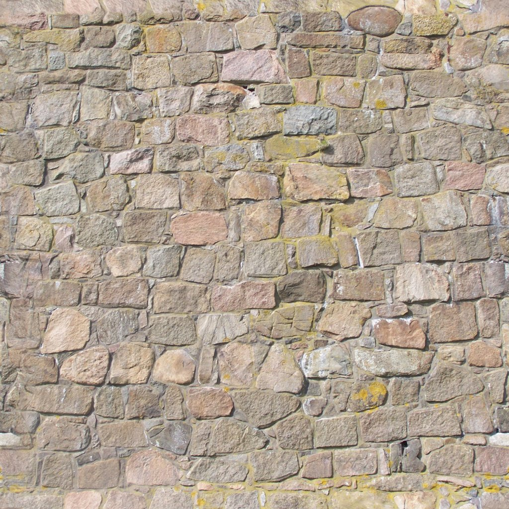
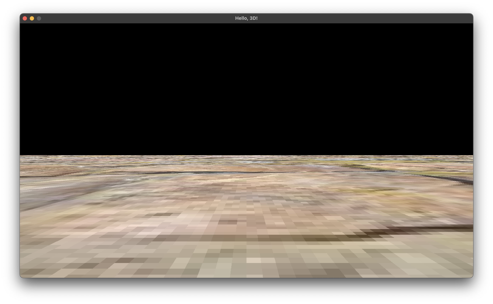
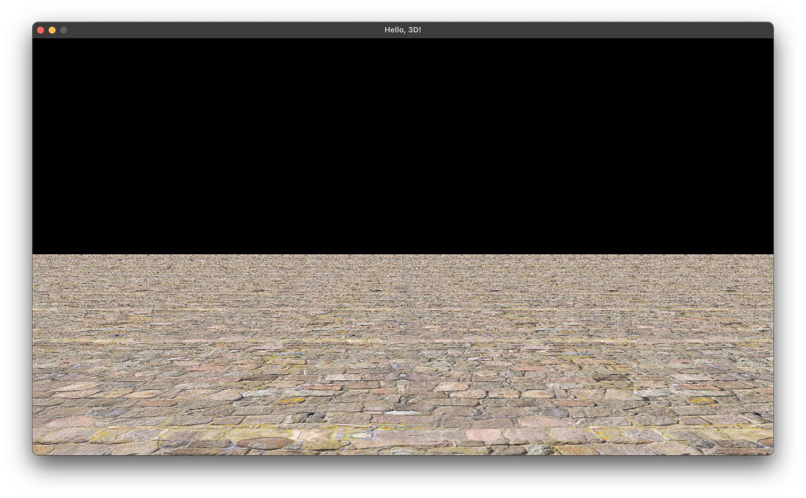

## Lecture 20

# [**3D Levels: Floors, Movement, and Collisions**](SDLProject/main.cpp)

### 21 Thermidor, Year CCXXX

***Song of the day***: _[**The Feels**](https://youtu.be/9j6_KM-uzfY) by TWICE (2021)._

---

### Sections

1. [**Getting Our Feet On The Ground**](#part-1-getting-our-feet-on-the-ground)
2. [**3D Movement**](#part-2-3d-movement)
3. [**3D Collisions**](#part-3-3d-collisions)

### Part 1: *Getting Our Feet On The Ground*

Now that we've put 3D objects on the ground, let's start building an actual 3D world to explore. 

Our first step (no pun intended) is to give the illusion of standing on an actual floor. I've included several textures [**here**](assets/) that you can use for this. Generally speaking, the textures used for floors are those that can easily be repeated in a grid-like pattern, such as this one:



<sub>**Figure 1**: The texture I will be using for the floor. Notice that each edge easily connects the opposite side's.</sub>

The way we're going to do this is essentially by creating a giant, flattish cube just slightly below our line of sight. For this, we'll add a scaling factor as an instance attribute to our `Entity` class:

```c++
// Entity.h
enum EntityType { PLAYER, PLATFORM, ENEMY, CUBE, SHIP, FLOOR };

class Entity
{
public:
    glm::vec3 scale;
};
```
```c++
// Entity.cpp
Entity::Entity()
{
    this->scale        = glm::vec3(1.0f);
}

void Entity::update(float delta_time)
{
    this->model_matrix = glm::scale(this->model_matrix, this->scale);
}
```
```c++
// main.c++
const char* FLOOR_FILEPATH = "assets/100_1453_seamless.JPG";

struct GameState
{
    Entity *floor;
};

void initialise()
{
    GLuint floor_texture_id = Util::load_texture(FLOOR_FILEPATH);
    Mesh* floor_mesh = new Mesh();
    floor_mesh->load_OBJ("assets/cube.obj");
    
    state.floor = new Entity();
    state.floor->entity_type = FLOOR;
    state.floor->texture_id = floor_texture_id;
    state.floor->position = glm::vec3(0.0f, -0.5f, 0.0f);
    state.floor->mesh = floor_mesh;
    state.floor->scale = glm::vec3(100.0, 0.5f, 100.0f);
    state.floor->update(0.0f);
}
```

<sub>**Code Blocks 1, 2, and 3**: Getting a floor onto our screen.</sub>

What we get is a bit of a rough-looking, untiled floor:



<sub>**Figure 2**: A giant, single tile.</sub>

How do we get this tile to actually tesselate? The change has to happen in our `Mesh` class, where we need to tell our mesh to multiply the number of texture coordinates by some tesselation factor:

```c++
// Mesh.h
class Mesh {
    public:
        void load_OBJ(const char *file_name, float texture_repeat_rate);
};
```
```c++
// Mesh.cpp
void Mesh::load_OBJ(const char *file_name, float texture_repeat_rate) {
    while (getline(in_file, line)) {
        // ...
        
        } else if(token == "vt") {
            int num_UVs = 0;
            while(getline(string_stream, token, ' ') && num_UVs < 2) {
                if(token.size() > 0) {
                    printf("token: [%s]\n", token.c_str());
                    file_uvs.push_back(atof(token.c_str()) * texture_repeat_rate); // <——right here
                    num_UVs++;
                }
            }
        }

        //...
    }
}
```
```c++
// main.cpp
void initialise()
{
    floor_mesh->load_OBJ("assets/cube.obj", 10);
}
```

<sub>**Code Blocks 4, 5, and 6**: Adding a tesselating factor to `load_OBJ()`. If you want this method to work the way it did before we added this, simply make `texture_repeat_rate` equal to `1`.</sub>

The result is something quite nice and comparably realistic:



<sub>**Figure 3**: The same floor with our tile texture repeated 50 times.</sub>

Pretty cool right? Our next step is, of course, to be able to actually move in this world.

### Part 2: *3D Movement*

Movement in 3D a notch more complicated—specially if we are dealing with moving cameras. With 2D games, the cardinal directions never change; north, south, east and west never change. The problem with a moving camera is that the player's "local" sense of direction changes with their point of view. For example, if a player is facing north, then their sense of "forward" is also north. If a player rotates 45-degrees to the right, though, their sense of "forward" (i.e., their north) is now squarely in the north-west direction.

All of this is to say that we are not only dealing with transformations of the player's model matrix, but also of the game's view matrix—they need to be directly connected to each other. The [**math for this**](https://learnopengl.com/Getting-started/Camera) is not especially complicated—it has to do with our good friend the unit circle and bit of trigonometry, but this is how it translates to code:

```c++
// main.cpp
void process_input()
{
    const Uint8 *keys = SDL_GetKeyboardState(NULL);
    
    // Turning left and right
    if (keys[SDL_SCANCODE_A])      { state.player->rotation.y += 1.0f; }
    else if (keys[SDL_SCANCODE_D]) { state.player->rotation.y -= 1.0f; }
    
    state.player->velocity.x = 0;
    state.player->velocity.z = 0;
    
    // Moving forward and back
    if (keys[SDL_SCANCODE_W])
    {
        state.player->velocity.z = cos(glm::radians(state.player->rotation.y)) * -2.0f;
        state.player->velocity.x = sin(glm::radians(state.player->rotation.y)) * -2.0f;
    }
    else if (keys[SDL_SCANCODE_S])
    {
        state.player->velocity.z = cos(glm::radians(state.player->rotation.y)) * 2.0f;
        state.player->velocity.x = sin(glm::radians(state.player->rotation.y)) * 2.0f;
    }
}

void update()
{
    view_matrix = glm::mat4(1.0f);
    view_matrix = glm::rotate(view_matrix, glm::radians(state.player->rotation.y), glm::vec3(0.0f, -1.0f, 0.0f));
    view_matrix = glm::translate(view_matrix, -state.player->position);
}
```

<sub>**Code Block 7**: Adding basic movement to our 3D scene. Note that the transformations of the view matrix are in the opposite direction to the player's. Why?</sub>

Lo!


<sub>**Figure 4**: First person views.</sub>

### Part 3: *3D Collisions*

Hit boxes in 3D can get _very_ complicated _very_ fast so, for the purposes of this class, we will be using something called an [**axis-aligned bounding box (AABB)**](https://en.wikipedia.org/wiki/Bounding_volume#Common_types). Essentially, our hit boxes will be literal cuboids surrounding the entire 3D model. 


<sub>**Figure 5**: Two examples of AABBs.</sub>

While this is very rudimentary, for the purposes of an introductory class, these are more than enough. Let's get crates onto the scene:

```c++
// main.cpp
#define CRATE_COUNT 3

const char* CRATE_FILEPATH = "assets/crate0_diffuse.png";

struct GameState
{
    Entity *crates;
};

void initialise()
{
    GLuint crate_texture_id = Util::load_texture(CRATE_FILEPATH);
    Mesh* crate_mesh = new Mesh();
    crate_mesh->load_OBJ("assets/cube.obj", 1);
    
    state.crates = new Entity[CRATE_COUNT];

    state.crates[0].entity_type = CUBE;
    state.crates[0].texture_id = crate_texture_id;
    state.crates[0].position = glm::vec3(1.0f, 0.25f, -3.0f);
    state.crates[0].mesh = crate_mesh;
    
    state.crates[1].entity_type = CUBE;
    state.crates[1].texture_id = crate_texture_id;
    state.crates[1].position = glm::vec3(0.0f, 0.25f, -3.0f);
    state.crates[1].mesh = crate_mesh;
    
    state.crates[2].entity_type = CUBE;
    state.crates[2].texture_id = crate_texture_id;
    state.crates[2].position = glm::vec3(-1.0f, 0.25f, -3.0f);
    state.crates[2].mesh = crate_mesh;
}

void update()
{
    while (delta_time >= FIXED_TIMESTEP)
    {
        for (int i = 0; i < CRATE_COUNT; i++) state.crates[i].update(FIXED_TIMESTEP, state.player, state.crates, CRATE_COUNT);
    }
}

void render()
{
    for (int i = 0; i < CRATE_COUNT; i++) state.crates[i].render(&program);
}
```

<sub>**Code Block 8**: You could also instantiate these with a `for`-loop or, as we did earlier in the semester, with a map data array. The latter, of course, may be substantially more complicated given that it would have to be a two-dimensional array. Nothing that you wouldn't be able to handle, though.</sub>

Output:


<sub>**Figure 6**: Three non-collidable crates.</sub>

So, how do we add collision detection to these? It turns out that it is literally as easy as modifying our previous box-to-box collision code to include our third dimension:

Before: 

```c++
float x_distance = fabs(this->position.x - other->position.x) - ((this->width  + other->width)  / 2.0f);
float y_distance = fabs(this->position.y - other->position.y) - ((this->height + other->height) / 2.0f);
    
if (x_distance < 0 && y_distance < 0) return true; // collision
    
return false; // no collision
```

After:

```c++
float x_distance = fabs(this->position.x - other->position.x) - ((this->width  + other->width)  / 2.0f);
float y_distance = fabs(this->position.y - other->position.y) - ((this->height + other->height) / 2.0f);
float z_distance = fabs(this->position.z - other->position.z) - ((this->depth  + other->depth)  / 2.0f);

if (x_distance < 0 && y_distance < 0 && z_distance < 0) return true; // collision

return false; // no collision
```

We have to make some minor modifications to `Entity`'s `update()` as well in order to check for collidable objects. None of this is new stuff, and should look amply familiar:

```c++
// Entity.h
class Entity
{
public:
    // The dimensions of our AABB    
    float width;
    float height;
    float depth;
    
    bool check_collision(Entity *other);
    void update(float delta_time, Entity *player, Entity *objects, int object_count);
};
```
```c++
// Entity.cpp
Entity::Entity()
{
    this->width  = 1.0f;
    this->height = 1.0f;
    this->depth  = 1.0f;
}

bool Entity::check_collision(Entity *other)
{
    float x_distance = fabs(this->position.x - other->position.x) - ((this->width  + other->width)  / 2.0f);
    float y_distance = fabs(this->position.y - other->position.y) - ((this->height + other->height) / 2.0f);
    float z_distance = fabs(this->position.z - other->position.z) - ((this->depth  + other->depth)  / 2.0f);
    
    if (x_distance < 0 && y_distance < 0 && z_distance < 0) return true;
    
    return false;
}

void Entity::update(float delta_time, Entity *player, Entity *objects, int object_count)
{
    // Before moving, save the object's current position
    glm::vec3 previous_position = this->position;
    
    // Then, move
    this->velocity += this->acceleration * delta_time;
    this->position += this->velocity * delta_time;
    
    // If the object is itself the player... (optional, depends on your game)
    if (this->entity_type == PLAYER)
    {
        // For every collidable entity that was passed into update()
        for (int i = 0; i < object_count; i++)
        {
            // Ignore if the object is the floor
            if (objects[i].entity_type == FLOOR) continue;
            
            // But check if it collided with an object of any other type
            if (this->check_collision(&objects[i]))
            {
                // If it did, simply revert back to its position before moving
                this->position = previous_position;
                break;
            }
        }
    }
    
    this->model_matrix = glm::mat4(1.0f);
    this->model_matrix = glm::translate(this->model_matrix, this->position);
    this->model_matrix = glm::scale(this->model_matrix, this->scale);
    this->model_matrix = glm::rotate(this->model_matrix, glm::radians(this->rotation.y), glm::vec3(0.0f, 1.0f, 0.0f));
    this->model_matrix = glm::rotate(this->model_matrix, glm::radians(this->rotation.z), glm::vec3(0.0f, 0.0f, 1.0f));
}
```
```c++
void initialise()
{
    state.floor->update(0.0f, state.player, NULL, 0);
}

void update()
{
    while (delta_time >= FIXED_TIMESTEP)
    {
        state.player->update(FIXED_TIMESTEP, state.player, state.crates, CRATE_COUNT);
        
        for (int i = 0; i < CRATE_COUNT; i++) state.crates[i].update(FIXED_TIMESTEP, state.player, state.crates, CRATE_COUNT);
    }
}

void shutdown()
{
    SDL_Quit();
    
    delete state.floor;
    delete state.player;
    delete [] state.crates;
}
```

<sub>**Code Blocks 9, 10, and 11**: Adding collision boxes to our entity. Honestly, this look almost identical to 2D collisions.</sub>

And just like that, we have collisions:


<sub>**Figure 7**: Three collidable crates.</sub>