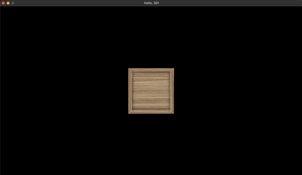
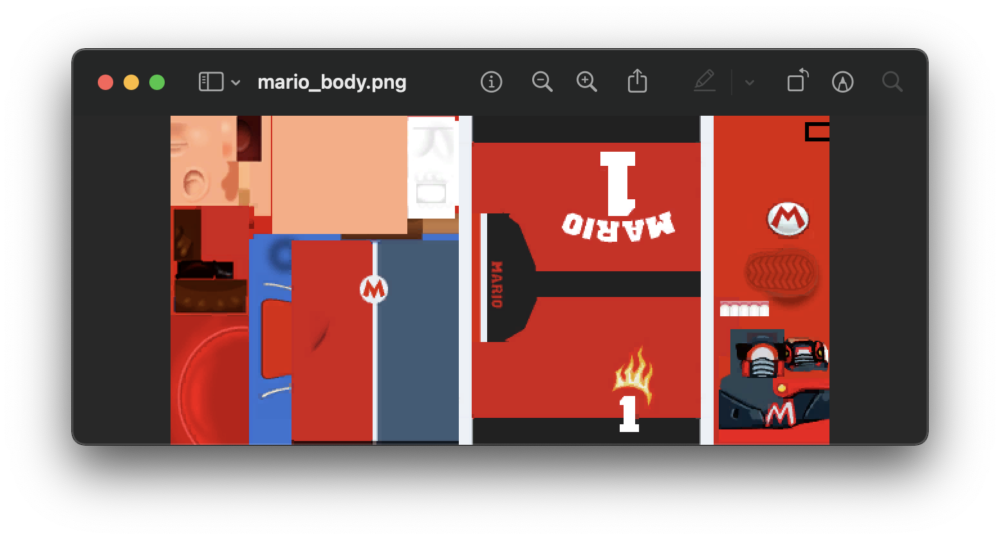
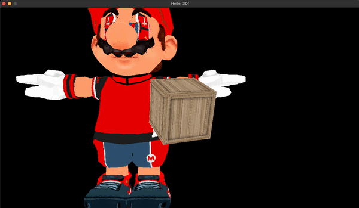
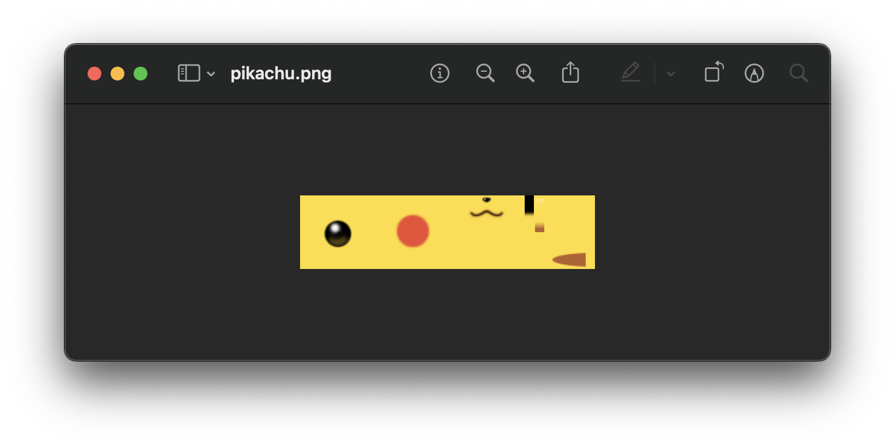

## Lecture 19

# [**3D**](SDLProject/main.cpp)

### 15 Thermidor, Year CCXXX

***Song of the day***: _[**Dal giorno in cui sei nato tu**](https://youtu.be/F3DGBuM9hjI) by Andrea Laszlo de Simone (2020)._

---

### Sections

1. [**Meshes**](#part-1-meshes-and-obj-files)
2. [**The `Mesh` Class**](#part-2-the-mesh-class)
3. [**More Complex Objects**](#part-3-more-complex-objects)

### Part 1: _Meshes and OBJ Files_

Last class I hinted at the fact that we'll be using the `Mesh` class to build our 3D models in conjunction with the `Entity` class. A mesh, as defined in game design, is simply a collection of vertices connected by lines that create a 3D model.


<sub>**Figure 1**: A set of two- and three-dimensional meshes.</sub>

Meshes for cubes are relatively simple—we built one on Tuesday—but what about larger models? In this case, the points in the mesh are placed so as to approximate the curves of the model (the more vertices, the more "realistic" a model is as it more closely resembles the curvature of real objects). There are various file formats for storing the list of vertices (triangles), texture coordinates (and more) that make up a 3D model.

[**OBJ**](https://en.wikipedia.org/wiki/Wavefront_.obj_file) files, for instance, are a very simple to read and most 3D programs can export to this format. Let's look at what one might look for the same cube we have:

```h
# cube.obj
#

mtllib cube.mtl
o cube

v -0.500000 -0.500000 0.500000
v 0.500000 -0.500000 0.500000
v -0.500000 0.500000 0.500000
v 0.500000 0.500000 0.500000
v -0.500000 0.500000 -0.500000
v 0.500000 0.500000 -0.500000
v -0.500000 -0.500000 -0.500000
v 0.500000 -0.500000 -0.500000

vt 0.000000 0.000000
vt 1.000000 0.000000
vt 0.000000 1.000000
vt 1.000000 1.000000

vn 0.000000 0.000000 1.000000
vn 0.000000 1.000000 0.000000
vn 0.000000 0.000000 -1.000000
vn 0.000000 -1.000000 0.000000
vn 1.000000 0.000000 0.000000
vn -1.000000 0.000000 0.000000

g cube
usemtl cube
s 1
f 1/1/1 2/2/1 3/3/1
f 3/3/1 2/2/1 4/4/1
s 2
f 3/1/2 4/2/2 5/3/2
f 5/3/2 4/2/2 6/4/2
s 3
f 5/4/3 6/3/3 7/2/3
f 7/2/3 6/3/3 8/1/3
s 4
f 7/1/4 8/2/4 1/3/4
f 1/3/4 8/2/4 2/4/4
s 5
f 2/1/5 8/2/5 4/3/5
f 4/3/5 8/2/5 6/4/5
s 6
f 7/1/6 1/2/6 5/3/6
f 5/3/6 1/2/6 3/4/6
```

<sub>**Code Block 1**: OBJ file for a cube.</sub>

OBJ files are structured thusly:

- **`#`**: Comments
- **`mtlib`** and **`.mtl`**: The name of the "material" that the model will be built out of
- **`v`**: Vertices
- **`vt`**: Texture coordinates
- **`vn`**: Vertex normals (related to lighting—we will not use these in this class)
- **`f`**: A "face"; indices into a list containing a vertex, a texture coordinate, and a vertex normal

Let's take advantage of these files by using our `Mesh` class.

### Part 2: _The `Mesh` Class_

If we take advantage of the [**`Mesh`**](Mesh.h) [**class**](Mesh.cpp), which is provided for you, we can abstract away even _more_ portions of our code. Instead of using the vertex and texture coordinates, let's use the [**`cube.obj`** file](assets/cube.obj) (also provided for you). Make the following changes:

```c++
// Entity.h
#include "Mesh.h"

class Entity
{   
public:
    Mesh* mesh;

//    float *vertices;
//    float *texture_coordinates;
//    int number_of_vertices;
};
```
```c++
// Entity.cpp
void Entity::render(ShaderProgram *program)
{
    program->SetModelMatrix(this->model_matrix);
    
    glBindTexture(GL_TEXTURE_2D, this->texture_id);
    
    this->mesh->render(program);
}
```
```c++
// main.cpp
void initialise()
{
    Mesh* cube_mesh = new Mesh();
    cube_mesh->load_OBJ("assets/cube.obj");
    
    state.crates = new Entity[CRATE_COUNT];
    state.crates[0].texture_id = cube_texture_id;
    state.crates[0].position = glm::vec3(0.0f, 0.0f, -5.0f);
    state.crates[0].entity_type = CUBE;
    state.crates[0].mesh = cube_mesh;
}
```

<sub>**Code Block 2, 3, and 4**: Just...look at how beautiful and modular our code is now.</sub>

The result should be exactly what we had before, and with much less code!



<sub>**Figure 2**: Surpriseeeee.</sub>

### Part 3: _More Complex Objects_

The cool thing about this is that upgrading to more complex models is super easy. For instance, let's use this Mario texture:



<sub>**Figure 3**: This is generally what textures for complex objects look like.</sub>

```c++
// main.cpp
#define ENEMY_COUNT 1

const char* MARIO_FILEPATH = "assets/mario_body.png";

struct GameState
{
    // Let's, for the time being, call these new entities "enemies"
    Entity *enemies;
};

void initialise()
{
    state.enemies = new Entity[ENEMY_COUNT];
    
    GLuint mario_texture_id = Util::load_texture(MARIO_FILEPATH);
    Mesh* mario_mesh = new Mesh();
    mario_mesh->load_OBJ("assets/mario.obj");
    
    state.enemies[0].texture_id = mario_texture_id;
    state.enemies[0].position = glm::vec3(-10.0f, -20.0f, -50.0f); // Notice how far away this is
    state.enemies[0].entity_type = ENEMY;
    state.enemies[0].mesh = mario_mesh;
}

void update()
{
    while (deltaTime >= FIXED_TIMESTEP)
    {
        for (int i = 0; i < ENEMY_COUNT; i++) state.enemies[i].update(FIXED_TIMESTEP);
    }
}

void render()
{
    for (int i = 0; i < ENEMY_COUNT; i++) state.enemies[i].render(&program);
}
```

<sub>**Code Block 5**: The code is exactly the same!</sub>

And the result is this absolutely horrifying Mario model:



<sub>**Figure 4**: Dear god.</sub>

The reason why the `position` attribute is in the location that it is is because, generally speaking, the origin coordinates start from one of the bottom left/right edges.

---

How about a Pikachu?



<sub>**Figure 5**: I promise this one will look better.</sub>

```c++
// main.cpp
#define ENEMY_COUNT     2

void initialise()
{
    GLuint pikachu_texture_id = Util::load_texture(PIKACHU_FILEPATH);
    Mesh* pikachu_mesh = new Mesh();
    pikachu_mesh->load_OBJ("assets/pikachu.obj");
    
    state.enemies[1].texture_id = pikachu_texture_id;
    state.enemies[1].position = glm::vec3(2.0f, 0.0f, -5.0f);
    state.enemies[1].entity_type = ENEMY;
    state.enemies[1].mesh = pikachu_mesh;
}
```
```c++
// Entity.cpp
void Entity::update(float delta_time)
{
    if (this->entity_type == ENEMY) this->rotation += glm::vec3(0.0f, this->ROTATION_SPEED * delta_time, 0.0f);

    this->model_matrix = glm::rotate(this->model_matrix,
                                     this->entity_type == CUBE ? glm::radians(this->rotation.x) : glm::radians(this->rotation.y),
                                     glm::vec3(this->entity_type == CUBE ? 1.0 : 0.0f, 1.0f, 0.0f));
}
```

