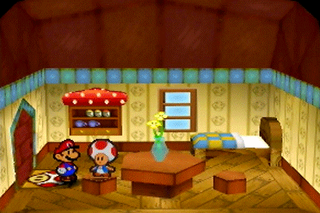
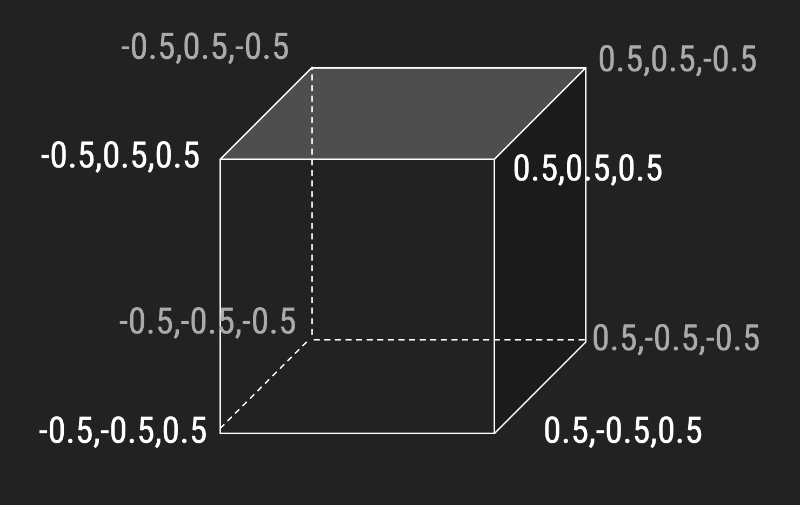
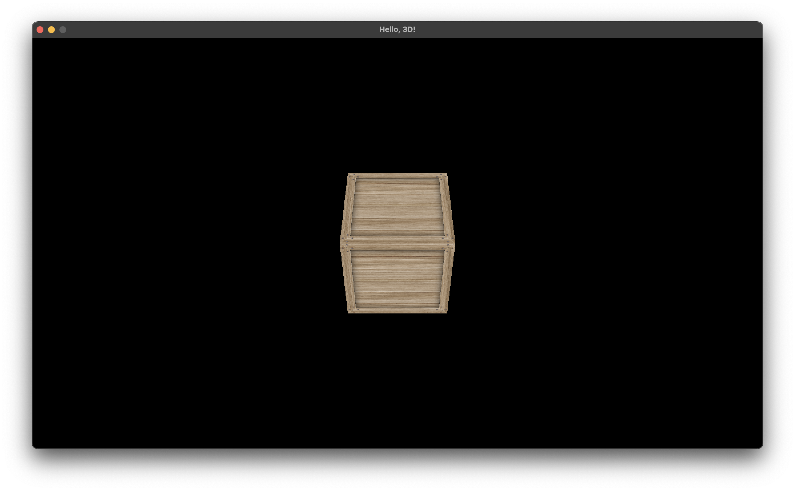
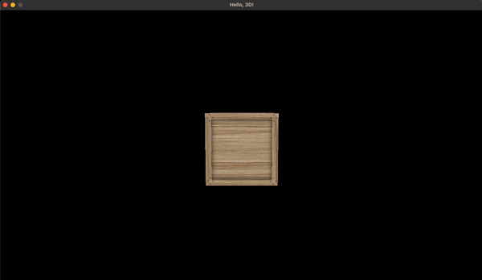

<h2 align=center>Lecture 19</h2>

<h1 align=center>3D</h1>

<h3 align=center>7 Thermidor, Year CCXXXI</h3>

***Song of the day***: _[**Dal giorno in cui sei nato tu**](https://youtu.be/F3DGBuM9hjI) by Andrea Laszlo de Simone (2020)._

---

### Sections

1. [**How Does 3D Work?**](#part-1-how-does-3d-work)
2. [**Projection Matrix**](#part-2-projection-matrix)
3. [**Vertices in 3D**](#part-3-vertices-in-3d)
4. [**Z-Buffer**](#part-4-z-buffer)
5. [**Creating 3D `Entity` Objects**](#part-5-creating-3d-entity-objects)
6. [**Transformations in 3D**](#part-6-transformations-in-3d)

### Part 1: _How Does 3D Work?_

In the beginning of the semester, I sort of hinted at the fact that 3D game programming was pretty much a simple extension of 2D programming. This is somewhat correct, but it would be more accurate to say that 2D game programming is a "paring down" of 3D programming—after all, all we are doing is making sure our objects transform in the X- and Y-directions, but not the Z-direction. Aside from a few more directive that we will learn about, there's very little we'll have to change, which is great news for us; these concepts translate well into Unity and Unreal.

---

The most obvious difference between 2D and 3D is that 3D uses a mesh of triangles as opposed to a square made up of 2 triangles:


<sub>**Figures 1 and 2**: Mario in 2- and 3-dimensional space.</sub>

A more accurate representation of how 2D works in OpenGL is best illustrated by the Paper Mario model, wherein two-dimensional characters move in three-dimensional space:



<sub>**Figure 3**: 2.5D, I guess.</sub>

To accomplish this, we have to work with our heretofore unused Z-axis, which will, by virtue of existing, change a couple of other things that so have remained the same.


<sub>**Figure 4**: Three-dimensional Cartesian space.</sub>

### Part 2: _Projection Matrix_

The first change we have to make to our current engine is the way the camera "films" our characters. Thus far, we've been using [**orthographic projection**](https://en.wikipedia.org/wiki/Orthographic_projection) to visualise our objects. This is a very convenient way of doing this, since that is literally what this type of projection is used for. The trade-offs are, of course, that all objects appear to be standing right next to each other, so we have _no sense of perspective_. It goes without saying that spatial visual perspective is necessary for 3D games to feel natural, so we'll have to change this.

The new projection type that we will be dealing with now is called [**perspective**](https://en.wikipedia.org/wiki/3D_projection#Perspective_projection):


<sub>**Figure 5**: Perspective projection (left) vs orthographic projection (right).</sub>

The code to make this happen is as follows:

```c++
#define WINDOW_WIDTH  1280
#define WINDOW_HEIGHT 720
#define NEAR_PLANE_DIST 0.1f
#define FAR_PLANE_DIST  100.0F
#define FOV_ANGLE 45.0f

void initialise()
{
    // Updating the size of our screen
    display_window = SDL_CreateWindow("Hello, 3D!",
                                      SDL_WINDOWPOS_CENTERED, SDL_WINDOWPOS_CENTERED,
                                      WINDOW_WIDTH, WINDOW_HEIGHT,
                                      SDL_WINDOW_OPENGL);

    glViewport(0, 0, WINDOW_WIDTH, WINDOW_HEIGHT);

    // Using our new projection model
    projection_matrix = glm::perspective(glm::radians(FOV_ANGLE),               // Field of view
                                         (float) WINDOW_WIDTH / WINDOW_HEIGHT,  // Aspect ratio
                                         NEAR_PLANE_DIST,                       // Distance from the camera to the near plane
                                         FAR_PLANE_DIST);                       // Distance from the camera to the far plane
}
```

<sub>**Code Block 1**: Switching to `glm::perspective()`. Notice that our window width and height are now relevant to how we project onto the game's world.</sub>

To better understand the parameters of `glm::perspective()`, check out the following diagram:


<sub>**Figure 6**: What our camera sees under a perspective projection.</sub>

### Part 3: _Vertices in 3D_

The second thing that changes in 3D is the amount of vertices we have to keep track of—as you can imagine, these are a lot more. For example, consider the case of a cube:



<sub>**Figure 7**: We've doubled the amount of vertices we have now. The same applies to our texture coordinates.</sub>

Our new arrays, thus, looks like this:

```c++
float CUBE_VERTICES[] =
{
    // Face 1
    -0.5,  0.5, -0.5, -0.5,  0.5,  0.5,  0.5,  0.5,  0.5,
    -0.5,  0.5, -0.5,  0.5,  0.5,  0.5,  0.5,  0.5, -0.5,

    // Face 2
     0.5, -0.5, -0.5,  0.5, -0.5,  0.5, -0.5, -0.5,  0.5,
     0.5, -0.5, -0.5, -0.5, -0.5,  0.5, -0.5, -0.5, -0.5,

    // Face 3
    -0.5,  0.5, -0.5, -0.5, -0.5, -0.5, -0.5, -0.5,  0.5,
    -0.5,  0.5, -0.5, -0.5, -0.5,  0.5, -0.5,  0.5,  0.5,

    // Face 4
     0.5,  0.5,  0.5,  0.5, -0.5,  0.5,  0.5, -0.5, -0.5,
     0.5,  0.5,  0.5,  0.5, -0.5, -0.5,  0.5,  0.5, -0.5,

    // Face 5
    -0.5,  0.5,  0.5, -0.5, -0.5,  0.5,  0.5, -0.5,  0.5,
    -0.5,  0.5,  0.5,  0.5, -0.5,  0.5,  0.5,  0.5,  0.5,

    // Face 6
     0.5,  0.5, -0.5,  0.5, -0.5, -0.5, -0.5, -0.5, -0.5,
     0.5,  0.5, -0.5, -0.5, -0.5, -0.5, -0.5,  0.5, -0.5
};

float CUBE_TEXTURE_COORDINATES[] =
{
    // Face 1
    0.0f, 0.0f, 0.0f, 1.0f, 1.0f, 1.0f,
    0.0f, 0.0f, 1.0f, 1.0f, 1.0f, 0.0f,

    // Face 2
    0.0f, 0.0f, 0.0f, 1.0f, 1.0f, 1.0f,
    0.0f, 0.0f, 1.0f, 1.0f, 1.0f, 0.0f,
    
    // Face 3
    0.0f, 0.0f, 0.0f, 1.0f, 1.0f, 1.0f,
    0.0f, 0.0f, 1.0f, 1.0f, 1.0f, 0.0f,
    
    // Face 4
    0.0f, 0.0f, 0.0f, 1.0f, 1.0f, 1.0f,
    0.0f, 0.0f, 1.0f, 1.0f, 1.0f, 0.0f,
    
    // Face 5
    0.0f, 0.0f, 0.0f, 1.0f, 1.0f, 1.0f,
    0.0f, 0.0f, 1.0f, 1.0f, 1.0f, 0.0f,
    
    // Face 6
    0.0f, 0.0f, 0.0f, 1.0f, 1.0f, 1.0f,
    0.0f, 0.0f, 1.0f, 1.0f, 1.0f, 0.0f
};
```

<sub>**Code Block 2**: Texture and vertex coordinates for a cube.</sub>

We'll be using a simple texture for our cube, making it look like a [**crate**](assets/readme/crate0_diffuse.png).

### Part 4: _Z-Buffer_

Another small thing we need to point out is the way OpenGL decides which pixel to render when several objects overlap? Basically, there's something called the [**z-buffer**](https://en.wikipedia.org/wiki/Z-buffering). This data buffer is:

> ...used in computer graphics to represent depth information of objects in 3D space from a particular perspective. Depth buffers are an aid to rendering a scene to ensure that the correct polygons properly occlude other polygons.


<sub>**Figure 8**: Z-buffer data.</sub>

Interestingly, this buffer is off by default in OpenGL, so we have to turn it on in `initialise()`:

```c++
void initialise()
{
    glEnable(GL_DEPTH_TEST);  // Enable comparisons to the buffer.
    glDepthMask(GL_TRUE);     // Enable writing to the depth buffer.
    
    /**
     The depth function is how an incoming pixel is compared against one that is already there.
     
     `GL_LEQUAL` means “use the incoming pixel if its distance from the camera is less than
     or equal to what is there already.”
     */
    glDepthFunc(GL_LEQUAL);   // Set the depth function.
}

void render()
{
    glClear(GL_COLOR_BUFFER_BIT | GL_DEPTH_BUFFER_BIT);
}
```

<sub>**Code Block 3**: We also need to clear the depth buffer.</sub>

### Part 5: _Creating 3D `Entity` Objects_

Let's adapt entity to fit this new paradigm. Since the number of vertices will vary from shape to shape, we will need to be able to set it from now on, instead of having it be the same set of vertices/texture coordinates:

```c++
// Entity.h
enum EntityType { PLAYER, PLATFORM, ENEMY, CUBE };

class Entity
{
public:
    float *m_vertices;
    float *m_texture_coordinates;
    int m_number_of_vertices;
}
```
```c++
// Entity.cpp
void Entity::render(ShaderProgram *program)
{
    program->set_model_matrix(m_model_matrix);
    
    glBindTexture(GL_TEXTURE_2D, m_texture_id);

    // These are now instance attributes instead of local variables    
    glVertexAttribPointer(program->get_position_attribute(), 3, GL_FLOAT, false, 0, m_vertices);
    glEnableVertexAttribArray(program->get_position_attribute());
    
    glVertexAttribPointer(program->get_tex_coord_attribute(), 2, GL_FLOAT, false, 0, m_texture_coordinates);
    glEnableVertexAttribArray(program->get_tex_coord_attribute());
    
    glDrawArrays(GL_TRIANGLES, 0, m_number_of_vertices);
    
    glDisableVertexAttribArray(program->get_position_attribute());
    glDisableVertexAttribArray(program->get_tex_coord_attribute());
}
```

<sub>**Code Block 4**: Changes to our `Entity` class.</sub>

Finally, let's instantiate them in `main.cpp`:

```c++
#define CRATE_COUNT 1

const char* CRATE_FILEPATH = "assets/crate0_diffuse.png";

struct GameState
{
    Entity *crates;
};

void initialise()
{
    GLuint cube_texture_id = Util::load_texture(CRATE_FILEPATH);
    
    g_state.crates = new Entity[CRATE_COUNT];
    g_state.crates[0].set_texture_id(cube_texture_id);
    g_state.crates[0].set_position(glm::vec3(0.0f, 0.0f, -5.0f));
    g_state.crates[0].set_vertices(CUBE_VERTICES);
    g_state.crates[0].set_texture_coordinates(CUBE_TEXTURE_COORDINATES);
    g_state.crates[0].set_number_of_vertices(36);
    g_state.crates[0].set_entity_type(CUBE);
}

void update()
{
    while (deltaTime >= FIXED_TIMESTEP)
    {
        for (int i = 0; i < CRATE_COUNT; i++) g_state.crates[i].update(FIXED_TIMESTEP);
    }
}

void render()
{
    for (int i = 0; i < CRATE_COUNT; i++) g_state.crates[i].render(&g_shader_program);
}
```

<sub>**Code Block 5**: Changes to our `main.cpp`.</sub>

And lo! We get our very first 3D model!


<sub>**Figure 8**: Looking at our create head-on.</sub>

### Part 6: _Transformations in 3D_

Transformations in 3D work very similar to how they do in 2D. For example, if we wanted our crate to rotate, we need to add a rotation attribute to the `Entity` class:

```c++
// Entity.h
class Entity
{
private:
    glm::vec3 m_rotation;


public:
    glm::vec3  const get_rotation() const { return m_rotation; };

    void set_rotation(glm::vec3 new_rotation) { m_rotation = new_rotation; };
}
```
```c++
// Entity.cpp
Entity::Entity()
{
    m_rotation = glm::vec3(0.0f);
}

void Entity::update(float delta_time)
{
    m_model_matrix = glm::rotate(m_model_matrix, glm::radians(m_rotation.x), glm::vec3(1.0, 0.0f, 0.0f));
}

void Entity::render(ShaderProgram *program)
{
    program->set_model_matrix(m_model_matrix);
}
```
```c++
void initialise()
{
    g_state.crates[0].set_rotation(glm::vec3(45.0f, 0.0f, 0.0f));
}
```

Result:



<sub>**Figure 9**: Our crate rotated by 45-degrees on the x-axis.</sub>

---

We can animate this rotation as well!

```c++
// Entity.h
class Entity 
{
    const int ROTATION_SPEED = 45;
};
```
```c++
// Entity.cpp
void Entity::update(float delta_time)
{
    if (m_entity_type == CUBE) m_rotation.x += ROTATION_SPEED * delta_time;
}
```
```c++
void initialise()
{
    g_state.crates[0].set_entity_type(CUBE);
}
```

Result:



<sub>**Figure 10**: Our crate rotating by 45-degrees on the x-axis.</sub>

Or, by doing something like this:

```c++
// Enitity.cpp
void Entity::update(float delta_time)
{
    if (m_entity_type == CUBE) m_rotation += glm::vec3(ROTATION_SPEED * delta_time, ROTATION_SPEED * delta_time, 0.0f);

    m_model_matrix = glm::rotate(m_model_matrix, glm::radians(m_rotation.x), glm::vec3(1.0, 1.0f, 0.0f));
}
```

We get:


<sub>**Figure 11**: Our crate rotating by 45-degrees on the x- and y-axis.</sub>