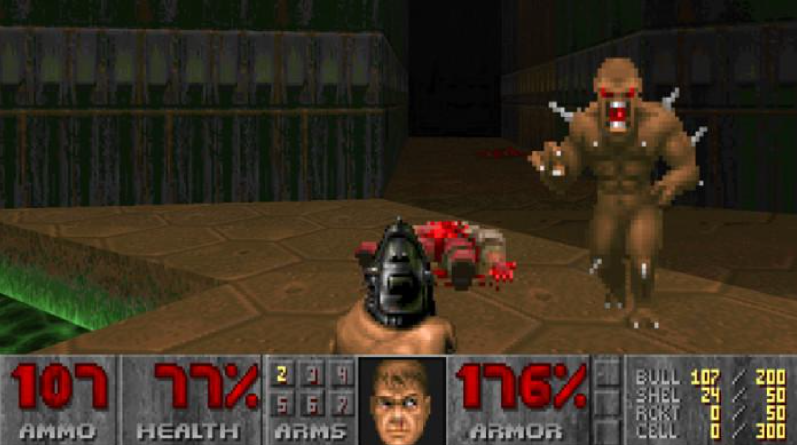
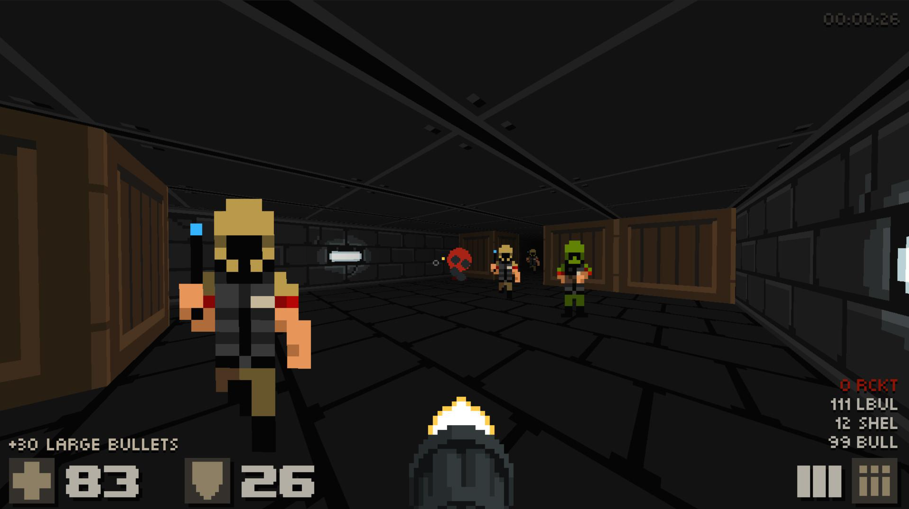
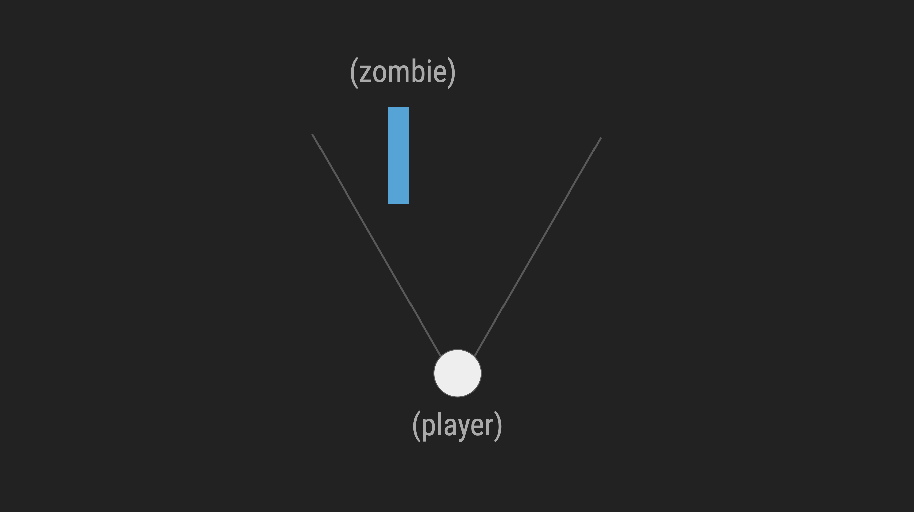
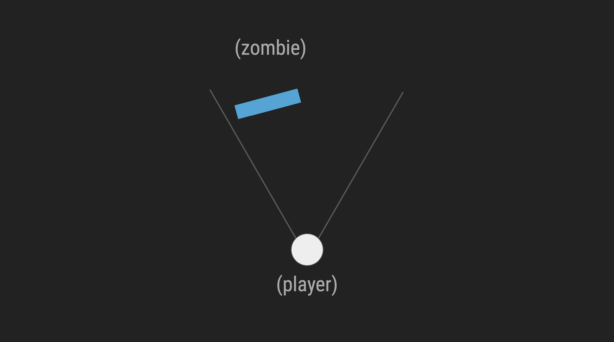
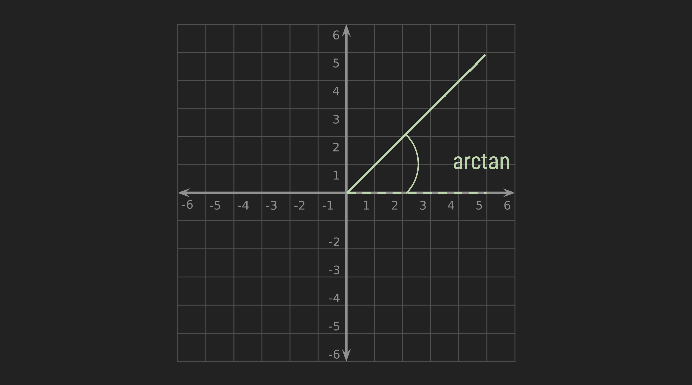
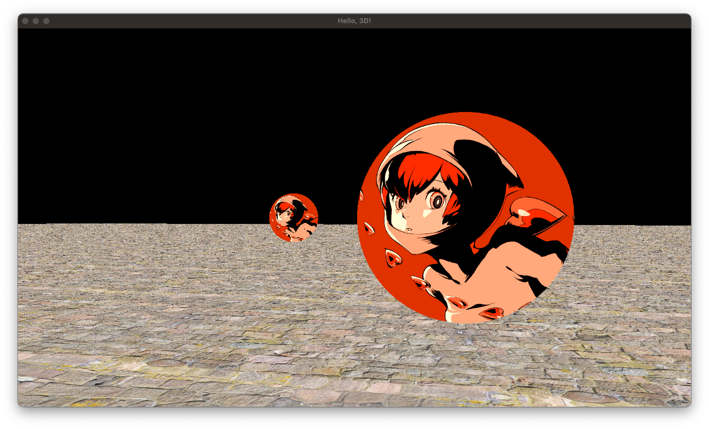

## Lecture 21

# [**Billboards**](main.cpp)

### 24 Thermidor, Year CCXXX

***Song of the day***: _[****]() by  ()._

---

### Sections

1. [**Billboards Or, How To Animate 2D in Three Dimensions**](#part-1-billboards-or-how-to-animate-2d-in-three-dimensions)
2. [**Applying Billboarding to `Entity`**](#part-2-applying-billboarding-to-entity)

### Part 1: *Billboards Or, How To Animate 2D in Three Dimensions*

I mentioned in the past couple of lectures that we would not be covering 3D animations. This unfortunate fact owes it necessity to the fact that animation 3D is way beyond the scope of this class. So, are we stuck with our current abilities in 3D? 

Definitely not. There's actually a pretty clever technique used in some early 3D games in order to circumvent these limitations—billboards:




<sub>**Figures 1 and 2**: Early 3D games such as _Doom_ made heavy use of billboarding—that is, animated 2D sprites that always face the player.</sub>

This technique works in the following way. Usually, if we render a 2D model onto our 2D world, we would get something like this:



<sub>**Figure 3**: A non-billboard 2D entity in a 3D world. Say, an enemy zombie.</sub>

The key here is to rotate this 2D entity around the y-axis, every frame, to face the player's point of view head on. Something like this:



<sub>**Figure 4**: Our zombie now appears to be facing us, in spite of having no concept of three-dimensional movement.</sub>

The math necessary to perform this operation is actually very simple, and is directly related to the **arctan** of the angle between the player's position and the enemy's position:



```
if the sprite is a billboard:
    rotation = arctan of the angle between the difference in position of the player and the enemy
```

<sub>**Figure 5**: Pseudo-coded logic of billboarding.</sub>

### Part 2: *Applying Billboarding to `Entity`*

We can very simply incorporate this logic onto our `Entity` class by adding a new enumarator attribute, `RenderMode`, and then applying billboarding operations if this entity happens to be a billboard:

```c++
// Entity.h
enum RenderMode { REGULAR, BILLBOARD };

class Entity
{
public:
    RenderMode render_mode;
}
```
```c++
// Entity.cpp
void Entity::update(float delta_time, Entity *player, Entity *objects, int object_count)
{
    if (this->render_mode == BILLBOARD)
    {
        // Pseudo-code in figure 5
        float direction_x = this->position.x - player->position.x;
        float direction_y = this->position.z - player->position.z;
        this->rotation.y = glm::degrees(atan2f(direction_x, direction_y));
    }
}

void Entity::render(ShaderProgram *program)
{
    switch(this->render_mode)
    {
        case BILLBOARD:
            this->draw_billboard(program);
            break;
            
        case REGULAR:
            this->mesh->render(program);
            break;
    }
}

void Entity::draw_billboard(ShaderProgram *program) {
    // Literally just the render operations of a 2D entity
    // We've seen this time and time again
    float vertices[] = { -0.5, -0.5, 0.5, -0.5, 0.5, 0.5, -0.5, -0.5, 0.5, 0.5, -0.5, 0.5 };
    float texture_coordinates[] = { 0.0, 1.0, 1.0, 1.0, 1.0, 0.0, 0.0, 1.0, 1.0, 0.0, 0.0, 0.0 };
    
    glVertexAttribPointer(program->positionAttribute, 2, GL_FLOAT, false, 0, vertices);
    glEnableVertexAttribArray(program->positionAttribute);
    
    glVertexAttribPointer(program->texCoordAttribute, 2, GL_FLOAT, false, 0, texture_coordinates);
    glEnableVertexAttribArray(program->texCoordAttribute);
    glDrawArrays(GL_TRIANGLES, 0, 6);
    
    glDisableVertexAttribArray(program->positionAttribute);
    glDisableVertexAttribArray(program->texCoordAttribute);
}
```
```c++
// main.cpp
#define ENEMY_COUNT 3

const char* SOPH_FILEPATH = "assets/soph.png";

struct GameState
{
    Entity *enemies;
};

void initialise()
{
    GLuint sophia_texture_id = Util::load_texture(SOPH_FILEPATH);
    
    state.enemies = new Entity[ENEMY_COUNT];
    
    for (int i = 0; i < ENEMY_COUNT; i++)
    {
        state.enemies[i].entity_type = ENEMY;
        state.enemies[i].texture_id = sophia_texture_id;
        state.enemies[i].position = glm::vec3(rand() % 20 - 10, 0.5, rand() % 20 - 10);
        state.enemies[i].render_mode = BILLBOARD;
        state.enemies[i].rotation = glm::vec3(0.0f, 0.0f, 0.0f);
        state.enemies[i].acceleration = glm::vec3(0.0f, 0.0f, 0.0f);
    }
}

void update()
{
    while (delta_time >= FIXED_TIMESTEP)
    {
        for (int i = 0; i < ENEMY_COUNT; i++) state.enemies[i].update(FIXED_TIMESTEP, state.player, state.crates, CRATE_COUNT);
    }
}

void render()
{
    for (int i = 0; i < ENEMY_COUNT; i++) state.enemies[i].render(&program);
}

void shutdown()
{
    delete [] state.enemies;
}
```

<sub>**Code Block 1**: Adding a few billboarded enemies.</sub>

Result:



<sub>**Figure 6**: Hello, Sophie.</sub>

