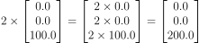
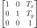
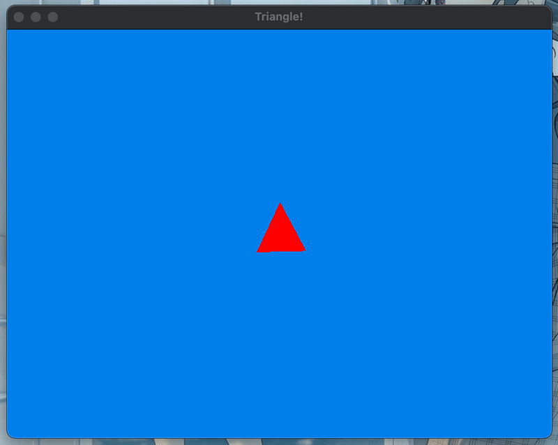
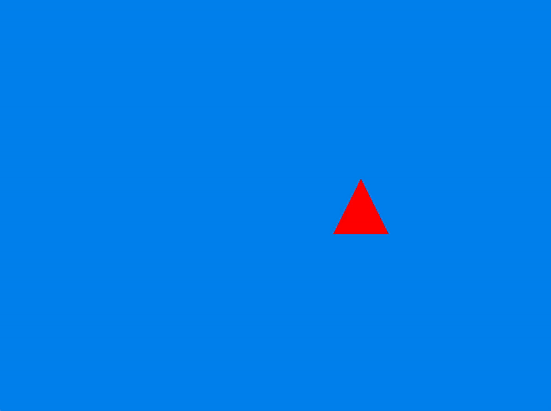
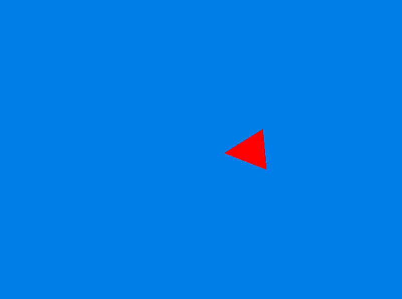

<h2 align=center>Lecture 03</h2>

<h1 align=center>Delta Time</h1>

<h3 align=center>22 Horsebow Moon, Imperial Year 1180</h3>

<p align=center><strong><em>Song of the day</strong>: <a href="https://youtu.be/f_G43LhHEos"><strong><u>Burgundy Red</u></strong></a> by 落日飛車 (SUNSET ROLLERCOASTER) (2016)</em></p>

### Sections

1. [**Matrix Operations Review**](#part-1-matrix-operations-review)
2. [**Spaces**](#part-2-spaces)
3. [**Timing, FPS, and Delta Time**](#part-3-timing-fps-and-delta-time)

### Part 1: _Matrix Operations Review_ 

Recall our three transformations, with their respective matrices:

- **Scaling**:



<sub>**Figure 1**: A matrix being scaled by a scalar value of 2.</sub>

- **Rotation**:


<sub>**Figure 2**: A column vector being rotated by an angle of Θ.</sub>

- **Translation**:



<sub>**Figure 3**: The standard transformation matrix for the x- and y-dimensions.</sub>

Thus far, we have been applying these transformations to the model matrix one after the other:

```c++
g_model_matrix = glm::translate(g_model_matrix, glm::vec3(TRANS_VALUE, 0.0f, 0.0f));
g_model_matrix = glm::scale(g_model_matrix, scale_vector);
g_model_matrix = glm::rotate(g_model_matrix, ROT_ANGLE, glm::vec3(0.0f, 0.0f, 1.0f));
```

Mathematically speaking, there's nothing inherently wrong with doing this. Ideally, though, we would like to minimise the amount of times our model matrix gets operated on. In other words, it would be great if we could simply apply a single transformation matrix—complete with scaling rotation, and translation—onto our model matrix and apply _that_ every frame. In terms of code, this would mean that our model matrix would simply start as an identity matrix, and then the appropriate transformation would be applied to it.

This shouldn't be too bad—we, after all, know that 4 x 4 matrices multiply—but there's one last crucially-important fact about matrix multiplication that we should keep in mind: the order of operations ***does*** affect the result.

Picture a small triangle at position (0<sub>x</sub>, 0<sub>y</sub>):

```
                ^ y
                |
                |
                |
                |
                |
              +---+            x 
<-------------|   |------------->
              +---+
                |
                |
                |
                |
                |
                v
```

<sub>**Figure 4**: A square at the origin.</sub>

If we applied a positive translation on the y-axis first, a quarter-clockwise rotation second, and some scaling somewhere in between, we would get the following:

```
                ^ y
                |
                |
                x             
              /   \
              \   /
                X
                |               x
<---------------|--------------->
                |
                |
                v
```

<sub>**Figure 5**: Our model after translation -> rotation.</sub>

If we tried the **same exact transformations**, but placed rotation first, we would instead get the following:

```
                ^ y
                |
                |     X             
                |   /   \
                |   \   /
                |     X
                |               x
<---------------|--------------->
                |
                |
                v
```

<sub>**Figure 6**: Our model after rotation -> translation.</sub>

This happens because, when we rotate, the model's "view" no longer matches the cartesian view. In other words, to the rotated model, moving forward upwards looks the same regardless of which direction is facing. It has, in other words, no idea where left and right actually are—it only knows where _its_ left and right are.

This is partially to blame for the strange behaviour when we tried to get our triangle to move from its position and to the right _of the cartesian plane_, but instead we got the following:



<sub>**Figure 7**: Here, our model _is_ moving to the right every frame—only its _right_ and the plane's _right_ are two different direction.</sub>

In game development terminology, we call the model's "frame of reference" the ***model space***, and the cartesian plane's the ***world space***.

### Part 2: _Spaces_

This doesn't only apply between models and the world—it also happens between models. Let's say that our square is the main character of our game, and straight ahead lies an item:

```


  +---+                  X
  |   |                  |
  +---+                  |
—————————————————————————————————————
 Character              Item
```

<sub>**Figure 8**: Our character facing an item.</sub>

If we were to translate both items _with respect to the world_, the code would be similar to what we've seen before:

```c++
character_model_matrix = glm::mat4(1.0f);
character_model_matrix = glm::translate(character_model_matrix, glm::vec3(TRANS_VALUE, TRANS_VALUE, 0.0f));

item_model_matrix = glm::mat4(1.0f);
item_model_matrix = glm::translate(item_model_matrix, glm::vec3(TRANS_VALUE, TRANS_VALUE, 0.0f));
```

<sub>**Code Block 1**: Translating both items in the world space.</sub>

What happens when our character picks up the item, though? The item ceases to follow its own "space", and adopts the character's:

```
                   +
                  /
                 /
            +---+
            |   |
            +---+
—————————————————————————————————————
      Character + Item
```

<sub>**Figure 9**: Our character is now holding the item, and carrying it everywhere with them.</sub>

Our code now has to account for both the character's transformations **and** for the item's own transformations:

```c++
character_model_matrix = glm::mat4(1.0f);
character_model_matrix = glm::translate(character_model_matrix, glm::vec3(TRANS_VALUE, TRANS_VALUE, 0.0f));

item_model_matrix = glm::translate(character_model, glm::vec3(TRANS_VALUE, TRANS_VALUE, 0.0f));
item_model_matrix = glm::rotate(character_model_matrix, ANGLE, glm::vec3(0.0f, 0.0f, 1.0f));
```

<sub>**Code Block 2**: The character is probably still translated with respect to the world space, but our item now also has to be translated with respect to our character; in a sense, the character's space becomes the item's world space.</sub>

---

Now, it goes without saying that games require movement to actually be games. What we have been doing so far is something akin to the following:

```c++
glm::mat4 g_model_matrix;

void initialise() 
{
    g_model_matrix = glm::mat4(1.0f);
}

void update()
{
    g_model_matrix = glm::translate(g_model_matrix, glm::vec3(0.1f, 0.0f, 0.0f));
}
```

<sub>**Code Block 3**: Your basic game look animation.</sub>

This is how games have been programmed and thought of since the dawn of the industry—but it is now, by and large, antiquated and can cause weird things to happen.

Take as an example something that happened to several people in the class: their triangle was either spinning slower than mine, or oftentimes much faster than mine. This is not uncommon—after all, mine is a laptop from 2022 that is in no way set up to provide a crazy framerate. This is a problem, though, because when we make games, we want them all to run at the same "speed," regardless of the machine that it is running on. For this reason, we will change two things in our code. 

The first is, instead of keeping track of the matrix's transformations per frame, we keep track of the arguments values being passed into them:

```c++
glm::mat4 g_model_matrix;

float g_model_x;
float g_model_y;

void initialise() 
{
    g_model_matrix = glm::mat4(1.0f)
    g_model_x = 0.1f;
    g_model_y = 0.0f;
}

void update()
{
    g_model_matrix = glm::mat4(1.0f);
    g_model_matrix = glm::translate(g_model_matrix, glm::vec3(g_model_x, g_model_y, 0.0f));
}
```

<sub>**Code Block 4**: A better way to handle position changes.</sub>

The second is, instead of relying on our computer's speed to update our frame, we need to use a method that will keep track of time the same way on every machine.

### Part 3: _Timing, FPS, and Delta Time_

Faster hardware updates more times than its slower counterpart. This means that, unfortunately, if your computer is running at 60 frames-per-second (fps) and mine at 30 fps, the game _will_ run twice as fast on your machine than in mine.

```c++
float g_x_player = 0.0f;

void update()
{
    /**
    * This line of code will run more times on a faster machine.
    * At 60fps, it will run 60 times per second, for example.
    */
    g_x_player += 1.0f;
}

void render()
{
    glm::mat4 g_model_matrix = glm::mat4(1.0f);
    g_model_matrix = glm::translate(g_model_matrix, glm::vec3(g_x_player, 0.0f, 0.0f));
}
```

---

The way we standardise all of our players' play speed is by using something we call **delta time**. This calculation and value will look different, of course, depending on the machine. For example:

- **60fps**: Sixty frames per second means that your computer is changing frames every 16.66ms, making the delta time _0.0166_.
- **30fps**: Sixty frames per second means that your computer is changing frames every 33.33ms, making the delta time _0.0333_.

Our code above would thus change to the following if we were running at 30fps:

```c++
float g_x_player = 0.0f;
float g_z_rotate = 0.04f;
float g_delta_time = 0.0333f;  // But how do we calculate this? We're about to find out

void update()
{
    // This also works with rotation!
    g_x_player += 1.0 * delta_time;
    g_z_rotate += 0.001 * delta_time;
}

void render()
{
    g_model_matrix = glm::mat4(1.0f);
    g_model_matrix = glm::translate(g_model_matrix, glm::vec3(g_x_player, 0.0f, 0.0f));
    g_model_matrix = glm::rotate(g_model_matrix, g_z_rotate, glm::vec3(1.0f, 0.0f, 0.0f));
}
```

<sub>**Code Block 5**: Using delta time to accommodate for a player's framerate.</sub>

---

Let's apply this delta time to a simplified version of our triangle program. Let's say that we just wanted to move the triangle 0.01 units to the right every frame:

```c++
/* Some code... */

float g_triangle_x = 0.0f;

/* More code... */

void update()
{
    g_triangle_x += 0.01f;
    g_model_matrix = glm::mat4(1.0f);
    g_model_matrix = glm::translate(g_model_matrix, glm::vec3(g_triangle_x, 0.0f, 0.0f));
}

/* More code... */
```

<sub>**Code Block 6**: Leaving the frame rate to our computer.</sub>


This doesn't actually fix our problem, though, as the value of `triangle_x` simply increases by 0.01 as fast as the computer can refresh the frame.

The way we do this is by keeping track of our **ticks**. Ticks are basically the amount of time that has gone by since we initialised SDL—kind of like a stopwatch.

Start by creating a global variable to keep track of the ticks from the previous frame. Something like:

```c++
float g_previous_ticks = 0.0f;
```

The formula to then calculate the delta time every frame is as follows:

```c++
void update()
{
    float ticks = (float) SDL_GetTicks() / 1000.0f;  // get the current number of ticks
    float delta_time = ticks - g_previous_ticks;     // the delta time is the difference from the last frame
    g_previous_ticks = ticks;

    g_triangle_x += 1.0f * delta_time;               // let's try a much higher value to test our changes
    g_model_matrix = glm::mat4(1.0f);
    g_model_matrix = glm::translate(g_model_matrix, glm::vec3(g_model_matrix, 0.0f, 0.0f));
}
```

<sub>**Code Block 7**: Leaving the frame rate to the laws of space-time.</sub>



<sub>**Figure 10**: This is starting to make a lot more sense.</sub>

---

By the way, what would happen if we applied this delta time concept to rotation now?

```c++
float g_triangle_x = 0.0f;
float g_triangle_rotate = 0.0f;
float g_previous_ticks = 0.0f;

/* Some code here... */

void update()
{
    float ticks = (float) SDL_GetTicks() / 1000.0f;  // get the current number of ticks
    float delta_time = ticks - g_previous_ticks;       // the delta time is the difference from the last frame
    g_previous_ticks = ticks;

    g_triangle_x += 1.0f * delta_time;
    g_triangle_rotate += 90.0 * delta_time;            // 90-degrees per second
    g_model_matrix = glm::mat4(1.0f);

    /* Translate -> Rotate */
    g_model_matrix = glm::translate(g_model_matrix, glm::vec3(g_triangle_x, 0.0f, 0.0f));
    g_model_matrix = glm::rotate(g_model_matrix, glm::radians(g_triangle_rotate), glm::vec3(0.0f, 0.0f, 1.0f));
}
```



<sub>**Figure 11**: Our long-desired behaviour. It is here!</sub>

Try switching the order of operations to `Rotate -> Translate` and see what it looks like!
