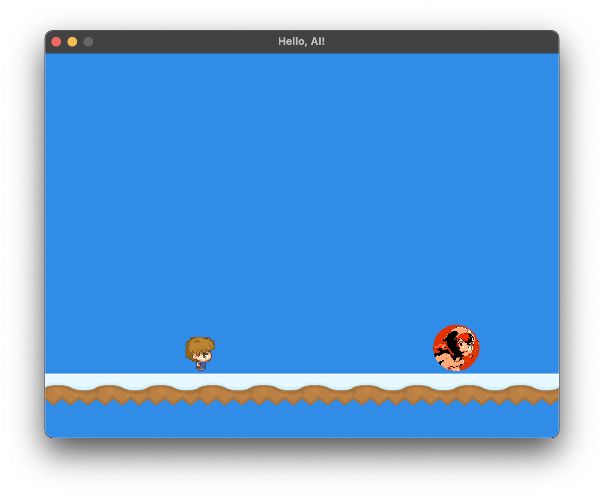
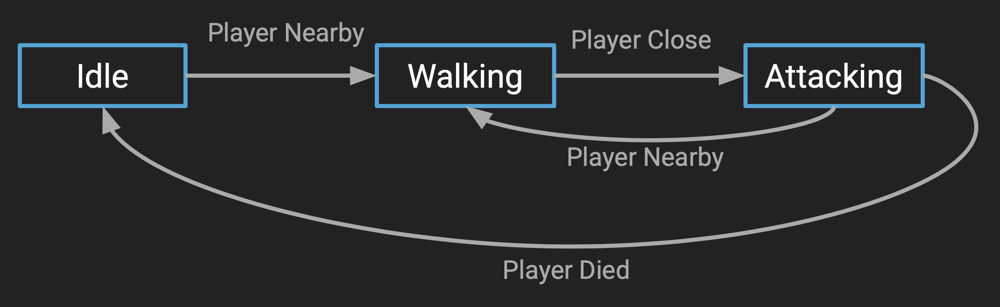
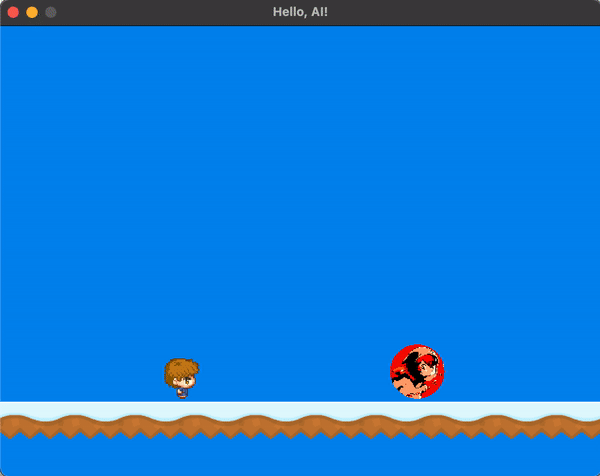
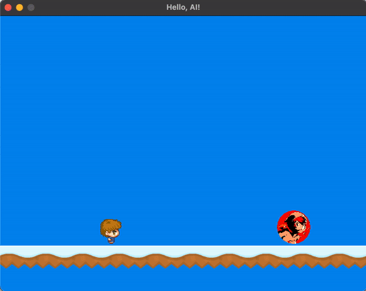

<h2 align=center>Week 07: <em>Part 2</em></h2>

<h1 align=center>Sound Effects</h1>

<h3 align=center>9 Lone Moon, Imperial Year MMXXIV<h3>

<p align=center><strong><em>Song of the day</strong>: <a href="https://youtu.be/SRLLHIE8RZU?si=RXmDYewrTPi1OK88"><strong><u>Of All The Gin Joints In The World</u></strong></a> by Fall Out Boy (2005).</em></p>

### Sections

1. [**Setting The Stage**](#part-1-setting-the-stage)
2. [**Enemy States, AI Types, and AI States**](#part-2-enemy-states-ai-types-and-ai-states)
3. [**"Guarding" Behaviour**](#part-3-guarding-behaviour)
4. [**Pit Avoidance**](#part-4-pit-avoidance)

### Part 1: **Setting The Stage**

In order to get a quick demo of really basic enemy AI in action, let's get set up a Mario-like level with one enemy:

```c++
#define PLATFORM_COUNT 11
#define ENEMY_COUNT 1

struct GameState
{
    Entity *player;
    Entity *platforms;
    Entity *enemies;
    
    Mix_Music *bgm;
    Mix_Chunk *jump_sfx;
};

const float PLATFORM_OFFSET = 5.0f;

void initialise()
{
    // ––––– PLATFORM ––––– //
    GLuint platform_texture_id = load_texture(PLATFORM_FILEPATH);
    
    g_state.platforms = new Entity[PLATFORM_COUNT];
    
    for (int i = 0; i < PLATFORM_COUNT; i++)
    {
        g_state.platforms[i].set_entity_type(PLATFORM);
        g_state.platforms[i].m_texture_id = platform_texture_id;
        g_state.platforms[i].set_position(glm::vec3(i - PLATFORM_OFFSET, -3.0f, 0.0f));
        g_state.platforms[i].set_width(0.4f);
        g_state.platforms[i].update(0.0f, NULL, NULL, 0);
    }

    // ––––– SOPHIE ––––– //
    GLuint enemy_texture_id = load_texture(ENEMY_FILEPATH);
    
    g_state.enemies = new Entity[ENEMY_COUNT];
    g_state.enemies[0].set_entity_type(ENEMY);
    g_state.enemies[0].m_texture_id = enemy_texture_id;
    g_state.enemies[0].set_position(glm::vec3(3.0f, 0.0f, 0.0f));
    g_state.enemies[0].set_movement(glm::vec3(0.0f));
    g_state.enemies[0].set_speed(1.0f);
    g_state.enemies[0].set_acceleration(glm::vec3(0.0f, -9.81f, 0.0f));
}

void update()
{
    while (delta_time >= FIXED_TIMESTEP)
    {
        for (int i = 0; i < ENEMY_COUNT; i++) g_state.enemies[i].update(FIXED_TIMESTEP, g_state.player, g_state.platforms, PLATFORM_COUNT);
    }
}

void render()
{
    for (int i = 0; i < PLATFORM_COUNT; i++) g_state.platforms[i].render(&g_program);
    for (int i = 0; i < ENEMY_COUNT; i++)    g_state.enemies[i].render(&g_program);
}

void shutdown()
{
    delete [] g_state.platforms;
    delete [] g_state.enemies;
}
```

<sub>**Code Block 1**: New additions to our family.</sub>

What we get is something like this:



<sub>**Figure 1**: Hello, World 1-1.</sub>

Let's see if we can't get Sophie to behave like some sort of enemy and chase George around.

### Part 2: **Enemy States, AI Types, and AI States**

Remember sometime ago when we said that a single type of entity probably wouldn't cut it as the complexity of our games grew? Well, we've just about reached that crossroad. If you study a bit theoretical computer science, you'll eventually come across something called a [**finite state machine**](https://en.wikipedia.org/wiki/Finite-state_machine) (FSM). To grossly simplify the concept, a FSM is a theoretical machine that has a very specific set of actions. It can only perform actions contained in this set, and it changes from action to action depending on external conditions. A common example of an FSM is a traffic light—it only performs a very specific set of actions, and it changes between those actions depending on the traffic situation.

Unless you are planning on hooking up a super advanced ML model to control your enemies' behaviour in the span of the month and a half of time we have left of the semester (don't let me stop you), you are more than likely going to want to settle for making them FSMs. So, yes, when we talk about enemy AI, we are actually talking about finite state behaviour. But that's much less catchy.



<sub>**Figure 2**: Our FSM model.</sub>

Our first step is to give our `Entity` class three new enum attributes. These will determine whether an entity is our player, an enemy, or a platform:

```c++
// Entity.h
enum EntityType { PLATFORM, PLAYER, ENEMY  };
enum AIType     { WALKER                   };
enum AIState    { WALKING, IDLE, ATTACKING };

class Entity
{
private:
    EntityType m_entity_type;
    AIType     m_ai_type;
    AIState    m_ai_state;

public:
    // AI methods
    void ai_activate();
    void ai_walk();

    // Getters
    EntityType const get_entity_type()    const { return m_entity_type;   };
    AIType     const get_ai_type()        const { return m_ai_type;       };
    AIState    const get_ai_state()       const { return m_ai_state;      };

    // Setters
    void const set_entity_type(EntityType new_entity_type)  { m_entity_type   = new_entity_type;      };
    void const set_ai_type(AIType new_ai_type)              { m_ai_type       = new_ai_type;          };
    void const set_ai_state(AIState new_state)              { m_ai_state      = new_state;            };
}
```
```c++
// Entity.cpp
void Entity::activate_ai()
{
    // Turn on AI behaviour
}

void Entity::ai_walk()
{
    // Once AI behaviour is turned on, activate a specific set of actions, called "walker"
}

void Entity::update()
{
    if (entity_type == ENEMY) { activate_ai(); }
}
```
```c++
// main.cpp
void initialise()
{
    // Platforms
    for (int i = 0; i < PLATFORM_COUNT; i++)
    {
        g_state.platforms[i].set_entity_type(PLATFORM);
    }

    // Player
    g_state.player->set_entity_type(PLAYER);

    // Enemy
    g_state.enemies[0].set_entity_type(ENEMY);
}
```

<sub>**Code Blocks 2, 3, and 4**: Setting up for turning our entities into finite state machines.</sub>

So what exactly will we do with these new attributes and methods? Well, once we turn on AI behaviour with `activate_ai()`, we'll give this specific enemy special directives depending on the type of AI (`AIType`) they are:

```c++
// Entity.cpp
void Entity::ai_activate(Entity *player)
{
    switch (m_ai_type)
    {
        case WALKER:
            ai_walk();
            break;
            
        default:
            break;
    }
}

void Entity::ai_walk()
{
    // Walk left
    m_movement = glm::vec3(-1.0f, 0.0f, 0.0f);
}
```
```c++
// main.cpp
void initialise()
{
    g_state.enemies[0].set_entity_type(ENEMY);
    g_state.enemies[0].set_ai_type(GUARD);
    g_state.enemies[0].set_ai_state(IDLE);
}
```

<sub>**Code Blocks 5 and 6**: If our enemy happens to be a walker, it will start moving to the left.</sub>


What we get is something that's perhaps not too exciting, but it's a start:



<sub>**Figure 3**: There she goes.</sub>

But the whole point of AI is, of course, to make it reactive to outside stimuli. To our player, specifically. So, let's make a new type of AI that will start chasing the player if it gets too close. Let's call it a `GUARD`.

### Part 3: _"Guarding" Behaviour_

Alright, so let's make this our goal:

1. The enemy, by default, will be idle i.e. it will not be moving or doing anything else.
2. If our player gets too close to the enemy (say, a distance less than `3.0f`), the enemy will switch to walking mode.
3. Until the player is outside of the detection range, the enemy will walk towards the player, "chasing" them.

Here are our changes:

```c++
// Entity.h
enum AIType { WALKER, GUARD };

class Entity
{
public:
    void ai_activate(Entity *player);
    void ai_walk();
    void ai_guard(Entity *player);

    void update(float delta_time, Entity *player, Entity *collidable_entities, int collidable_entity_count);
}
```
```c++
// Entity.cpp
void Entity::ai_activate(Entity *player)
{
    switch (m_ai_type)
    {
        case WALKER:
            ai_walk();
            break;
            
        case GUARD:
            ai_guard(player);
            break;
            
        default:
            break;
    }
}

void Entity::ai_guard(Entity *player)
{
    switch (m_ai_state) {
        case IDLE:
            if (glm::distance(m_position, player->get_position()) < 3.0f) m_ai_state = WALKING;
            break;
            
        case WALKING:
            // Depending on where the player is in respect to their x-position
            // Change direction of the enemy
            if (m_position.x > player->get_position().x) {
                m_movement = glm::vec3(-1.0f, 0.0f, 0.0f);
            } else {
                m_movement = glm::vec3(1.0f, 0.0f, 0.0f);
            }
            break;
            
        case ATTACKING:
            break;
            
        default:
            break;
    }
}

void Entity::update(float delta_time, Entity *player, Entity *collidable_entities, int collidable_entity_count)
{
    if (m_entity_type == ENEMY) ai_activate(player);
}

bool const Entity::check_collision(Entity *other) const
{
    if (other == this) return false; // If we are checking with collisions with ourselves, this should be false
}
```
```c++
// main.cpp
void initialise()
{
    g_state.enemies[0].set_ai_type(GUARD);
    g_state.enemies[0].set_ai_state(IDLE);  // start at rest
}

void update()
{
    while (delta_time >= FIXED_TIMESTEP)
    {
        g_state.player->update(FIXED_TIMESTEP, g_state.player, g_state.platforms, PLATFORM_COUNT);
        
        for (int i = 0; i < ENEMY_COUNT; i++) g_state.enemies[i].update(FIXED_TIMESTEP, g_state.player, g_state.platforms, PLATFORM_COUNT);
    }
}
```

<sub>**Code Blocks 7, 8, and 6**: Adding a different type of AI.</sub>

The key factor here is that now our entities' `update()` method not only accepts the platforms as parameters, but also the actual player. Make sure to not bother checking for collisions with yourself!



<sub>**Figure 4**: Now that's something to be afraid of.</sub>

### Part 4: _Pit Avoidance_

One last concept that you should start thinking about is how your enemies will detect pits in front of them. Collisions against walls are simple—we already have the code for it. But how do we check for something that we can't even touch?

Here's an idea. Add two more collision flags to your entities, slightly under and to the side of them:


<sub>**Figure 5**: Say, `is_about_to_fall_left` and `is_about_to_fall_right`.</sub>

Then, have it do a [**point-to-box detection**](https://github.com/sebastianromerocruz/CS3113-material/tree/main/lectures/collision-detection#point-to-box-collisions) in both directions. If at any point the flags notice a gap, then we have reached a pit.


<sub>**Figure 6**: The red circle represents a "collision" with a gap.</sub>
