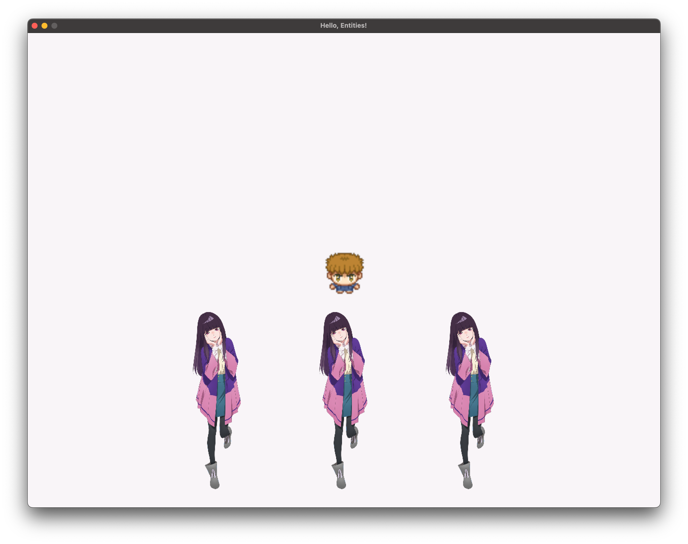

<h2 align=center>Week 05</h2>

<h1 align=center>Entities</h1>

<h3 align=center>3 Wyvern Moon, Imperial Year MMXXIV</h3>

<p align=center><strong><em>Song of the day</strong>: <a href="https://www.youtube.com/watch?v=8s9vljW8HLA"><strong><u>果実 (Fruit)</u></strong></a> by Akasaki (2023)</em></p>


---

### Sections

1. [**On Modularity and Refactoring**](#mod)
2. [**The `Entity` Class**](#entity)
3. [**Game State**](#state)

---

<a id="mod"></a>

### Part 1: _On Modularity and Refactoring_

As we discussed last week, coming up with systems whereby our game's components can be easily created and manipulated is of paramount importance. Especially when we consider our most complex project thus far, _Pong_, that is still, at its core, only three objects. And even then, our `main.cpp` is already getting to the point where finding anything is a pain—just take a look at the state of our constant / variable space from last class:

```c++
constexpr char SPRITESHEET_FILEPATH[] = "assets/george_0.png",
               FONTSHEET_FILEPATH[]   = "assets/font1.png";

constexpr int SPRITESHEET_DIMENSIONS = 4;
constexpr int SECONDS_PER_FRAME = 4;
constexpr int LEFT  = 0,
              RIGHT = 1,
              UP    = 2,
              DOWN  = 3;

int g_george_walking[SPRITESHEET_DIMENSIONS][SPRITESHEET_DIMENSIONS] =
{
    { 1, 5, 9,  13 }, // for George to move to the left,
    { 3, 7, 11, 15 }, // for George to move to the right,
    { 2, 6, 10, 14 }, // for George to move upwards,
    { 0, 4, 8,  12 }  // for George to move downwards
};

GLuint g_george_texture_id;

float g_player_speed = 1.0f;  // move 1 unit per second

int *g_animation_indices = g_george_walking[DOWN];  // start George looking down
int g_animation_frames   = SPRITESHEET_DIMENSIONS;
int g_animation_index    = 0;

float g_animation_time = 0.0f;
```

<sub>**Code Block 1**: Yikes. And that's for a *single* animated character.</sub>

Needless to say, we're going to have to rectify this situation pretty quickly; this wouldn't be a computer science class without some refactoring towards maximum modularity.

Let's make a data structure that will represent and handle all things related to our game objects. In game development, these are often called **entities**.

<br>

<a id="entity"></a>

### Part 2: _The `Entity` Class_

The goal is for us not to see **any code related to creating, modifying, and animating entities**. While we can create the entities in the `main.cpp`'s `initialise()` function, each entity should have its own `render()` and `update()` methods. Let's make a simple class to cover those basic points:

```c++
// Entity.h
class Entity {
public:
    glm::vec3 m_position;
    glm::vec3 m_movement;
    float m_speed;

    GLuint m_texture_id;

    glm::mat4 m_model_matrix;

    Entity();

    void update(float delta_time);
    void render(ShaderProgram *program);
};
```
```c++
// Entity.cpp
Entity::Entity()
{
    m_position = glm::vec3(0);
    m_speed = 0;

    m_model_matrix = glm::mat4(1.0f);
}

void Entity::update(float delta_time)
{
    m_position += m_movement * m_speed * deltaTime;
    
    m_model_matrix = glm::mat4(1.0f);
    m_model_matrix = glm::translate(m_model_matrix, position);
}

void Entity::render(ShaderProgram *program) {
    program->SetModelMatrix(m_model_matrix);

    float vertices[] = { -0.5, -0.5, 0.5, -0.5, 0.5, 0.5, -0.5, -0.5, 0.5, 0.5, -0.5, 0.5 };
    float tex_coords[] = { 0.0, 1.0, 1.0, 1.0, 1.0, 0.0, 0.0, 1.0, 1.0, 0.0, 0.0, 0.0 };
    
    glBindTexture(GL_TEXTURE_2D, textureID);
    
    glVertexAttribPointer(program->get_position_attribute(), 2, GL_FLOAT, false, 0, vertices);
    glEnableVertexAttribArray(program->get_position_attribute());
    
    glVertexAttribPointer(program->get_tex_coordinate_attribute(), 2, GL_FLOAT, false, 0, tex_coords);
    glEnableVertexAttribArray(program->get_tex_coordinate_attribute());
    
    glDrawArrays(GL_TRIANGLES, 0, 6);
    
    glDisableVertexAttribArray(program->get_position_attribute());
    glDisableVertexAttribArray(program->get_tex_coordinate_attribute());
}
```

<sub>**Code Blocks 2 and 3**: The basics necessary to create a textured, non-animated sprite. Preceding member attributes with an `m_` is [**common practice**](https://www.learncpp.com/cpp-tutorial/classes-and-class-members/) in C++. </sub>

<br>

<a id="state"></a>

### Part 3: _Game State_

We could throw an `Entity` object onto our `initialise()` function, but let's take a step back first. We're getting to a point in the complexity of our games where we'll want to keep track of various events in our game—stuff like the player pressing start to pause the game, the player changing levels, the player losing the game, etc.. These are called **states** in game design, and keeping all things related to the game in one place will make our lives much easier later on. For that reason, let's place our player object inside a `struct` in our `main.cpp` file:

```c++
struct GameState
{
    Entity* player;
};

GameState g_state;

void initialise()
{
    // Some code...
    
    g_state.player             = new Entity();
    g_state.player->m_position   = glm::vec3(0.0f);
    g_state.player->m_movement   = glm::vec3(0.0f);
    g_state.player->m_speed      = 1.0f;
    g_state.player->m_texture_id = load_texture(SPRITESHEET_FILEPATH);
}
```

<sub>**Code Block 4: A better approach to game programming design.</sub>

Of course, this will also mean that, wherever you used global variables and constants such as `g_player_position` or perhaps `PLAYER_SPEED`, you will need to replace them with `g_state.player->m_position` and `g_state.player->m_movement`. Getters and setters wouldn't be a bad idea, either.

Here are my finalised `Entity` class's [**`h`**](SDLProject/Entity.h) and [**C++**](SDLProject/Entity.cpp) files:

```c++
// Entity.h
cenum AnimationDirection { LEFT, RIGHT, UP, DOWN };

class Entity
{
private:
    // Removed individual animation arrays
    int m_walking[4][4]; // 4x4 array for walking animations

    // ————— TRANSFORMATIONS ————— //
    glm::vec3 m_movement;
    glm::vec3 m_position;
    glm::vec3 m_scale;
    
    glm::mat4 m_model_matrix;
    
    float     m_speed;

    // ————— TEXTURES ————— //
    GLuint    m_texture_id;

    // ————— ANIMATION ————— //
    int m_animation_cols;
    int m_animation_frames,
        m_animation_index,
        m_animation_rows;
    
    int  *m_animation_indices = nullptr;
    float m_animation_time    = 0.0f;
    
public:
    // ————— STATIC VARIABLES ————— //
    static constexpr int SECONDS_PER_FRAME = 4;

    // ————— METHODS ————— //
    Entity();
    Entity(GLuint texture_id, float speed, int walking[4][4], float animation_time,
           int animation_frames, int animation_index, int animation_cols, 
           int animation_rows);
    Entity(GLuint texture_id, float speed); // Simpler constructor
    ~Entity();

    void draw_sprite_from_texture_atlas(ShaderProgram *program, GLuint texture_id, 
                                        int index);
    void update(float delta_time);
    void render(ShaderProgram *program);
    
    void normalise_movement() { m_movement = glm::normalize(m_movement); };
    
    void face_left()  { m_animation_indices = m_walking[LEFT];  }
    void face_right() { m_animation_indices = m_walking[RIGHT]; }
    void face_up()    { m_animation_indices = m_walking[UP];    }
    void face_down()  { m_animation_indices = m_walking[DOWN];  }

    void move_left()  { m_movement.x = -1.0f; face_left(); };
    void move_right() { m_movement.x = 1.0f;  face_right(); };
    void move_up()    { m_movement.y = 1.0f;  face_up(); };
    void move_down()  { m_movement.y = -1.0f; face_down(); };

    // ————— GETTERS ————— //
    glm::vec3 const get_position()   const { return m_position;   }
    glm::vec3 const get_movement()   const { return m_movement;   }
    glm::vec3 const get_scale()      const { return m_scale;      }
    GLuint    const get_texture_id() const { return m_texture_id; }
    float     const get_speed()      const { return m_speed;      }

    // ————— SETTERS ————— //
    void const set_position(glm::vec3 new_position)  { m_position   = new_position;     }
    void const set_movement(glm::vec3 new_movement)  { m_movement   = new_movement;     }
    void const set_scale(glm::vec3 new_scale)        { m_scale      = new_scale;        }
    void const set_texture_id(GLuint new_texture_id) { m_texture_id = new_texture_id;   }
    
    void const set_speed(float new_speed)           { m_speed      = new_speed;        }
    void const set_animation_cols(int new_cols)     { m_animation_cols = new_cols;     }
    void const set_animation_rows(int new_rows)     { m_animation_rows = new_rows;     }
    void const set_animation_frames(int new_frames) { m_animation_frames = new_frames; }
    void const set_animation_index(int new_index)   { m_animation_index = new_index;   }
    void const set_animation_time(int new_time)     { m_animation_time = new_time;     }

    // Setter for m_walking
    void set_walking(int walking[4][4])
    {
        for (int i = 0; i < 4; ++i)
        {
            for (int j = 0; j < 4; ++j)
            {
                m_walking[i][j] = walking[i][j];
            }
        }
    }
};
```
```c++
#define GL_SILENCE_DEPRECATION
#define STB_IMAGE_IMPLEMENTATION

#ifdef _WINDOWS
#include <GL/glew.h>
#endif

#define GL_GLEXT_PROTOTYPES 1
#include <SDL.h>
#include <SDL_opengl.h>
#include "glm/mat4x4.hpp"
#include "glm/gtc/matrix_transform.hpp"
#include "ShaderProgram.h"
#include "Entity.h"

// Default constructor
Entity::Entity()
    : m_position(0.0f), m_movement(0.0f), m_scale(1.0f, 1.0f, 0.0f), m_model_matrix(1.0f),
      m_speed(0.0f), m_animation_cols(0), m_animation_frames(0), m_animation_index(0),
      m_animation_rows(0), m_animation_indices(nullptr), m_animation_time(0.0f),
      m_texture_id(0)
{
    // Initialize m_walking with zeros or any default value
    for (int i = 0; i < SECONDS_PER_FRAME; ++i)
        for (int j = 0; j < SECONDS_PER_FRAME; ++j) m_walking[i][j] = 0;
}

// Parameterized constructor
Entity::Entity(GLuint texture_id, float speed, int walking[4][4], float animation_time,
               int animation_frames, int animation_index, int animation_cols, 
               int animation_rows)
    : m_position(0.0f), m_movement(0.0f), m_scale(1.0f, 1.0f, 0.0f), m_model_matrix(1.0f),
      m_speed(speed), m_animation_cols(animation_cols),
      m_animation_frames(animation_frames), m_animation_index(animation_index),
      m_animation_rows(animation_rows), m_animation_indices(nullptr),
      m_animation_time(animation_time), m_texture_id(texture_id)
{
    set_walking(walking);
}

// Simpler constructor for partial initialization
Entity::Entity(GLuint texture_id, float speed)
    : m_position(0.0f), m_movement(0.0f), m_scale(1.0f, 1.0f, 0.0f), m_model_matrix(1.0f),
      m_speed(speed), m_animation_cols(0), m_animation_frames(0), m_animation_index(0),
      m_animation_rows(0), m_animation_indices(nullptr), m_animation_time(0.0f),
      m_texture_id(texture_id)
{
    // Initialize m_walking with zeros or any default value
    for (int i = 0; i < SECONDS_PER_FRAME; ++i)
        for (int j = 0; j < SECONDS_PER_FRAME; ++j) m_walking[i][j] = 0;
}

Entity::~Entity() { }

void Entity::draw_sprite_from_texture_atlas(ShaderProgram *program, GLuint texture_id, int index)
{
    // Step 1: Calculate the UV location of the indexed frame
    float u_coord = (float) (index % m_animation_cols) / (float) m_animation_cols;
    float v_coord = (float) (index / m_animation_cols) / (float) m_animation_rows;
    
    // Step 2: Calculate its UV size
    float width = 1.0f / (float) m_animation_cols;
    float height = 1.0f / (float) m_animation_rows;
    
    // Step 3: Just as we have done before, match the texture coordinates to the vertices
    float tex_coords[] =
    {
        u_coord, v_coord + height, u_coord + width, v_coord + height, u_coord + width, v_coord,
        u_coord, v_coord + height, u_coord + width, v_coord, u_coord, v_coord
    };
    
    float vertices[] =
    {
        -0.5, -0.5, 0.5, -0.5,  0.5, 0.5,
        -0.5, -0.5, 0.5,  0.5, -0.5, 0.5
    };
    
    // Step 4: And render
    glBindTexture(GL_TEXTURE_2D, texture_id);
    
    glVertexAttribPointer(program->get_position_attribute(), 2, GL_FLOAT, false, 0, vertices);
    glEnableVertexAttribArray(program->get_position_attribute());
    
    glVertexAttribPointer(program->get_tex_coordinate_attribute(), 2, GL_FLOAT, false, 0, tex_coords);
    glEnableVertexAttribArray(program->get_tex_coordinate_attribute());
    
    glDrawArrays(GL_TRIANGLES, 0, 6);
    
    glDisableVertexAttribArray(program->get_position_attribute());
    glDisableVertexAttribArray(program->get_tex_coordinate_attribute());
}

void Entity::update(float delta_time)
{
    if (m_animation_indices != NULL)
    {
        if (glm::length(m_movement) != 0)
        {
            m_animation_time += delta_time;
            float frames_per_second = (float) 1 / SECONDS_PER_FRAME;
            
            if (m_animation_time >= frames_per_second)
            {
                m_animation_time = 0.0f;
                m_animation_index++;
                
                if (m_animation_index >= m_animation_frames)
                {
                    m_animation_index = 0;
                }
            }
        }
    }
    
    m_position += m_movement * m_speed * delta_time;
    m_model_matrix = glm::mat4(1.0f);
    m_model_matrix = glm::translate(m_model_matrix, m_position);
    m_model_matrix = glm::scale(m_model_matrix, m_scale);
}

void Entity::render(ShaderProgram *program)
{
    program->set_model_matrix(m_model_matrix);
    
    if (m_animation_indices != NULL)
    {
        draw_sprite_from_texture_atlas(program, m_texture_id, 
                                       m_animation_indices[m_animation_index]);
        return;
    }
    
    float vertices[]   = { -0.5, -0.5, 0.5, -0.5, 0.5, 0.5, -0.5, -0.5, 0.5, 0.5, -0.5, 0.5 };
    float tex_coords[] = {  0.0,  1.0, 1.0,  1.0, 1.0, 0.0,  0.0,  1.0, 1.0, 0.0,  0.0, 0.0 };
    
    glBindTexture(GL_TEXTURE_2D, m_texture_id);
    
    glVertexAttribPointer(program->get_position_attribute(), 2, GL_FLOAT, false, 0, vertices);
    glEnableVertexAttribArray(program->get_position_attribute());
    glVertexAttribPointer(program->get_tex_coordinate_attribute(), 2, GL_FLOAT, false, 0, tex_coords);
    glEnableVertexAttribArray(program->get_tex_coordinate_attribute());
    
    glDrawArrays(GL_TRIANGLES, 0, 6);
    
    glDisableVertexAttribArray(program->get_position_attribute());
    glDisableVertexAttribArray(program->get_tex_coordinate_attribute());
}
```

<sub>**Code Blocks 5 and 6**: Organising our entities in such a way that all of its functionality is just a method call away.</sub>

I didn't define all the possible getters and setters here, but I know those are subject of preference (I really like them in C++), so the way our completely-instantiated `g_state.player` looks like in `initialise()` now is:

```c++
GLuint player_texture_id = load_texture(GEORGE_FILEPATH);
    
int player_walking_animation[4][4] =
{
    { 1, 5, 9, 13 },  // for George to move to the left,
    { 3, 7, 11, 15 }, // for George to move to the right,
    { 2, 6, 10, 14 }, // for George to move upwards,
    { 0, 4, 8, 12 }   // for George to move downwards
};

g_game_state.player = new Entity(
    player_texture_id,         // texture id
    1.0f,                      // speed
    player_walking_animation,  // animation index sets
    0.0f,                      // animation time
    4,                         // animation frame amount
    0,                         // current animation index
    4,                         // animation column amount
    4                          // animation row amount
);

g_game_state.player->face_down();
```
<sub>**Code Block 7**: Creating and instantiating our player's important values.</sub>


The benefit of what we have just done is that our main `update()` and `render()` functions now look beautifully simple; the heavy weight is being carried by the `Entity` class:

```c++
void update()
{
    float ticks = (float) SDL_GetTicks() / MILLISECONDS_IN_SECOND; // get the current number of ticks
    float delta_time = ticks - previous_ticks; // the delta time is the difference from the last frame
    previous_ticks = ticks;

    g_state.player->update(delta_time);
}

void render()
{
    glClear(GL_COLOR_BUFFER_BIT);
    
    g_state.player->render(&program);
    
    SDL_GL_SwapWindow(display_window);
}
```

<sub>**Code Block 8**: A programmer's dream.</sub>

---

The cool thing about this system is that adding enemies and/or NPCs (non-playable characters) is as simple as adding it to our `GameState` struct, and mass-initialising using a `for`-loop. For example, say that we wanted to have three NPCs on the screen (let's use the `mei.png` texture for them):

```c++
constexpr int NUMBER_OF_NPCS = 3;

struct GameState
{
    Entity* player;
    Entity** npcs;
};

void initialise()
{
    // ————— NPCs ————— //
    g_game_state.npcs = new Entity*[NUMBER_OF_NPCS];
    
    GLuint kita_texture_id = load_texture(KITA_FILEPATH, LINEAR);

    for (int i = 0; i < NUMBER_OF_NPCS; i++)
    {
        g_game_state.npcs[i] = new Entity(
            kita_texture_id,  // texture id
            1.0f              // speed
        );
        g_game_state.npcs[i]->set_scale(KITA_INIT_SCALE);
    }

    g_game_state.npcs[0]->set_position(glm::vec3( 0.0f, -1.0f, 0.0f));
    g_game_state.npcs[1]->set_position(glm::vec3(-2.0f, -1.0f, 0.0f));
    g_game_state.npcs[2]->set_position(glm::vec3( 2.0f, -1.0f, 0.0f));
}

void update()
{
    float ticks = (float) SDL_GetTicks() / MILLISECONDS_IN_SECOND; // get the current number of ticks
    float delta_time = ticks - previous_ticks; // the delta time is the difference from the last frame
    previous_ticks = ticks;

    // Apply update for every NPC object    
    for (int i = 0; i < NUMBER_OF_NPCS; i++) g_game_state.npcs[i]->update(delta_time);
}


void render()
{
    glClear(GL_COLOR_BUFFER_BIT);
    
    for (int i = 0; i < NUMBER_OF_NPCS; i++)
        g_game_state.npcs[i]->render(&g_shader_program);
    
    SDL_GL_SwapWindow(display_window);
}
```
<sub>**Code Block 9**: Entities allow us to have common behaviour for every game, making functionality super simple.</sub>

Output:



<sub>**Figure 1**: It's dangerous to go alone.</sub>