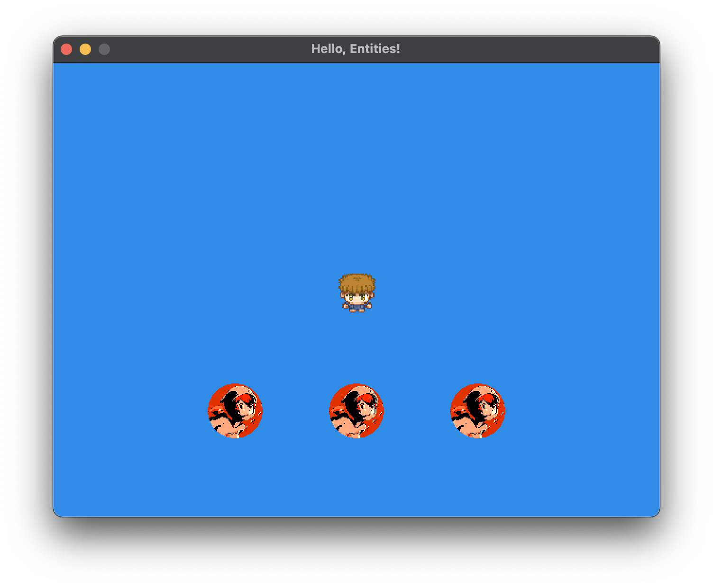

<h2 align=center>Week 05: <em>Part 2</em></h2>

<h1 align=center>Entities</h1>

<h3 align=center>23 Pegasus Moon, Imperial Year MMXXIV</h3>

<p align=center><strong><em>Song of the day</strong>: <a href="https://youtu.be/nGCd8cNFLd0?si=BZo6tzFSBTY4tes7"><strong><u>When Winter Comes Around</u></strong></a> by The Lemon Twigs (2023).</em></p>

### Sections

1. [**On Modularity and Refactoring**](#part-1-on-modularity-and-refactoring)
2. [**The `Entity` Class**](#part-2-the-entity-class)
3. [**More On Game States**](#part-3-more-on-game-states)

### Part 1: _On Modularity and Refactoring_

As we discussed last week, coming up with systems whereby our game's components can be easily created and manipulated is of paramount importance. Especially when we consider our most complex project thus far, _Pong_, that is still, at its core, only three objects. And even then, our `main.cpp` is already getting to the point where finding anything is a pain—just take a look at the state of our constant / variable space from last class:

```c++
define LOG(argument) std::cout << argument << '\n'

const int WINDOW_WIDTH  = 640,
          WINDOW_HEIGHT = 480;

const float BG_RED     = 0.1922f,
            BG_BLUE    = 0.549f,
            BG_GREEN   = 0.9059f,
            BG_OPACITY = 1.0f;

const int VIEWPORT_X = 0,
          VIEWPORT_Y = 0,
          VIEWPORT_WIDTH  = WINDOW_WIDTH,
          VIEWPORT_HEIGHT = WINDOW_HEIGHT;

const char V_SHADER_PATH[] = "shaders/vertex_textured.glsl",
           F_SHADER_PATH[] = "shaders/fragment_textured.glsl";

const float MILLISECONDS_IN_SECOND = 1000.0;

const char SPRITESHEET_FILEPATH[] = "assets/george_0.png";

const float MINIMUM_COLLISION_DISTANCE = 1.0f;

const int NUMBER_OF_TEXTURES = 1; // to be generated, that is
const GLint LEVEL_OF_DETAIL  = 0;  // base image level; Level n is the nth mipmap reduction image
const GLint TEXTURE_BORDER   = 0;   // this value MUST be zero
const int SPRITESHEET_DIMENSIONS = 4;
const int SECONDS_PER_FRAME = 4;
const int LEFT  = 0,
          RIGHT = 1,
          UP    = 2,
          DOWN  = 3;

int *ANIMATION_RIGHT = new int[4] { 3, 7, 11, 15 }; // for George to move to the right
int *ANIMATION_LEFT  = new int[4] { 1, 5, 9,  13 }; // for George to move to the left
int *ANIMATION_UP    = new int[4] { 2, 6, 10, 14 }; // for George to move upwards
int *ANIMATION_DOWN  = new int[4] { 0, 4, 8,  12 }; // for George to move downwards

int **GEORGE_WALKING = new int*[4]
{
    ANIMATION_LEFT, ANIMATION_RIGHT, ANIMATION_UP, ANIMATION_DOWN
};

const int FONTBANK_SIZE = 16;

SDL_Window* g_display_window;
bool g_game_is_running = true;
bool g_is_growing = true;

ShaderProgram g_program;
glm::mat4 g_view_matrix, g_model_matrix, g_projection_matrix;

float g_previous_ticks = 0.0f;

GLuint g_player_texture_id;

glm::vec3 g_player_position    = glm::vec3(0.0f, 0.0f, 0.0f),
          g_player_movement    = glm::vec3(0.0f, 0.0f, 0.0f),
          g_player_orientation = glm::vec3(0.0f, 0.0f, 0.0f),
          g_player_rotation    = glm::vec3(0.0f, 0.0f, 0.0f);

float g_player_speed = 1.0f;  // move 1 unit per second

int *g_animation_indices = GEORGE_WALKING[DOWN];  // start George looking down

int g_animation_frames = SPRITESHEET_DIMENSIONS;
int g_animation_index  = 0;

float g_animation_time = 0.0f;
```

<sub>**Code Block 1**: Yikes. And that's for a *single* animated character.</sub>

Needless to say, we're going to have to rectify this situation pretty quickly; this wouldn't be a computer science class without some refactoring towards maximum modularity.

Let's make a data structure that will represent and handle all things related to our game objects. In game development, these are often called **entities**.

### Part 2: _The `Entity` Class and Game States_

The goal is for us not to see **any code related to creating, modifying, and animating entities**. While we can create the entities in the `main.cpp`'s `initialise()` function, each entity should have its own `render()` and `update()` methods. Let's make a simple class to cover those basic points:

```c++
// Entity.h
class Entity {
public:
    glm::vec3 m_position;
    glm::vec3 m_movement;
    float m_speed;

    GLuint m_texture_id;

    glm::mat4 m_model_matrix;

    Entity();

    void Update(float delta_time);
    void Render(ShaderProgram *program);
};
```
```c++
// Entity.cpp
Entity::Entity()
{
    m_position = glm::vec3(0);
    m_speed = 0;

    m_model_matrix = glm::mat4(1.0f);
}

void Entity::Update(float delta_time)
{
    m_position += m_movement * m_speed * deltaTime;
    
    m_model_matrix = glm::mat4(1.0f);
    m_model_matrix = glm::translate(m_model_matrix, position);
}

void Entity::Render(ShaderProgram *program) {
    program->SetModelMatrix(m_model_matrix);

    float vertices[] = { -0.5, -0.5, 0.5, -0.5, 0.5, 0.5, -0.5, -0.5, 0.5, 0.5, -0.5, 0.5 };
    float texCoords[] = { 0.0, 1.0, 1.0, 1.0, 1.0, 0.0, 0.0, 1.0, 1.0, 0.0, 0.0, 0.0 };
    
    glBindTexture(GL_TEXTURE_2D, textureID);
    
    glVertexAttribPointer(program->positionAttribute, 2, GL_FLOAT, false, 0, vertices);
    glEnableVertexAttribArray(program->positionAttribute);
    
    glVertexAttribPointer(program->texCoordAttribute, 2, GL_FLOAT, false, 0, texCoords);
    glEnableVertexAttribArray(program->texCoordAttribute);
    
    glDrawArrays(GL_TRIANGLES, 0, 6);
    
    glDisableVertexAttribArray(program->positionAttribute);
    glDisableVertexAttribArray(program->texCoordAttribute);
}
```

<sub>**Code Blocks 2 and 3**: The basics necessary to create a textured, non-animated sprite. Preceding member attributes with an `m_` is [**common practice**](https://www.learncpp.com/cpp-tutorial/classes-and-class-members/) in C++. </sub>

---

We could throw an `Entity` object onto our `initialise()` function, but let's take a step back first. We're getting to a point in the complexity of our games where we'll want to keep track of various events in our game—stuff like the player pressing start to pause the game, the player changing levels, the player losing the game, etc.. These are called **states** in game design, and keeping all things related to the game in one place will make our lives much easier later on. For that reason, let's place our player object inside a `struct` in our `main.cpp` file:

```c++
struct GameState
{
    Entity* player;
};

GameState g_state;

void initialise()
{
    // Some code...
    
    g_state.player             = new Entity();
    g_state.player->m_position   = glm::vec3(0.0f);
    g_state.player->m_movement   = glm::vec3(0.0f);
    g_state.player->m_speed      = 1.0f;
    g_state.player->m_texture_id = load_texture(SPRITESHEET_FILEPATH);
}
```

<sub>**Code Block 4: A better approach to game programming design.</sub>

Of course, this will also mean that, wherever you used global variables and constants such as `g_player_position` or perhaps `PLAYER_SPEED`, you will need to replace them with `g_state.player->m_position` and `g_state.player->m_movement`. Getters and setters wouldn't be a bad idea, either.

Here are my finalised `Entity` class's [**`h`**](SDLProject/Entity.h) and [**C++**](SDLProject/Entity.cpp) files:

```c++
// Entity.h
class Entity
{
private:
    int *m_animation_right = NULL, // move to the right
        *m_animation_left  = NULL, // move to the left
        *m_animation_up    = NULL, // move upwards
        *m_animation_down  = NULL; // move downwards
    
    glm::vec3 m_position;
public:
    // ————— STATIC VARIABLES ————— //
    static const int SECONDS_PER_FRAME = 4;
    static const int LEFT  = 0,
                     RIGHT = 1,
                     UP    = 2,
                     DOWN  = 3;
    
    // ————— ANIMATION ————— //
    int **m_walking = new int*[4]
    {
        m_animation_left,
        m_animation_right,
        m_animation_up,
        m_animation_down
    };
    
    int m_animation_frames = 0,
        m_animation_index  = 0,
        m_animation_cols   = 0,
        m_animation_rows   = 0;
    
    int  *m_animation_indices = NULL;
    float m_animation_time    = 0.0f;
    
    // ————— TRANSFORMATIONS ————— //
    float     m_speed;
    glm::vec3 m_movement;
    glm::mat4 m_model_matrix;
    
    GLuint    m_texture_id;

    // ————— METHODS ————— //
    Entity();
    ~Entity();

    void draw_sprite_from_texture_atlas(ShaderProgram *program, GLuint texture_id, int index);
    void update(float delta_time);
    void render(ShaderProgram *program);
    
    // ————— GETTERS ————— //
    glm::vec3 const get_position() const { return m_position; };
    glm::vec3 const get_movement() const { return m_movement; };
    
    // ————— SETTERS ————— //
    void const set_position(glm::vec3 new_position) { m_position = new_position; };
    void const set_movement(glm::vec3 new_movement) { m_movement = new_movement; };
};
```
```c++
#define GL_SILENCE_DEPRECATION
#define STB_IMAGE_IMPLEMENTATION

#ifdef _WINDOWS
#include <GL/glew.h>
#endif

#define GL_GLEXT_PROTOTYPES 1
#include <SDL.h>
#include <SDL_opengl.h>
#include "glm/mat4x4.hpp"
#include "glm/gtc/matrix_transform.hpp"
#include "ShaderProgram.h"
#include "Entity.h"

Entity::Entity()
{
    m_position     = glm::vec3(0);
    m_speed        = 0;
    m_model_matrix = glm::mat4(1.0f);
}

Entity::~Entity()
{
    delete [] m_animation_up;
    delete [] m_animation_down;
    delete [] m_animation_left;
    delete [] m_animation_right;
    delete [] m_walking;
}

void Entity::draw_sprite_from_texture_atlas(ShaderProgram *program, GLuint texture_id, int index)
{
    // Step 1: Calculate the UV location of the indexed frame
    float u_coord = (float) (index % m_animation_cols) / (float) m_animation_cols;
    float v_coord = (float) (index / m_animation_cols) / (float) m_animation_rows;
    
    // Step 2: Calculate its UV size
    float width = 1.0f / (float) m_animation_cols;
    float height = 1.0f / (float) m_animation_rows;
    
    // Step 3: Just as we have done before, match the texture coordinates to the vertices
    float tex_coords[] =
    {
        u_coord, v_coord + height, u_coord + width, v_coord + height, u_coord + width, v_coord,
        u_coord, v_coord + height, u_coord + width, v_coord, u_coord, v_coord
    };
    
    float vertices[] =
    {
        -0.5, -0.5, 0.5, -0.5,  0.5, 0.5,
        -0.5, -0.5, 0.5,  0.5, -0.5, 0.5
    };
    
    // Step 4: And render
    glBindTexture(GL_TEXTURE_2D, texture_id);
    
    glVertexAttribPointer(program->positionAttribute, 2, GL_FLOAT, false, 0, vertices);
    glEnableVertexAttribArray(program->positionAttribute);
    
    glVertexAttribPointer(program->texCoordAttribute, 2, GL_FLOAT, false, 0, tex_coords);
    glEnableVertexAttribArray(program->texCoordAttribute);
    
    glDrawArrays(GL_TRIANGLES, 0, 6);
    
    glDisableVertexAttribArray(program->positionAttribute);
    glDisableVertexAttribArray(program->texCoordAttribute);
}

void Entity::update(float delta_time)
{
    if (m_animation_indices != NULL)
    {
        if (glm::length(m_movement) != 0)
        {
            m_animation_time += delta_time;
            float frames_per_second = (float) 1 / SECONDS_PER_FRAME;
            
            if (m_animation_time >= frames_per_second)
            {
                m_animation_time = 0.0f;
                m_animation_index++;
                
                if (m_animation_index >= m_animation_frames)
                {
                    m_animation_index = 0;
                }
            }
        }
    }
    
    m_position += m_movement * m_speed * delta_time;
    m_model_matrix = glm::mat4(1.0f);
    m_model_matrix = glm::translate(m_model_matrix, m_position);
}

void Entity::render(ShaderProgram *program)
{
    program->SetModelMatrix(m_model_matrix);
    
    if (m_animation_indices != NULL)
    {
        draw_sprite_from_texture_atlas(program, m_texture_id, m_animation_indices[m_animation_index]);
        return;
    }
    
    float vertices[]   = { -0.5, -0.5, 0.5, -0.5, 0.5, 0.5, -0.5, -0.5, 0.5, 0.5, -0.5, 0.5 };
    float tex_coords[] = {  0.0,  1.0, 1.0,  1.0, 1.0, 0.0,  0.0,  1.0, 1.0, 0.0,  0.0, 0.0 };
    
    glBindTexture(GL_TEXTURE_2D, m_texture_id);
    
    glVertexAttribPointer(program->positionAttribute, 2, GL_FLOAT, false, 0, vertices);
    glEnableVertexAttribArray(program->positionAttribute);
    glVertexAttribPointer(program->texCoordAttribute, 2, GL_FLOAT, false, 0, tex_coords);
    glEnableVertexAttribArray(program->texCoordAttribute);
    
    glDrawArrays(GL_TRIANGLES, 0, 6);
    
    glDisableVertexAttribArray(program->positionAttribute);
    glDisableVertexAttribArray(program->texCoordAttribute);
}
```

<sub>**Code Blocks 5 and 6**: Organising our entities in such a way that all of its functionality is just a method call away.</sub>

I didn't define all the possible getters and setters here, but I know those are subject of preference (I really like them in C++), so the way our completely-instantiated `g_state.player` looks like in `initialise()` now is:

```c++
// ————— PLAYER ————— //
g_state.player = new Entity();
g_state.player->set_position(glm::vec3(0.0f));
g_state.player->set_movement(glm::vec3(0.0f));
g_state.player->m_speed = 1.0f;
g_state.player->m_texture_id = load_texture(SPRITESHEET_FILEPATH);

g_state.player->m_walking[g_state.player->LEFT]  = new int[4] { 1, 5, 9,  13 };
g_state.player->m_walking[g_state.player->RIGHT] = new int[4] { 3, 7, 11, 15 };
g_state.player->m_walking[g_state.player->UP]    = new int[4] { 2, 6, 10, 14 };
g_state.player->m_walking[g_state.player->DOWN]  = new int[4] { 0, 4, 8,  12 };

g_state.player->m_animation_indices = g_state.player->m_walking[g_state.player->DOWN];  // start George looking down
g_state.player->m_animation_frames = 4;
g_state.player->m_animation_index  = 0;
g_state.player->m_animation_time   = 0.0f;
g_state.player->m_animation_cols   = 4;
g_state.player->m_animation_rows   = 4;
```
<sub>**Code Block 7**: Creating and instantiating our player's important values.</sub>


This, in and of itself, could be its own function. Consider making one! The benefit of what we have just done is that our main `update()` and `render()` functions now look beautifully simple; the heavy weight is being carried by the `Entity` class:

```c++
void update()
{
    float ticks = (float) SDL_GetTicks() / MILLISECONDS_IN_SECOND; // get the current number of ticks
    float delta_time = ticks - previous_ticks; // the delta time is the difference from the last frame
    previous_ticks = ticks;

    g_state.player->update(delta_time);
}

void render()
{
    glClear(GL_COLOR_BUFFER_BIT);
    
    g_state.player->render(&program);
    
    SDL_GL_SwapWindow(display_window);
}
```

<sub>**Code Block 8**: A programmer's dream.</sub>

---

The cool thing about this system is that adding enemies is as simple as adding it to our `GameState` struct, and mass-initialising using a `for`-loop. For example, say that we wanted to have three enemies on the screen (let's use the `soph.png` texture for them):

```c++
# define NUMBER_OF_ENEMIES 3

struct GameState
{
    Entity* player;
    Entity* enemies[NUMBER_OF_ENEMIES];
};

void initialise()
{
    // Some code...
    GLuint enemy_texture_id = load_texture("assets/soph.png");
    
    for (int i = 0; i < NUMBER_OF_ENEMIES; i++)
    {
        g_state.enemies[i] = new Entity();
        g_state.enemies[i]->m_speed = 1.0f;
        g_state.enemies[i]->m_speed = enemy_texture_id;
    }
    
    // Giving them random starting positions
    g_state.enemies[0]->set_position(glm::vec3(0.0f, -2.0f, 0.0f));
    g_state.enemies[1]->set_position(glm::vec3(-2.0f, -2.0f, 0.0f));
    g_state.enemies[2]->set_position(glm::vec3(2.0f, -2.0f, 0.0f));
}

void update()
{
    float ticks = (float) SDL_GetTicks() / MILLISECONDS_IN_SECOND; // get the current number of ticks
    float delta_time = ticks - previous_ticks; // the delta time is the difference from the last frame
    previous_ticks = ticks;

    // Apply update for every enemy object    
    for (int i = 0; i < NUMBER_OF_ENEMIES; i++)
    {
        g_state.enemies[i]->update(delta_time);
    }
}


void render()
{
    glClear(GL_COLOR_BUFFER_BIT);
    
    for (int i = 0; i < NUMBER_OF_ENEMIES; i++)
    {
        g_state.enemies[i]->render(&program);
    }
    
    SDL_GL_SwapWindow(display_window);
}
```
<sub>**Code Block 9**: Entities allow us to have common behaviour for every game, making functionality super simple.</sub>

Output:



<sub>**Figure 1**: It's dangerous to go alone.</sub>

### Part 3: _More On Game States_

To give you more of an idea of the kinds of things that we can store in our `GameState` structs, consider the following examples:

- **Example 1**: Player, enemies, items, score.

```c++
struct GameState
{
    Entity *player;
    Entity *enemies[10];
    Entity *items[5];
    int score;
}
```

- **Example 2**: Bullet hell.

```c++
#define MAX_BULLETS 100;

struct GameState
{
    int next_bullet;
    Entity *bullets[MAX_BULLETS];
}

GameState state;

void initialise()
{
    state.next_bullet = 0;

    for (int i = 0; i < MAX_BULLETS; i++)
    {
        state.bullets[i].active = false;
    }
}

void fire()
{
    bullet[state.next_bullet].position = ...;
    bullet[state.next_bullet].active = true;

    state.next_bullet++;
    if (state.next_bullet == MAX_BULLETS) { next_bullet = 0; }
}
```

<sub>Note here that `active` is not an attribute that we defined earlier. This is assuming that you made some changes to `Entity` to suit your needs.<sub>

- **Example 3**: Level select.

```c++
enum GameMode { MAIN_MENU, GAME_LEVEL, GAME_OVER };

struct GameState
{
    GameMode game_mode;
}

GameState state;

void initialise()
{
    state.game_mode = MAIN_MENU;
}

void process_input()
{
    switch(state.game_mode)
    {
        case MAIN_MENU:
            process_input_main_menu();
            break;

        case GAME_LEVEL:
            process_input_game_level();
            break;

        case GAME_OVER:
            process_input_game_over();
            break;
    }
}

void update()
{
    float ticks = (float) SDL_GetTicks() / 1000.0f;
    float delta_time = ticks - last_ticks;
    last_ticks = ticks;

    switch(state.game_mode)
    {
        case MAIN_MENU:
            update_main_menu(delta_time);
            break;

        case GAME_LEVEL:
            update_game_level(delta_time);
            break;

        case GAME_OVER:
            update_game_over(delta_time);
            break;
    } 
}
```