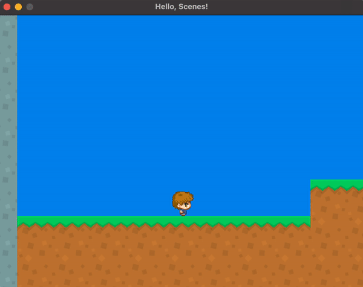
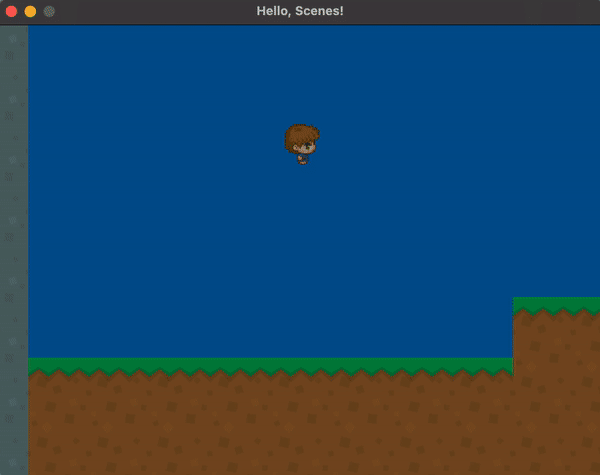
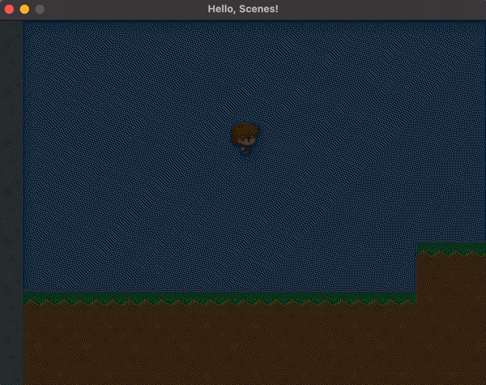
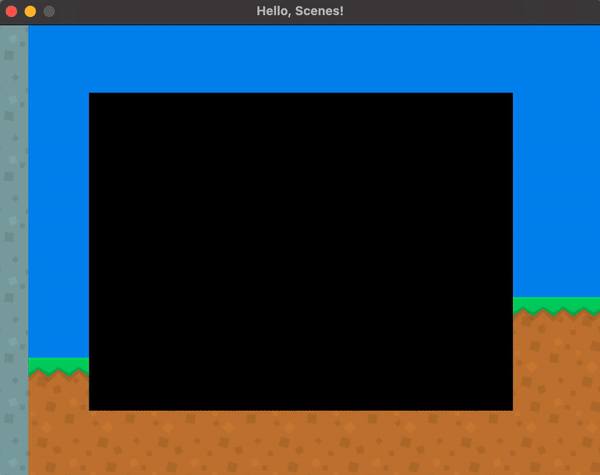
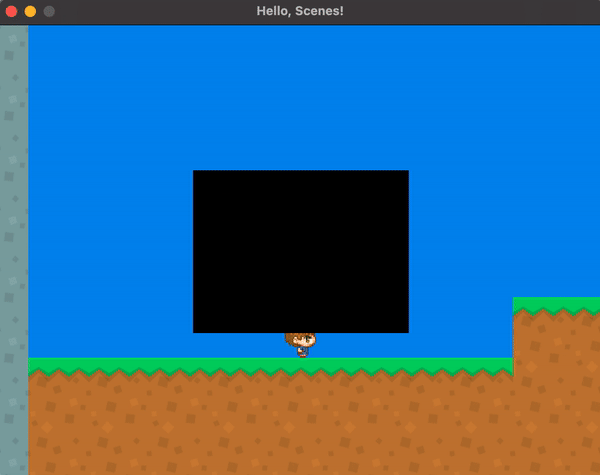

<h2 align=center>Week 9</h2>

<h1 align=center>Effects</h1>

<h3 align=center>1 Red Wolf Moon, Imperial Year MMXXIV</h3>

<p align=center><strong><em>Song of the day</strong>: <a href="https://www.youtube.com/watch?v=phT2MJAn1KY&ab_channel=TOMORROWXTOGETHER-Topic"><strong><u>APT</u></strong></a> by ROSÉ & Bruno Mars (2024).</em></p>

---

### Sections

1. [**Multiple Levels**](#1)
2. [**Effects**](#2)
    1. [**Setup**](#2-1)
    2. [**Fade-In**](#2-2)
    3. [**Fade-Out**](#2-3)
    4. [**Growing and Shrinking**](#2-4)
    <!-- 4. [**Shaking**](#shaking) -->

---

<a id="1"></a>

### Part 1: _Multiple Levels_

We left off last time with a level system for our games. The next step is to be able to create and switch between these levels. For this, I will prove the concept by making an almost identical version of `LevelA`, called `LevelB`, and switch between the two of them. You can find the code to the `LevelB` class [**here**](SDLProject/LevelB.h) and [**here**](SDLProject/LevelB.cpp), but really they only differ in their level data.

What I'd instead like to follow is how we switch between these levels. The first step is to create an array of `Scenes` from which we will pick from later:

```c++
// Scene.h
struct GameState
{
    Map    *map;
    Entity *player;
    Entity *enemies;
    
    Mix_Music *bgm;
    Mix_Chunk *jump_sfx;
    
    int next_scene_id;
};
```
```c++
// LevelA.cpp
void LevelA::update(float delta_time)
{
    m_game_state.player->update(delta_time, m_game_state.player, m_game_state.enemies, ENEMY_COUNT, m_game_state.map);
    
    if (m_game_state.player->get_position().y < -10.0f) m_game_state.next_scene_id = 1;
}
```
```c++
// main.cpp
#include "Scene.h"
#include "LevelA.h"
#include "LevelB.h"

Scene  *g_current_scene;
LevelA *g_levelA;
LevelB *g_levelB;

Effects *g_effects;
Scene   *g_levels[2];

void initialise()
{
    g_levelA = new LevelA();
    g_levelB = new LevelB();
    
    g_levels[0] = g_levelA;
    g_levels[1] = g_levelB;

    // Start at level A
    switch_to_scene(g_levels[0]);
}

int main(int argc, char* argv[])
{
    while (g_app_status == RUNNNING)
    {
        process_input();
        update();
        
        if (g_current_scene->m_game_state.next_scene_id >= 0) switch_to_scene(g_levels[g_current_scene->m_game_state.next_scene_id]);
        
        render();
    }
}
```

<sub>**Code Blocks 1, 2, and 3**: Adding a level-changing mechanism. Essentially, in the `main()`, if the `state`'s `next_scene_id` is anything that over 0, we switch scenes. This only happens when the `if`-statement in `LevelA.cpp` triggers.</sub>

The result is something like the following:



<sub>**Figure 1**: George falling from Level A to Level B.</sub>

<br>

<a id="2"></a>

### Part 2: _Effects_

We should be proud of ourselves; we have reached a point where we're going to focus on the polish of our games instead of working on the actual mechanics. The first thing we should think about is adding some special effects, such as transitions and shaking.

How does this work? For transitions such as fade-ins and -outs, the trick is to create a black square that covers the entire screen. For fade-ins, we want to make this black square go from completely solid to completely invisible. We do this by manipulating the [**alpha-channel**](https://en.wikipedia.org/wiki/Alpha_compositing). We'll thus keep track of this value and change it accordingly.

---

<a id="2-1"></a>

#### Setup

The first thing we're going to do is set up an individual class for effects, called `Effects`:

```c++
// Effects.h
#pragma once
#define GL_SILENCE_DEPRECATION

#ifdef _WINDOWS
#include <GL/glew.h>
#endif

#define GL_GLEXT_PROTOTYPES 1
#include <vector>
#include <math.h>
#include <SDL.h>
#include <SDL_opengl.h>
#include "glm/mat4x4.hpp"
#include "glm/gtc/matrix_transform.hpp"
#include "ShaderProgram.h"

enum EffectType { NONE, FADEIN };

class Effects {
private:
    ShaderProgram m_shader_program;
    float         m_alpha;
    EffectType    m_current_effect;

public:
    glm::vec3 m_view_offset;
    
    Effects(glm::mat4 projection_matrix, glm::mat4 view_matrix);

    void draw_overlay();
    void start(EffectType effect_type);
    void update(float delta_time);
    void render();
};
```
```c++
#include "Effects.h"

Effects::Effects(glm::mat4 projection_matrix, glm::mat4 view_matrix) : m_current_effect(NONE), m_alpha(1.0f), m_effect_speed(1.0f), m_size(10.0f), m_view_offset(glm::vec3(0.0f))
{
    // Non textured Shader
    m_shader_program.load("shaders/vertex.glsl", "shaders/fragment.glsl");
    m_shader_program.set_projection_matrix(projection_matrix);
    m_shader_program.set_view_matrix(view_matrix);
}

void Effects::draw_overlay()
{
    glUseProgram(m_shader_program.programID);

    float vertices[] =
    {
        -0.5, -0.5,
         0.5, -0.5,
         0.5,  0.5,
        
        -0.5, -0.5,
         0.5,  0.5,
        -0.5,  0.5
    };

    glVertexAttribPointer(m_shader_program.get_position_attribute(), 2, GL_FLOAT, false, 0, vertices);
    glEnableVertexAttribArray(m_shader_program.get_position_attribute());
    glDrawArrays(GL_TRIANGLES, 0, 6);
    glDisableVertexAttribArray(m_shader_program.get_position_attribute());
}

void Effects::start(EffectType effect_type)
{
    m_current_effect = effect_type;

    switch (m_current_effect)
    {
        case NONE:   break;
        case FADEIN: break;
    }
}


void Effects::update(float delta_time)
{
   switch (m_current_effect)
   {
       case NONE:   break;
       case FADEIN: break;
   }
}

void Effects::render()
{
    glm::mat4 model_matrix = glm::mat4(1.0f);

    switch (m_current_effect)
    {
        case NONE:   break;
        case FADEIN: break;
    }
}
```

<sub>**Code Block 4**: A skeleton for our `Effects` class.</sub>

As you can see, right now we don't have much beyond no effect `NONE` and `FADEIN`, though neither is really doing much. Let's change that.

---

<a id="2-2"></a>

#### Fade-In

With fade-ins, we want to start with an α-value of 1:

```c++
void Effects::start(EffectType effect_type)
{
    m_current_effect = effect_type;

    switch (m_current_effect)
    {
        case NONE:                       break;   
        case FADEIN: m_alpha = 1.0f; break;
    }
}
```

And gradually go down to 0. We'll, of course, use our delta-time for that:

```c++
void Effects::update(float delta_time)
{
   switch (m_current_effect)
   {
       case NONE:   break;
       
       case FADEIN:
            m_alpha -= delta_time;
            if (m_alpha <= 0) m_current_effect = NONE;
                
            break;
   }
}
```

Note that once we reach an α-value of 0, we go back to a `NONE` effect. The one other thing that we have to add is in the `render()` method, where we'll update the overlay with its current α-value:

```c++
void Effects::render()
{
    glm::mat4 model_matrix = glm::mat4(1.0f);

    switch (m_current_effect)
    {
        case NONE:   break;
        case FADEIN:
            // Scale the model matrix to cover the whole screen
            model_matrix = glm::scale(model_matrix, glm::vec3(10.0f, 10.0f, 0.0f));

            // Apply the model matrix to the overlay
            this->m_shader_program.set_model_matrix(model_matrix);
            

            // Make it black (or whichever colour you want) and solid
            this->m_shader_program.set_colour(0.0f, 0.0f, 0.0f, m_alpha); // current α-value
            
            // Draw
            draw_overlay();

            break;
    }
}
```

Finally, let's set this all in motion in `main.cpp`:

```c++
#include "Effects.h"

Effects *g_effects;

void initialise()
{
    g_effects = new Effects(projection_matrix, view_matrix);
    g_effects->start(FADEIN);
}

void update()
{
    while (delta_time >= FIXED_TIMESTEP) {
        g_effects->update(FIXED_TIMESTEP);
    }
}

void render()
{
    g_current_scene->render(&g_shader_program);
    g_effects->render();
}
```

And we get the following effect:



<sub>**Figure 2**: Fade-in transition effect.</sub>

We can make this go a little bit slower, too, by adding an effect "speed" factor:

```c++
// Effect.h
class EffectManager {
private:
    float         m_effect_speed;

public:
    void start(EffectType effect_type, float effect_speed);
};
```
```cpp
// Effects.cpp
EffectManager::EffectManager(glm::mat4 projection_matrix, glm::mat4 view_matrix)
{
    // Initial value
    m_effect_speed = 1.0f;
}

void EffectManager::start(EffectType effect_type, float effect_speed)
{
    m_effect_speed = effect_speed;
}

void EffectManager::update(float delta_time)
{
   switch (m_current_effect)
   {
       case FADEIN:
            m_alpha -= delta_time * m_effect_speed;
            if (m_alpha <= 0) m_current_effect = NONE;
                
            break;
   }
}
```
```cpp
void initialise()
{
    g_effect_manager->start(FADEIN, 0.5f);
}
```

---

<a id="2-3"></a>

#### Fade-Out

Fading out works basically in the exact same way, but with increasing the α-value. Keep in mind that we should not switch the effect back to `NONE` when we reach 1. Otherwise, the black screen will disappear:

```c++
void Effects::start(EffectType effect_type)
{
    m_current_effect = effect_type;

    switch (m_current_effect)
    {
        case NONE:                         break;
        case FADEIN:  m_alpha     = 1.0f;  break;
        case FADEOUT: m_alpha     = 0.0f;  break;
    }
}

void Effects::update(float delta_time)
{
   switch (m_current_effect)
   {
       case NONE: break;
           
       // Fades
       case FADEIN:
           m_alpha -= delta_time;
           if (m_alpha <= 0) m_current_effect = NONE;
           
           break;
       case FADEOUT:
           if (m_alpha < 1.0f) m_alpha += delta_time;
}

void Effects::render()
{
    glm::mat4 model_matrix = glm::mat4(1.0f);

    switch (m_current_effect)
    {
        case FADEOUT:
        case FADEIN:
            m_shader_program.SetModelMatrix(model_matrix);
            m_shader_program.SetColor(0.0f, 0.0f, 0.0f, m_alpha);
            draw_overlay();

            break;
    }
}
```
```c++
enum EffectType { NONE, FADEIN, FADEOUT };
```
```c++
void initialise()
{
    effects->start(FADEIN, 1.0f);
}
```

The result:



<sub>**Figure 3**: Fade-out transition effect.</sub>

---

<a id="2-4"></a>

#### Growing and Shrinking

Having our overlay grow and shrink in and out of the screen works pretty much identical to the fading effects, except instead of changing `alpha`, we can change a `size` attribute:

```c++
// Effects.h
enum EffectType { NONE, FADEIN, FADEOUT, GROW, SHRINK };

class Effects {
private:
    float m_size;
};
```
```c++
// Effects.cpp
Effects::Effects(glm::mat4 projection_matrix, glm::mat4 view_matrix)
{
    m_size = 10.0f;
}

void Effects::start(EffectType effect_type)
{
    switch (m_current_effect)
    {
        case GROW:    m_size      = 0.0f;  break;
        case SHRINK:  m_size      = 10.0f; break;
    }
}

void Effects::update(float delta_time)
{
   switch (m_current_effect)
   {
       case GROW:
           if (m_size < 10.0f) m_size += delta_time * m_effect_speed;
           break;
           
       case SHRINK:
           if (m_size >= 0.0f) m_size -= delta_time * m_effect_speed;
           if (m_size < 0) m_current_effect = NONE;
           
           break;
    }
}

void Effects::render()
{
    glm::mat4 model_matrix = glm::mat4(1.0f);

    switch (m_current_effect)
    {
        case NONE:
            break;
            
        case GROW:
        case SHRINK:
        case FADEOUT:
        case FADEIN:
            // Expand the current square a bit
            model_matrix = glm::scale(model_matrix,
                                      glm::vec3(m_size,
                                                m_current_effect != GROW && m_current_effect != SHRINK ?
                                                    m_size : m_size * 0.75f,
                                                0.0f));
            
            m_shader_program.SetModelMatrix(model_matrix);
            m_shader_program.SetColor(0.0f, 0.0f, 0.0f, m_alpha);
            m_draw_overlay();

            break;
    }
}
```

Notice here that we had to modify the model matrix to reflect the size changes of our overlay. The multiplication by 0.75 is so that it grows in a rectangular pattern instead of a square pattern.




<sub>**Figures 4 and 5**: Shrinking and Growing effects.</sub>

<!-- ---

<a id="2-4"></a>

#### Shaking

A really cool effect that you can add to your game is a shaking effect to simulate the ground shaking. For this, we will have the view matrix shift rapidly for a second or two. So we need to keep track of both the time remaining and random directions that it will be shifting:

```c++
// Effects.h
enum EffectType { NONE, FADEIN, FADEOUT, GROW, SHRINK, SHAKE };

class Effects {
private:
    float      m_time_left;
public:
    // How much the view matrix will be shifted in a random direction
    glm::vec3 m_view_offset;
};
```
```c++
// Effects.cpp
Effects::Effects(glm::mat4 projection_matrix, glm::mat4 view_matrix)
{
    m_view_offset = glm::vec3(0.0f);
}

void Effects::start(EffectType effect_type)
{
    m_current_effect = effect_type;

    switch (m_current_effect)
    {
        case SHAKE:   m_time_left = 1.0f;  break;
    }
}

void Effects::update(float delta_time)
{
   switch (m_current_effect)
   {
       case SHAKE:
           m_time_left -= delta_time;
           if (m_time_left <= 0.0f)
           {
               m_view_offset = glm::vec3(0.0f, 0.0f, 0.0f);
               m_current_effect = NONE;
           } else
           {
               float min = -0.1f;
               float max =  0.0f;

               // Generate random value for the offset in both direction
               float offset_value = ((float) rand() / RAND_MAX) * (max - min) + min;

               m_view_offset = glm::vec3(offset_value, offset_value, 0.0f);
           }
   }
}
```
```c++
// main.cpp
bool is_colliding_bottom = false;

void update()
{
    while (delta_time >= FIXED_TIMESTEP) {
        if (is_colliding_bottom == false && current_scene->state.player->collided_bottom) effects->start(SHAKE, 1.0f);
        
        is_colliding_bottom = current_scene->state.player->collided_bottom;
    }

    view_matrix = glm::translate(view_matrix, effects->view_offset);
}
```


<sub>**Figure 6**: Really adds to the experience, I think.</sub> -->
