<h2 align=center>Lecture 01</h2>

<h1 align=center>Introduction</h1>

<h3 align=center>4 Prairial, Year CCXXXI</h3>

***Song of the day***: _[**hello world**](https://youtu.be/Yw6u6YkTgQ4) by Louie Zong._

---

Hey, my name is Sebastián, and my last names are Romero Cruz. I teach about programming for a living and, incredibly, 
sometimes even enjoy programming itself.

I'm actually very excited to teach this class; I have done both game development on Unity and interactive computer 
graphics with OpenGL before. Having the previlege of putting these two together by teaching this class and learning with
everyone is something I am super exited about.

Anyway, other things I enjoy are:

- **Slice of life anime**: my favourite is [***Hibike! Euphonium***](https://youtu.be/Cb9OAuquKaI)
- **French history**: anything starting with the French Revolution of 1789 to the end of the de Gaulle presidency in 1969. 
- **Literature**: my current favourite is [***Virtuoso***](https://www.goodreads.com/book/show/40139305-virtuoso).
- **Playing music**: I play a [**Rickenbacker 4001C64**](http://www.rickenbacker.com/model.asp?model=4001C64).

That's all I want to flex at the present moment. Let's talk about the course (see syllabus).

---

### Sections

1. [**Working with Github**](#part-1-working-with-github)
    1. [**Create a new repository through Github**](#step-1-create-a-new-repository-through-github)
    2. [**Cloning your repo**](#step-2-cloning-your-repo)
    3. [**Making and saving changes into your repo**](#step-3-making-and-saving-changes-into-your-repo)
2. [**Opening a sample project**](#part-2-opening-a-sample-project)
3. [**Understanding the basics**](#part-3-understanding-the-basics)
    1. [**Housekeeping**](#housekeeping)
    2. [**Constants and (global) variables**](#constants-and-global-variables)
    3. [**Starting our driver program**](#starting-our-driver-program)
    4. [**Setting up our context**](#setting-up-our-context)
    5. [**The game loop**](#the-game-loop)

---

### Part 1: _Working with GitHub_

The way we're going to be managing our work in this class via [**GitHub**](https://github.com/). Follow [**these instructions**](https://github.com/git-guides/install-git#install-git) to
install Git onto your computer.

If you have never used this site before, it's essentially a way for us to do our work on our own computer, and then asking 
GitHub to keep track of those changes.

The reason why this is helpful is because, as you're making progress in, say, one of your projects, you can ask GitHub to upload
those changes onto your account. This way, if you have a question for me, I can take a look at your latest "upload," download it
myself, and suggest some changes.

Moreover, **all of your finished projects must be successfully uploaded to GitHub to be considered on-time**. So let's spend some
time in learning how to this. I'm going to show you an easy method to creating a GitHub repository that you do in order to get 
youself set up for the rest of the summer:

<sub>**Note**: If you already know how to handle yourself in GitHub, you can skip this section entirely.</sub>

#### Step 1: _Create a new repository through GitHub_

After you've installed gotten yourself a GitHub account and installed Git, your first step is to create a new public repository in your account:


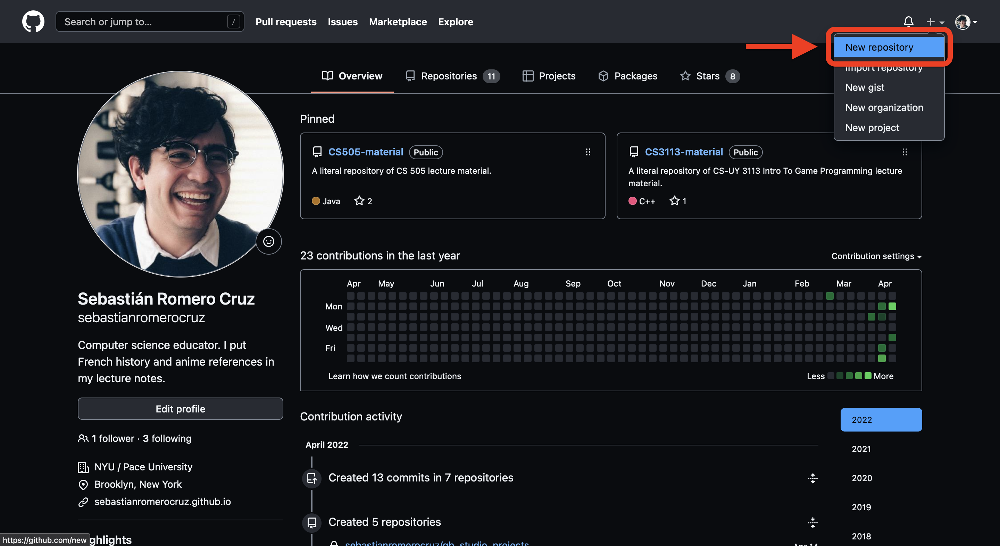


<sub>**Figures 1-3**: Creating a new public GitHub repository (or _repo_).</sub>

#### Step 2: _Cloning your repo_

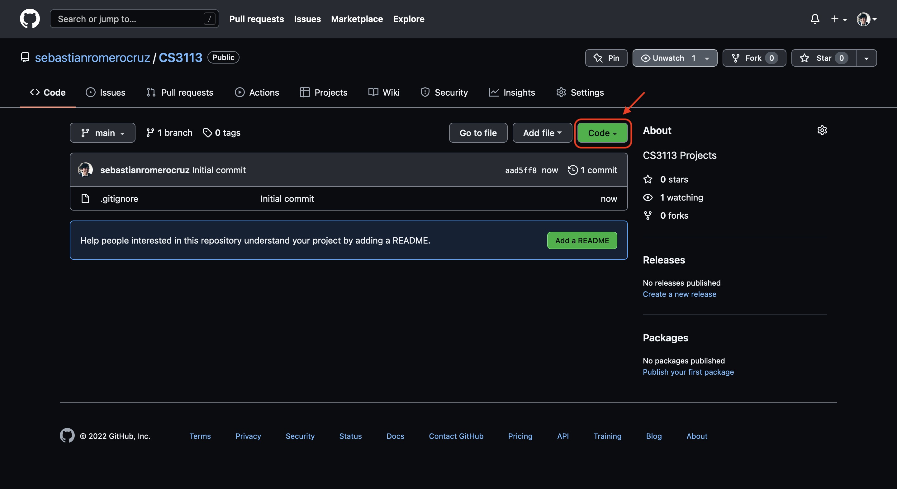
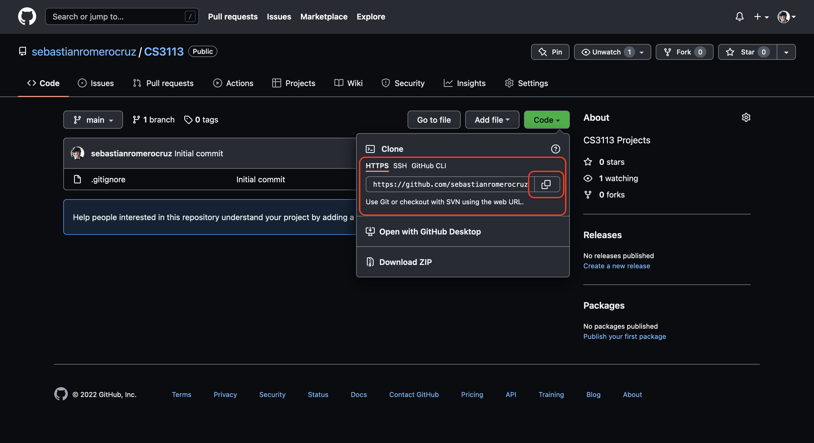
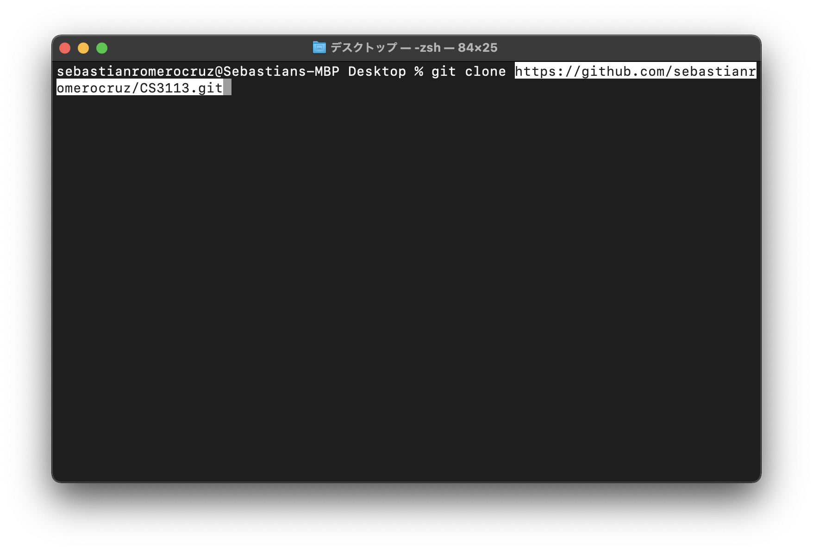
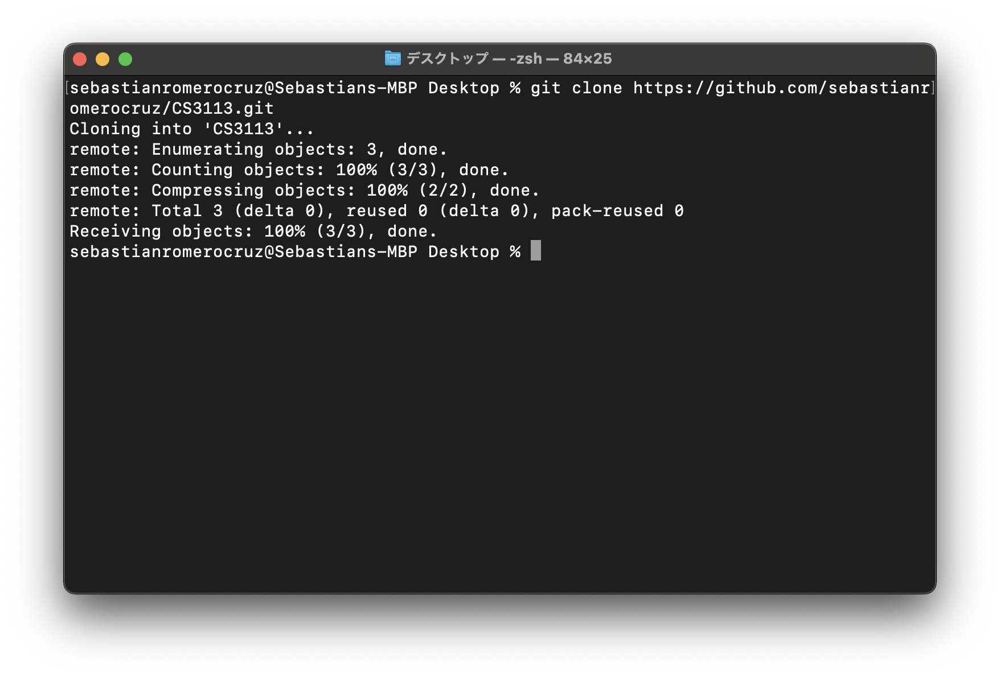
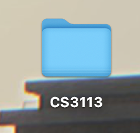

<sub>**Figures 4-7**: Getting the repo locally onto your computer.</sub>

#### Step 3: _Making and saving changes into your repo_

Let's make a simple change to your repo—create a `txt` file called `something.txt` inside your repo—and save
(i.e. push) them up to GitHub.

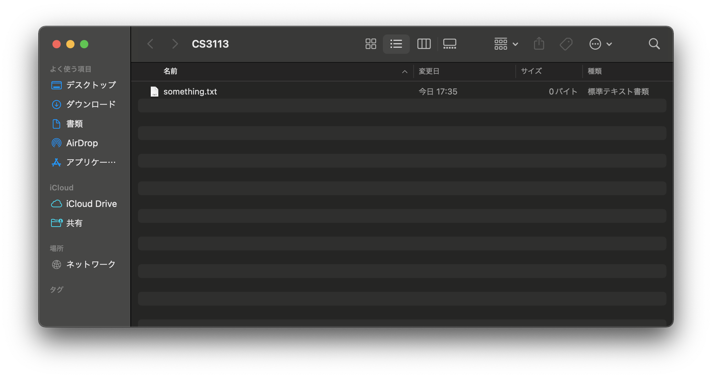

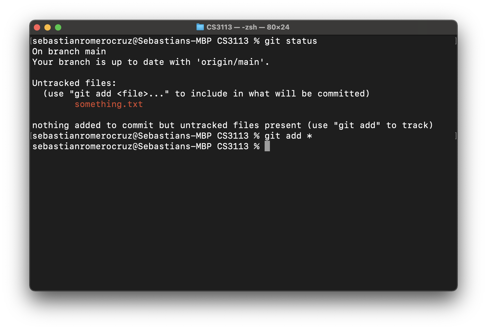
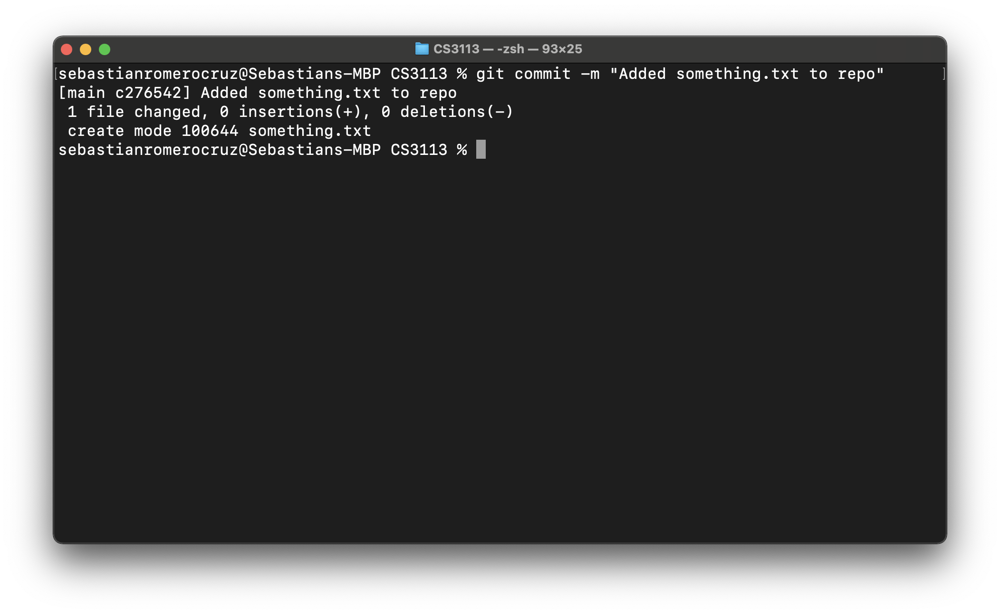
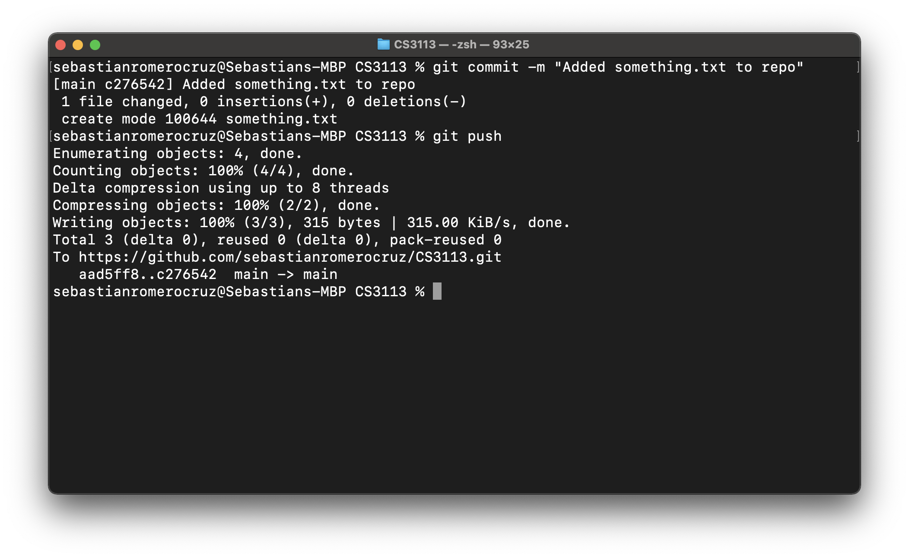


<sub>**Figures 9-14**: Making, adding, committing, and pushing changes onto GitHub.</sub>

### Part 2: _Opening a sample project_

Unfortunately, setting up OpenGL takes some setting up. A former instructor of the course and friend of mine, Carmine Guida, lent me these guides for each operating system, so please follow [**these instructions**](assets/Full%20Setup%20-%20Windows.pdf) if you are a Windows user or [**these instructions**](assets/Full%20Setup%20-%20Mac.pdf) if you are a Mac user. Once you've finished, come back to this `README`.

---

Alright, supposing that everything has been set-up correctly, the following code should compile without any errors:

```c++
#include <iostream>

#define GL_SILENCE_DEPRECATION

#ifdef _WINDOWS
#include <GL/glew.h>
#endif

#define GL_GLEXT_PROTOTYPES 1
#include <SDL.h>
#include <SDL_opengl.h>

const int WINDOW_WIDTH = 640;
const int WINDOW_HEIGHT = 480;
const float BG_RED = 0.1922f, BG_BLUE = 0.549f, BG_GREEN = 0.9059f;
const float BG_OPACITY = 1.0f;

SDL_Window* display_window;
bool game_is_running = true;

int main(int argc, char* argv[]) {
    SDL_Init(SDL_INIT_VIDEO);  // Initialising
    
    display_window = SDL_CreateWindow("Hello, World!", SDL_WINDOWPOS_CENTERED, SDL_WINDOWPOS_CENTERED, WINDOW_WIDTH, WINDOW_HEIGHT, SDL_WINDOW_OPENGL);
    
    SDL_GLContext context = SDL_GL_CreateContext(display_window);

    SDL_GL_MakeCurrent(display_window, context);
    
#ifdef _WINDOWS
    glewInit();
#endif

    glClearColor(BG_RED, BG_BLUE, BG_GREEN, BG_OPACITY);    
    
    SDL_Event event;
    while (game_is_running) {
        while (SDL_PollEvent(&event)) {
            if (event.type == SDL_QUIT || event.type == SDL_WINDOWEVENT_CLOSE) {
                game_is_running = false;
            }
        }
        
        glClear(GL_COLOR_BUFFER_BIT);
        SDL_GL_SwapWindow(display_window);
    }
    
    SDL_Quit();
    return 0;
}
```

And the result should be the following window popping up on your screen:

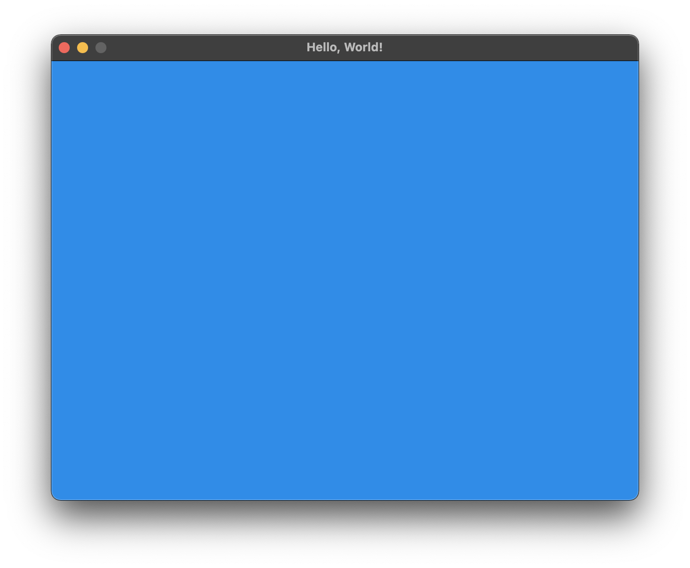

<sub>**Figure 15**: A lovely blue screen.</sub>

That's nice, isn't it? It may not seem like much, but getting pixels onto the screen using OpenGL is no small feat. Let's walk through the code, section by section, and understand what is going on here.

### Part 3: _Understanding the basics_

#### Housekeeping

The first few lines are fairly standard for OpenGL programs; we are basically just importing the necessary libraries for everything to run smoothly:

```c++
#define GL_SILENCE_DEPRECATION

#ifdef _WINDOWS
#include <GL/glew.h>
#endif

#define GL_GLEXT_PROTOTYPES 1
#include <SDL.h>
#include <SDL_opengl.h>
```

#### Constants and (global) variables

Next up are some constants that, while not strictly necessary, may make your programs easier to read and follow. For example, I define the dimensions of my display window, as well as the RGB values of my background, ahead of time. That way, if I have to change them on the fly, I can do so in one place only and not have to fish around for other instances of them. In short programs like these, it may not seem like a very big deal, but once you start making actual games, you're going to want to know what each value means, and to have an easy way to change them:

```c++
// Some constants necessary to get started
const int WINDOW_WIDTH = 640;
const int WINDOW_HEIGHT = 480;

// The background colours may change in the course of our games, so they can also be variables
const float BG_RED = 0.1922f, BG_BLUE = 0.549f, BG_GREEN = 0.9059f;
const float BG_OPACITY = 1.0f;
```

We also need to instantiate a couple of variables that are of supreme importance: our display window and our game-loop flag:

```c++
SDL_Window* display_window;
bool game_is_running = true;
```

`display_window` is simply where our game will be displayed, and `game_is_running` will keep track of whether our game is on or off. Naturally, it starts out as being on (or `true`), but if the player performs an action like closing the window, we will need a mechanism to flip this switch to `false`. We will talk about this in the sections that follow.

---

#### Starting our driver program

Just like in every other C++ program, we will need a `main`, or driver, function. Our game loop will reside in here:

```c++
int main(int argc, char* argv[])
{
    // The rest of the code described in this README will go in here
}
```

The first two things we have to do are initialise OpenGL and our `display_window` object:

```c++
SDL_Init(SDL_INIT_VIDEO);  // Initialising
    
display_window = SDL_CreateWindow("Hello, World!", 
                                  SDL_WINDOWPOS_CENTERED, SDL_WINDOWPOS_CENTERED, 
                                  WINDOW_WIDTH, WINDOW_HEIGHT, 
                                  SDL_WINDOW_OPENGL);
```

<sub>**Note**: For those of you who are curious, the parameters of [**`SDL_CreateWindow`**](https://wiki.libsdl.org/SDL_CreateWindow) are, in order: its title (`title`), its x-position (`x`), its y-position `y`, its width and height (`w` and `h`, respectively), and its flag (`flag`). Don't worry too much about what this flag means—all that matters is that it is `SDL_WINDOW_OPENGL` because we are working in an OpenGL context.</sub>

---

#### Setting up our context

Speaking of working in an OpenGL context, that's another thing we always have to create and set up:

```c++
    SDL_GLContext context = SDL_GL_CreateContext(display_window);  // Create an OpenGL context for an OpenGL window...
    SDL_GL_MakeCurrent(display_window, context);                   // ...and make it the context we are currently working in
```

An OpenGL context is many things, but you can think of it as an object that stores all of the "states" associated with this instance of OpenGL. Think of a context as an object that holds all of OpenGL; when a context is destroyed, OpenGL is also destroyed.

---

#### The game loop

And now, the moment of truth.

The function call making our background blue is the following:

```c++
glClearColor(BG_RED, BG_BLUE, BG_GREEN, BG_OPACITY);
```

<sub>**Note**: Remember our RBG values were defined in the constants section.</sub>

[**`glClearColor`**](https://docs.microsoft.com/en-us/windows/win32/opengl/glclearcolor) specifies the red, green, blue, and alpha values used by glClear to clear the color buffers (kind of like a computer screen might clear to black whenever it is inactive). In other words, we are making our screen 19.22% red, 54.9% green and 90.59% blue (a.k.a. [**bleu de France**](https://www.pantone.com/connect/18-4140-TCX)) with an opacity of 1.0 (a solid colour).

Having done this, we're ready to implement our game loop. For this, we use a `while`-loop that will run so long the `game_is_running` condition remains `true`. The mechanism we use to change this condition to `false` is by "polling", or waiting for, a user event (like a screen click or key press). For this simple program, the only event we will be polling for will be the user exiting the game:

```c++
SDL_Event event; // The SDL_Event type is a union that contains structures for the different event types, like quitting or closing
while (game_is_running) 
{
    /**
     Our games will go here, eventually!
        */
    while (SDL_PollEvent(&event)) 
    {
        /**
         Basically, while OpenGL is polling, or expecting, an event from the user, don't do anything.
            */
        if (event.type == SDL_QUIT || event.type == SDL_WINDOWEVENT_CLOSE) 
        {
            /**
             The only types of events we are expecting thus far are simple those that end our OpenGL program. This will change soon.
                */
            game_is_running = false;
        }
    }
    
    glClear(GL_COLOR_BUFFER_BIT); // Quite simply: clear the space in memory holding our colours
    SDL_GL_SwapWindow(display_window); // Update a window with whatever OpenGL is rendering
}
```