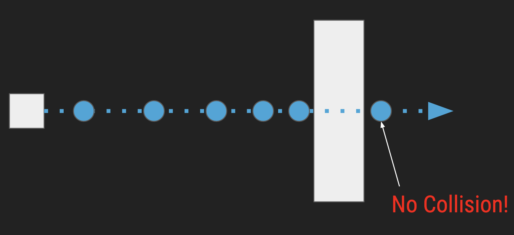

<h2 align=center>Week 6: <em>Day 2</em></h2>

<h1 align=center>Physics: <em>Fixed Timestep and Gravity</em></h1>

<h3 align=center>3 Wyvern Moon, Imperial Year MMXXIV<<h3>

<p align=center><strong><em>Song of the day</strong>: <a href="https://www.youtube.com/watch?v=rZxCk39NXxU"><strong><u>Drunk </u></strong></a> by Dijon (2019).</em></p>

---

### Sections

1. [**Fixed Time-step**](#part-1-fixed-time-step)
2. [**Gravity**](#part-2-gravity)

---

### Part 1: _Fixed Time-Step_

Just like in real life, video game physics must follow very rigid, consistent laws. One of those axiomatic measures that must be foolproof is the amount of space a body moves over time. We took our first step towards standardising this by adopting delta time. Currently, however, our timestep is as fast as our computer can go, which makes it variable. Now, while the delta time provides smooth movement on variable frame rates and is relatively simple to implement, physics simulations can become unstable if `Δt` varies too much. For instance, if our computer slows down / speeds up for whatever reason, we might end up with something like this:



```
Frame 1: t1 = 16ms
Frame 2: t2 = 18ms (Δt = t2 - t1 = 2ms)
Frame 3: t3 = 15ms (Δt = t3 - t2 = -3ms)

       |------|------|------|
  Time: 0     16ms   34ms   49ms
```

<sub>**Figures 1 and 2**: By slowing down right before a collision, the block has re-rendered beyond the way, avoiding a collision altogether.</sub>

The way we account for this is by using something called a **fixed-time step**. A fixed timestep (`Δt`) ensures that the game state updates at consistent intervals, regardless of the frame rate. This approach separates the update rate from the rendering rate, ensuring consistent behavior in the game's logic:
```
Fixed timestep: Δt = 16ms

Frame 1: t1 = 16ms
Frame 2: t2 = 16ms
Frame 3: t3 = 16ms

       |------|------|------|
  Time: 0     16ms   32ms   48ms
```

<sub>**Figure 3**: The amount of time between frames is now equal.</sub>

The basic idea of how to do this is to accumulate the elapsed time and process updates in fixed intervals. If the accumulated time exceeds the fixed timestep, the game updates multiple times within a single frame until the accumulated time is less than the fixed timestep.

**Steps:**
1. Calculate the elapsed time (`delta_time`) since the last frame.
2. Accumulate the elapsed time.
3. While the accumulated time is greater than or equal to the fixed timestep, update the game state and reduce the accumulated time by the fixed timestep.
4. Render the frame.

For example, consider the following two cases in which _only_ delta time is implemented vs the case where both delta time _and_ the fixed timestep is implemented. Update can run several times a timestep in this case.

#### Delta Time
```
Frame Time (ms):
|-----------16ms-----------|-------18ms------|--------15ms-------|
| Update & Render | Update & Render | Update & Render |
```

#### Fixed Timestep

```
Fixed Timestep (16ms):
|---16ms---|---16ms---|---16ms---|
| Update  | Update  | Update  |
           | Render   | Render  | Render  |

Elapsed Time:
|------Δt------|------Δt------|------Δt------|
```

Using a fixed timestep finally decouple decouples the update rate from the frame rate, resulting in consistent and stable game behavior, _especially_ for physics and movement, regardless of hardware differences.

```c++
constexpr float FIXED_TIMESTEP = 1.0f / 60.0f;

float g_time_accumulator = 0.0f;

void update()
{
    // ————— DELTA TIME ————— //
    float ticks = (float)SDL_GetTicks() / MILLISECONDS_IN_SECOND; // get the current number of ticks
    float delta_time = ticks - g_previous_ticks; // the delta time is the difference from the last frame
    g_previous_ticks = ticks;

    // ————— FIXED TIMESTEP ————— //
    // STEP 1: Keep track of how much time has passed since last step
    delta_time += g_time_accumulator;

    // STEP 2: Accumulate the ammount of time passed while we're under our fixed timestep
    if (delta_time < FIXED_TIMESTEP)
    {
        g_time_accumulator = delta_time;
        return;
    }

    // STEP 3: Once we exceed our fixed timestep, apply that elapsed time into the objects' update function invocation
    while (delta_time >= FIXED_TIMESTEP)
    {
        // Notice that we're using FIXED_TIMESTEP as our delta time
        g_game_state.player->update(FIXED_TIMESTEP);
        delta_time -= FIXED_TIMESTEP;
    }

    g_time_accumulator = delta_time;
}
```

<sub>**Code Block 1**: Accounting for the possibility of our computer messing with "space".</sub>

This may not make a huge difference in the games we've seen and made so far, but you can certainly imagine let's-players clipping through the walls of your game by exploiting the fact that you didn't take this into account. The fun in that is only when you don't expect it.

<br>

Choosing an appropriate fixed timestep is crucial for the stability and performance of your game. Here are some key considerations and steps for choosing the right fixed timestep. Some factors to consider are:

1. **Target Frame Rate**:
   - Common target frame rates for smooth gameplay are 30 FPS, 60 FPS, or higher.
   - Higher frame rates provide smoother gameplay but require more computational power.

2. **Game Type**:
   - Action games with fast-paced movement and physics simulations may require a higher update rate for accuracy.
   - Slower-paced games might tolerate a lower update rate.

3. **Physics Stability**:
   - Physics engines often have specific requirements for timestep intervals to ensure stable and accurate simulations.
   - Smaller timesteps provide more stable physics simulations but require more updates per second.

4. **Performance**:
   - Smaller timesteps mean more updates per second, which can be computationally expensive.
   - Balance between accuracy and performance is essential.

#### Common Fixed Timestep Values

1. **60 Updates per Second**:
   - Fixed timestep: 1/60 seconds (approximately 0.0166667 seconds or 16.67 milliseconds).
   - Common for fast-paced action games.
   - Provides a good balance between smoothness and performance.

2. **30 Updates per Second**:
   - Fixed timestep: 1/30 seconds (approximately 0.0333333 seconds or 33.33 milliseconds).
   - Used in less demanding games or for games targeting lower performance hardware.

3. **120 Updates per Second**:
   - Fixed timestep: 1/120 seconds (approximately 0.0083333 seconds or 8.33 milliseconds).
   - Used for very high-speed simulations or precise physics calculations.
   - Requires more computational power.

So, for a game targeting 60 updates per second:

```cpp
constexpr float FIXED_TIMESTEP = 1.0f / 60.0f; // ~0.0166667 seconds or 16.67 milliseconds
```

<br>

### Part 2: _Gravity_

Gravity, as defined by physics, is an acceleration—the rate at which velocity increases with respect to time. For Planet Earth, this rate of change of another rate of change is usually approximated to be 9.81 m/s<sup>2</sup>. Now, since we have position, and we have acceleration, we must also have the middle derivative, velocity:

```c++
// Entity.h
class Entity
{
private:
    glm::vec3 m_position;
    glm::vec3 m_velocity;
    glm::vec3 m_acceleration;

public:
    void update(float delta_time, Entity* collidable_entities, int collidable_entity_count);

    // ————— GETTERS ————— //
    glm::vec3 const get_position()     const { return m_position; };
    glm::vec3 const get_velocity()     const { return m_velocity; };
    glm::vec3 const get_acceleration() const { return m_acceleration; };
    glm::vec3 const get_movement()     const { return m_movement; };

    // ————— SETTERS ————— //
    void const set_position(glm::vec3 new_position) { m_position = new_position; };
    void const set_velocity(glm::vec3 new_velocity) { m_velocity = new_velocity; };
    void const set_acceleration(glm::vec3 new_position) { m_acceleration = new_position; };
    void const set_movement(glm::vec3 new_movement) { m_movement = new_movement; };
}
```
```c++
// Entity.cpp
// Default constructor
Entity::Entity()
    : m_position(0.0f), m_movement(0.0f), m_scale(1.0f, 1.0f, 0.0f), m_model_matrix(1.0f),
      m_speed(0.0f), m_animation_cols(0), m_animation_frames(0), m_animation_index(0),
      m_animation_rows(0), m_animation_indices(nullptr), m_animation_time(0.0f),
      m_texture_id(0), m_velocity(0.0f), m_acceleration(0.0f)
{
    // Initialize m_walking with zeros or any default value
    for (int i = 0; i < SECONDS_PER_FRAME; ++i)
        for (int j = 0; j < SECONDS_PER_FRAME; ++j) m_walking[i][j] = 0;
}

// Parameterized constructor
Entity::Entity(GLuint texture_id, float speed, int walking[4][4], float animation_time,
               int animation_frames, int animation_index, int animation_cols,
               int animation_rows)
    : m_position(0.0f), m_movement(0.0f), m_scale(1.0f, 1.0f, 0.0f), m_model_matrix(1.0f),
      m_speed(speed), m_animation_cols(animation_cols),
      m_animation_frames(animation_frames), m_animation_index(animation_index),
      m_animation_rows(animation_rows), m_animation_indices(nullptr),
      m_animation_time(animation_time), m_texture_id(texture_id), m_velocity(0.0f),
      m_acceleration(0.0f)
{
    set_walking(walking);
}

// Simpler constructor for partial initialization
Entity::Entity(GLuint texture_id, float speed)
    : m_position(0.0f), m_movement(0.0f), m_scale(1.0f, 1.0f, 0.0f), m_model_matrix(1.0f),
      m_speed(speed), m_animation_cols(0), m_animation_frames(0), m_animation_index(0),
      m_animation_rows(0), m_animation_indices(nullptr), m_animation_time(0.0f),
      m_texture_id(texture_id), m_velocity(0.0f), m_acceleration(0.0f)
{
    // Initialize m_walking with zeros or any default value
    for (int i = 0; i < SECONDS_PER_FRAME; ++i)
        for (int j = 0; j < SECONDS_PER_FRAME; ++j) m_walking[i][j] = 0;
}

void Entity::update(float delta_time, Entity* collidable_entities, int collidable_entity_count)
{
    // Some stuff...

    // Our character moves from left to right, so they need an initial velocity
    m_velocity.x = m_movement.x * m_speed;
    
    // And we add the gravity next
    m_velocity += m_acceleration * delta_time;
    m_position += m_velocity * delta_time;
    
    m_model_matrix = glm::mat4(1.0f);
    m_model_matrix = glm::translate(m_model_matrix, m_position);
}
```

```c++
// main.cpp
constexpr ACC_OF_GRAVITY -9.81f

void initialise()
{
    // Some code...

    // ————— PLAYER ————— //
    GLuint player_texture_id = load_texture(SPRITESHEET_FILEPATH);
    
    int player_walking_animation[4][4] =
    {
        { 1, 5, 9, 13 },  // for George to move to the left,
        { 3, 7, 11, 15 }, // for George to move to the right,
        { 2, 6, 10, 14 }, // for George to move upwards,
        { 0, 4, 8, 12 }   // for George to move downwards
    };

    g_game_state.player = new Entity(
        player_texture_id,         // texture id
        1.0f,                      // speed
        player_walking_animation,  // animation index sets
        0.0f,                      // animation time
        4,                         // animation frame amount
        0,                         // current animation index
        4,                         // animation column amount
        4                          // animation row amount
    );

    g_game_state.player->set_acceleration(glm::vec3(0.0f, ACC_OF_GRAVITY * 0.1, 0.0f));
    g_game_state.player->face_right();
}

void update()
{
    while (delta_time >= FIXED_TIMESTEP)
    {
        g_game_state.player->update(FIXED_TIMESTEP, g_game_state.platforms, 
                                    PLATFORM_COUNT);
        delta_time -= FIXED_TIMESTEP;
    }
}

void render()
{
    g_game_state.player->render(&g_shader_program);
}
```

<sub>**Code Blocks 2, 3, and 4**: Keeping track of our three physical vectors. For this model, we are commenting out all user movement in the vertical direction.</sub>

Of course, our player will drop endlessly, so let's add a platform:

```c++
// main.cpp
constexpr int PLATFORM_COUNT = 3;

struct GameState
{
    Entity* player;
    Entity* platforms;
};

void initialise()
{
    // ————— PLATFORM ————— //
    g_game_state.platforms = new Entity[PLATFORM_COUNT];

    for (int i = 0; i < PLATFORM_COUNT; i++)
    {
        g_game_state.platforms[i].set_texture_id(load_texture(PLATFORM_FILEPATH));
        g_game_state.platforms[i].set_position(glm::vec3(i - 1.0f, -3.0f, 0.0f));
        g_game_state.platforms[i].update(0.0f, nullptr, 0);
    }
}

void render()
{
    for (int i = 0; i < PLATFORM_COUNT; i++) 
        g_game_state.platforms[i].render(&g_shader_program);
}
```

<sub>**Code Block 5**: Adding a few platform entities.</sub>

And some simple collision detection between `Entity` objects:

```c++
// Entity.h
class Entity
{
private:
    // Some stuff...

    // This is an assumption based on our render() method's vertices
    // Think of using getters and setters to change these if necessary
    int m_width  = 1,
        m_height = 1;

public:
    bool const check_collision(Entity *other) const;

    // This is where keeping Entity objects nicely organised works nicely
    void update(float delta_time, Entity* collidable_entities, int entity_count);
}
```
```c++
// Entity.cpp
bool const Entity::check_collision(Entity* other) const
{
    float x_distance = fabs(m_position.x - other->m_position.x) - ((m_width + other->m_width) / 2.0f);
    float y_distance = fabs(m_position.y - other->m_position.y) - ((m_height + other->m_height) / 2.0f);

    return x_distance < 0.0f && y_distance < 0.0f;
}

void Entity::update(float delta_time, Entity* collidable_entities, int entity_count)
{
    // Check for collisions
    for (int i = 0; i < entity_count; i++)
    {
        if (check_collision(&collidable_entities[i])) return;
    }
}
```
```c++
// main.cpp
void initialise()
{
    // ————— PLATFORM ————— //
    g_game_state.platforms = new Entity[PLATFORM_COUNT];

    for (int i = 0; i < PLATFORM_COUNT; i++)
    {
        g_game_state.platforms[i].m_texture_id = load_texture(PLATFORM_FILEPATH);
        g_game_state.platforms[i].set_position(glm::vec3(i - 1.0f, -3.0f, 0.0f));
        g_game_state.platforms[i].update(0.0f, NULL, 0);
    }
}

void update()
{
    while (delta_time >= FIXED_TIMESTEP)
    {
        g_game_state.player->update(FIXED_TIMESTEP, g_game_state.platforms, PLATFORM_COUNT);
        delta_time -= FIXED_TIMESTEP;
    }
}
```

<sub>**Code Blocks 5 and 6**: Collision detection in `Entity`'s `update()` method.</sub>

Of course, we are stuck, since we are blocking all movement at collision. We'll fix that soon enough.
