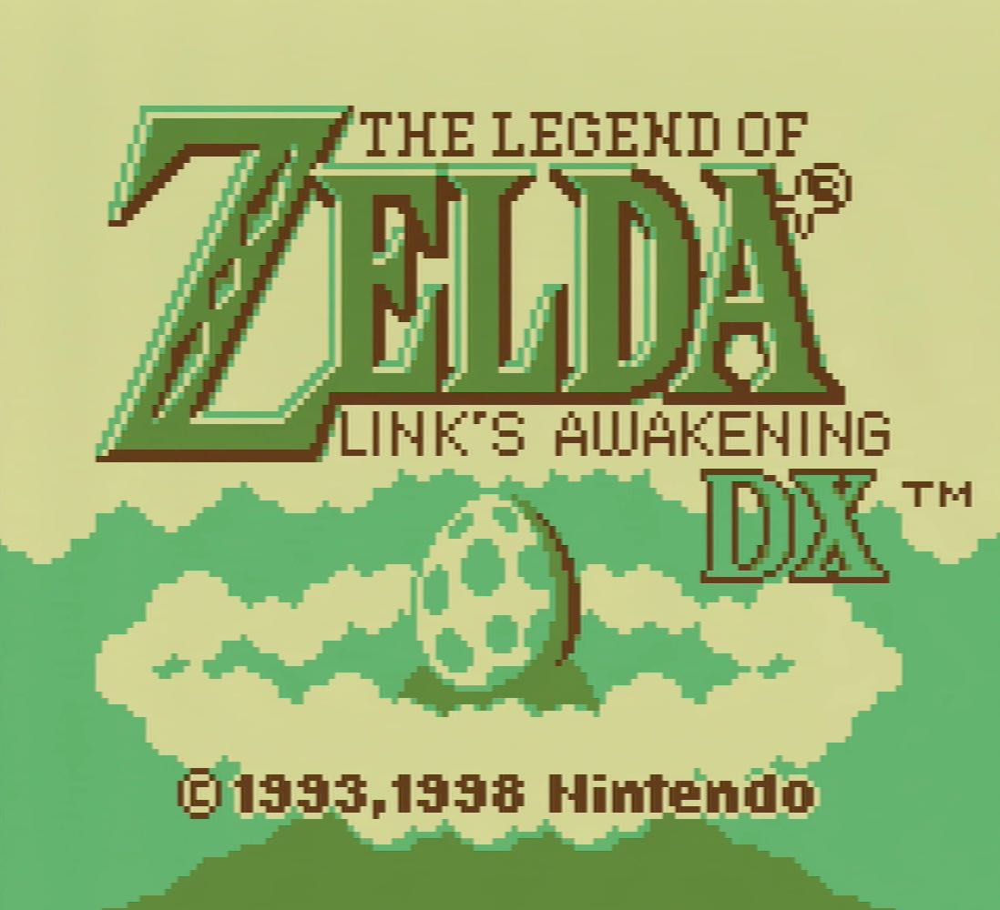

<h2 align=center>Week 8: <em>Part 2</em></h2>

<h1 align=center>Scenes</h1>

<h3 align=center>15 Lone Moon, Imperial Year MMXXIIV</h3>

***Song of the day***: _[**Cosmic Sermonettes EP**](https://youtu.be/mZq7RZd-9l8) by The Unperson (2019)._

---

### Sections

1. [**The `Utility` Class**](#part-1-the-utility-class)
2. [**Game Modes**](#part-2-game-modes)
3. [**Levels As Classes**](#part-3-levels-as-classes)
4. [**Clearning Up `main.cpp` And Preparing For Multiple Levels**](#part-4-cleaning-up-maincpp-and-preparing-for-multiple-levels)

### Part 1: _The `Utility` Class_

It's high-time we did some good ole TLC on our code. Refactoring is going to be essential now that we basically have all the pieces necessary for an entire platforming level. The next level of abstraction involves entire levels, so we need to do some clean-up to prepare for that.

The first step is to remove any class from our `main.cpp` file that is not included in our core `main()` function. We want this file to be as bare-bones as possible, so let's create a class to store all of these "helper" functions and have them available for use whenever we need them. You can call it whatever you like, of course, but I named it `Utility`. Here's what it looks like:

```c++
// Utility.h
#pragma once
#define GL_SILENCE_DEPRECATION

#ifdef _WINDOWS
#include <GL/glew.h>
#endif

#define GL_GLEXT_PROTOTYPES 1
#include <vector>
#include <SDL.h>
#include <SDL_opengl.h>
#include "glm/mat4x4.hpp"
#include "glm/gtc/matrix_transform.hpp"
#include "ShaderProgram.h"

class Utility {
public:
    // ————— METHODS ————— //
    static GLuint load_texture(const char* filepath);
    static void draw_text(ShaderProgram *program, GLuint font_texture_id, std::string text, float screen_size, float spacing, glm::vec3 position);
};
```
```c++
// Utility.cpp
#define LOG(argument) std::cout << argument << '\n'
#define STB_IMAGE_IMPLEMENTATION
#define NUMBER_OF_TEXTURES 1
#define LEVEL_OF_DETAIL    0
#define TEXTURE_BORDER     0
#define FONTBANK_SIZE      16

#include "Utility.h"
#include <SDL_image.h>
#include "stb_image.h"

GLuint Utility::load_texture(const char* filepath) {
    int width, height, number_of_components;
    unsigned char* image = stbi_load(filepath, &width, &height, &number_of_components, STBI_rgb_alpha);
    
    if (image == NULL)
    {
        LOG("Unable to load image. Make sure the path is correct.");
        assert(false);
    }
    
    GLuint texture_id;
    glGenTextures(NUMBER_OF_TEXTURES, &texture_id);
    glBindTexture(GL_TEXTURE_2D, texture_id);
    glTexImage2D(GL_TEXTURE_2D, LEVEL_OF_DETAIL, GL_RGBA, width, height, TEXTURE_BORDER, GL_RGBA, GL_UNSIGNED_BYTE, image);
    
    glTexParameteri(GL_TEXTURE_2D, GL_TEXTURE_MIN_FILTER, GL_NEAREST);
    glTexParameteri(GL_TEXTURE_2D, GL_TEXTURE_MAG_FILTER, GL_NEAREST);
    
    glTexParameteri(GL_TEXTURE_2D, GL_TEXTURE_WRAP_S, GL_REPEAT);
    glTexParameteri(GL_TEXTURE_2D, GL_TEXTURE_WRAP_T, GL_REPEAT);
    
    stbi_image_free(image);
    
    return texture_id;
}

void Utility::draw_text(ShaderProgram *program, GLuint font_texture_id, std::string text, float screen_size, float spacing, glm::vec3 position)
{
    float width = 1.0f / FONTBANK_SIZE;
    float height = 1.0f / FONTBANK_SIZE;

    
    std::vector<float> vertices;
    std::vector<float> texture_coordinates;
    
    for (int i = 0; i < text.size(); i++) {
        // 1. Get their index in the spritesheet, as well as their offset (i.e. their position
        //    relative to the whole sentence)
        int spritesheet_index = (int) text[i];  // ascii value of character
        float offset = (screen_size + spacing) * i;
        
        // 2. Using the spritesheet index, we can calculate our U- and V-coordinates
        float u_coordinate = (float) (spritesheet_index % FONTBANK_SIZE) / FONTBANK_SIZE;
        float v_coordinate = (float) (spritesheet_index / FONTBANK_SIZE) / FONTBANK_SIZE;

        // 3. Inset the current pair in both vectors
        vertices.insert(vertices.end(), {
            offset + (-0.5f * screen_size), 0.5f * screen_size,
            offset + (-0.5f * screen_size), -0.5f * screen_size,
            offset + (0.5f * screen_size), 0.5f * screen_size,
            offset + (0.5f * screen_size), -0.5f * screen_size,
            offset + (0.5f * screen_size), 0.5f * screen_size,
            offset + (-0.5f * screen_size), -0.5f * screen_size,
        });

        texture_coordinates.insert(texture_coordinates.end(), {
            u_coordinate, v_coordinate,
            u_coordinate, v_coordinate + height,
            u_coordinate + width, v_coordinate,
            u_coordinate + width, v_coordinate + height,
            u_coordinate + width, v_coordinate,
            u_coordinate, v_coordinate + height,
        });
    }

    // 4. And render all of them using the pairs
    glm::mat4 model_matrix = glm::mat4(1.0f);
    model_matrix = glm::translate(model_matrix, position);
    
    program->set_model_matrix(model_matrix);
    glUseProgram(program->get_program_id());
    
    glVertexAttribPointer(program->get_position_attribute(), 2, GL_FLOAT, false, 0, vertices.data());
    glEnableVertexAttribArray(program->get_position_attribute());
    glVertexAttribPointer(program->get_tex_coordinate_attribute(), 2, GL_FLOAT, false, 0, texture_coordinates.data());
    glEnableVertexAttribArray(program->get_tex_coordinate_attribute());
    
    glBindTexture(GL_TEXTURE_2D, font_texture_id);
    glDrawArrays(GL_TRIANGLES, 0, (int) (text.size() * 6));
    
    glDisableVertexAttribArray(program->get_position_attribute());
    glDisableVertexAttribArray(program->get_tex_coordinate_attribute());
}
```
<sub>**Code Blocks [1](SDLProject/Utility.h) and [2](SDLProject/Utility.cpp)**: Two functions, independent to any other structures from our program, made into methods of the `Utility` class. Notice that I made them both static so as to avoid having to create a `Utility` object.</sub>

One this to watch out for is that `Utility` should be the only file to have the following three lines. Delete them from everywhere else:

```c++
#define STB_IMAGE_IMPLEMENTATION
#include <SDL_image.h>
#include "stb_image.h
```

This pares down our `main.cpp` file a good amount but, of course, we're not stopping there. Most every game tracing back to the arcade era has more than one level to them. It's only logical that ours do as well.

### Part 2: _Game Modes_

Let's think about how games present themselves. When you first switch a game on, you are more often than not greeted by a start screen, no?



<sub>**Figure 1**: Nintendo's _Link's Awakening_ start "state". This is not a level or dungeon of any kind, and yet it is still very much part of the game.</sub>

This, in spite of not really being heavy on gameplay, is considered one of the many "states" of the game. That is, if we were to think of this in terms of pseudocode, you could say that the game might change from state to state constantly depending on the actions of the player:

```
states = { start_screen, save_file_screen, level_1, level_2 }
```

In other words, the player will turn on the game and immediately be taken to the `start_screen` state, or **scene**, and then proceed to the rest of the levels accordingly:

```
+––––––––––––––+
| Start Screen |
+––––––––––––––+
       |      +––––––––––––––––––––+       +–––––––––+       +–––––––––+
       +––––> | File Select Screen | ––––> | Level 1 | ––––> | Level 2 | ––––> ...
              +––––––––––––––––––––+       +–––––––––+       +–––––––––+
                           ^                    ^                ^
                            \                    \              /
                             \–––––––––––––––––\  \––\      /––/
                                                \     \    /
                                                 \     v  v
                                                +––––––––––––––+
                                                | Start Screen |
                                                +––––––––––––––+
```

<sub>**Figure 2**: How our game's scenes might be connected. Think of each of those arrows as pointers, where a player's button press or achievement in-level might trigger our scene to "swap out" for another one (e.g. pressing the `Start` button would swap out the `Level 1` scene for the `Start Screen` screen).</sub>

This turns out to be pretty close to what we'll achieve today. We would like our game to simply switch from state to state whenever the player performs certain actions, and each other states will have their own `initialise()`, `update()`, and `render()` methods. We're gonna call these special states "scenes", and will define them via the `Scene` class:

```c++
// Scene.h
#pragma once
#define GL_SILENCE_DEPRECATION

#ifdef _WINDOWS
#include <GL/glew.h>
#endif

#define GL_GLEXT_PROTOTYPES 1
#include <SDL_mixer.h>
#include <SDL.h>
#include <SDL_opengl.h>
#include "glm/mat4x4.hpp"
#include "glm/gtc/matrix_transform.hpp"
#include "ShaderProgram.h"
#include "Util.h"
#include "Entity.h"
#include "Map.h"

/**
    Notice that the game's state is now part of the Scene class, not the main file.
*/
struct GameState
{
    // ————— GAME OBJECTS ————— //
    Map *map;
    Entity *player;
    Entity *enemies;
    
    // ————— AUDIO ————— //
    Mix_Music *bgm;
    Mix_Chunk *jump_sfx;
    
    // ————— POINTERS TO OTHER SCENES ————— //
    int next_scene_id;
};

class Scene {
public:
    // ————— ATTRIBUTES ————— //
    int m_number_of_enemies = 1;
    
    GameState m_state;
    
    // ————— METHODS ————— //
    virtual void initialise() = 0;
    virtual void update(float delta_time) = 0;
    virtual void render(ShaderProgram *program) = 0;
    
    // ————— GETTERS ————— //
    GameState const get_state()             const { return m_state;             }
    int       const get_number_of_enemies() const { return m_number_of_enemies; }
};
```
```c++
// Scene.cpp
#include "Scene.h"
```

<sub>**Code Blocks [3](SDLProject/Scene.h) and [4](SDLProject/Scene.cpp)**: Consider this our most general representation of levels. Notice that I made our main three methods virtual to all the child classes to define their own behaviour (hence our very-empty `Scene.cpp`). Each one of those child classes will be represent a level.</sub>

### Part 3: _Levels As Classes_

Let's define our first "level". This can be very specific to whatever game you are making. I'm going to make show you a rather simple version, but feel free to change it, personalise it, and refine it as much as you like!

```c++
// LevelA.h
#include "Scene.h"

class LevelA : public Scene {
public:
    // ————— STATIC ATTRIBUTES ————— //
    int ENEMY_COUNT = 1;
    
    // ————— CONSTRUCTOR ————— //
    ~LevelA();
    
    // ————— METHODS ————— //
    void initialise() override;
    void update(float delta_time) override;
    void render(ShaderProgram *program) override;
};
```
```c++
// LevelA.cpp
#include "LevelA.h"
#include "Utility.h"

#define LEVEL_WIDTH 14
#define LEVEL_HEIGHT 8

unsigned int LEVEL_DATA[] =
{
    3, 0, 0, 0, 0, 0, 0, 0, 0, 0, 0, 0, 0, 0,
    3, 0, 0, 0, 0, 0, 0, 0, 0, 0, 0, 0, 0, 0,
    3, 0, 0, 0, 0, 0, 0, 0, 0, 0, 0, 0, 0, 0,
    3, 0, 0, 0, 0, 0, 0, 0, 0, 0, 0, 0, 0, 0,
    3, 0, 0, 0, 0, 0, 0, 0, 0, 0, 0, 0, 0, 0,
    3, 0, 0, 0, 0, 0, 0, 0, 0, 1, 1, 1, 1, 1,
    3, 1, 1, 1, 1, 1, 1, 1, 1, 2, 2, 2, 2, 2,
    3, 2, 2, 2, 2, 2, 2, 2, 2, 2, 2, 2, 2, 2
};

LevelA::~LevelA()
{
    delete [] m_state.enemies;
    delete    m_state.player;
    delete    m_state.map;
    Mix_FreeChunk(m_state.jump_sfx);
    Mix_FreeMusic(m_state.bgm);
}

void LevelA::initialise()
{
    GLuint map_texture_id = Utility::load_texture("assets/tileset.png");
    m_state.map = new Map(LEVEL_WIDTH, LEVEL_HEIGHT, LEVEL_DATA, map_texture_id, 1.0f, 4, 1);
    
    // Code from main.cpp's initialise()
    /**
     George's Stuff
     */
    // Existing
    m_state.player = new Entity();
    m_state.player->set_entity_type(PLAYER);
    m_state.player->set_position(glm::vec3(5.0f, 0.0f, 0.0f));
    m_state.player->set_movement(glm::vec3(0.0f));
    m_state.player->set_speed(2.5f);
    m_state.player->set_acceleration(glm::vec3(0.0f, -9.81f, 0.0f));
    m_state.player->m_texture_id = Utility::load_texture("assets/george_0.png");
    
    // Walking
    m_state.player->m_walking[m_state.player->LEFT]  = new int[4] { 1, 5, 9,  13 };
    m_state.player->m_walking[m_state.player->RIGHT] = new int[4] { 3, 7, 11, 15 };
    m_state.player->m_walking[m_state.player->UP]    = new int[4] { 2, 6, 10, 14 };
    m_state.player->m_walking[m_state.player->DOWN]  = new int[4] { 0, 4, 8,  12 };

    m_state.player->m_animation_indices = m_state.player->m_walking[m_state.player->RIGHT];  // start George looking left
    m_state.player->m_animation_frames = 4;
    m_state.player->m_animation_index  = 0;
    m_state.player->m_animation_time   = 0.0f;
    m_state.player->m_animation_cols   = 4;
    m_state.player->m_animation_rows   = 4;
    m_state.player->set_height(0.8f);
    m_state.player->set_width(0.8f);
    
    // Jumping
    m_state.player->m_jumping_power = 5.0f;
    
    /**
     Enemies' stuff */
    GLuint enemy_texture_id = Utility::load_texture("assets/soph.png");
    
    m_state.enemies = new Entity[ENEMY_COUNT];
    m_state.enemies[0].set_entity_type(ENEMY);
    m_state.enemies[0].set_ai_type(GUARD);
    m_state.enemies[0].set_ai_state(IDLE);
    m_state.enemies[0].m_texture_id = enemy_texture_id;
    m_state.enemies[0].set_position(glm::vec3(8.0f, 0.0f, 0.0f));
    m_state.enemies[0].set_movement(glm::vec3(0.0f));
    m_state.enemies[0].set_speed(1.0f);
    m_state.enemies[0].set_acceleration(glm::vec3(0.0f, -9.81f, 0.0f));
    
    
    /**
     BGM and SFX
     */
    Mix_OpenAudio(44100, MIX_DEFAULT_FORMAT, 2, 4096);
    
    m_state.bgm = Mix_LoadMUS("assets/dooblydoo.mp3");
    Mix_PlayMusic(m_state.bgm, -1);
    Mix_VolumeMusic(0.0f);
    
    m_state.jump_sfx = Mix_LoadWAV("assets/bounce.wav");
}

void LevelA::update(float delta_time)
{
    m_state.player->update(delta_time, m_state.player, m_state.enemies, ENEMY_COUNT, m_state.map);
    
    for (int i = 0; i < ENEMY_COUNT; i++)
    {
        m_state.enemies[i].update(delta_time, m_state.player, NULL, NULL, m_state.map);
    }
}

void LevelA::render(ShaderProgram *program)
{
    m_state.map->render(program);
    m_state.player->render(program);
}
```

<sub>**Code Blocks [5](SDLProject/LevelA.h) and [6](SDLProject/LevelA.cpp)**: Notice that this class is now doing most of the heavy lifting that used to be part of `main.cpp`.</sub>

As you can see, we're forming a very cool hierarchy whereby, for example, `main.cpp`'s `update()` method will simply need to call the `LevelA` object's `update()`, which would itself trigger every single `Entity` object's `update()` method.

---

Speaking of `main.cpp`, where does all of this refactoring leave it?

### Part 4: _Cleaning Up `main.cpp` And Preparing For Multiple Levels_

This may be the most jarring of changes from this lecture; we're very used to seeing a lot of the code that we've abstracted away inside of `main.cpp`. But now it's time to update it in such a way that will fit our new object-oriented paradigm.

Essentially:

1. Create a `Scene` pointer that will point to the current scene being used in the game.
2. Create a `LevelA` pointer that will represent our first scene: Level A. Later, when we have multiple scenes, this pointer will instead point to an array of `Scene` objects because polymorphism is beautiful.
3. Create a standalone function (or one that statically belongs to the `Utility` class) that will switch the pointer from step 1 into the current scene. This function will be triggered every time we switch scenes (e.g. when we finish level A and we want to move on to level B).
4. Delete basically all of the code involving entities from `initialise()` and instead instantiate your pointers from steps 1 and 2.
5. Everywhere in `main.cpp` where we previously did `state.player` will be now replaced by `current_scene->state.player`. `update()` and `render()` in particular will be reduced to a single call of `current_scene->update()`.

Cleaning this up is a laborious process, but after doing so properly, your program should work in exactly the same way as it did before this lecture:

```c++
#define LEVEL1_WIDTH 14
#define LEVEL1_HEIGHT 8
#define LEVEL1_LEFT_EDGE 5.0f

#include "Utility.h"
#include "Scene.h"
#include "LevelA.h"

// ————— GLOBAL VARIABLES ————— //
Scene *g_current_scene;
LevelA *g_level_a;

void switch_to_scene(Scene *scene)
{
    g_current_scene = scene;
    g_current_scene->initialise();
}

void initialise()
{
    g_level_a = new LevelA();
    switch_to_scene(g_level_a);
}

void process_input()
{
    g_current_scene->m_state.player->set_movement(glm::vec3(0.0f));
    
    SDL_Event event;
    while (SDL_PollEvent(&event))
    {
        switch (event.type) {
        case SDL_QUIT:
        case SDL_WINDOWEVENT_CLOSE:
            g_game_is_running  = false;
            break;

        case SDL_KEYDOWN:
            switch (event.key.keysym.sym) {
            case SDLK_q:
                // Quit the game with a keystroke
                g_game_is_running  = false;
                break;

            case SDLK_SPACE:
                // Jump
                    if (g_current_scene->m_state.player->m_collided_bottom)
                {
                    g_current_scene->m_state.player->m_is_jumping = true;
                    Mix_PlayChannel(-1, g_current_scene->m_state.jump_sfx, 0);
                }
                break;

            default:
                break;
            }

        default:
            break;
        }
    }

    const Uint8* key_state = SDL_GetKeyboardState(NULL);

    if (key_state[SDL_SCANCODE_LEFT])
    {
        g_current_scene->m_state.player->move_left();
        g_current_scene->m_state.player->m_animation_indices = g_current_scene->m_state.player->m_walking[g_current_scene->m_state.player->LEFT];
    }
    else if (key_state[SDL_SCANCODE_RIGHT])
    {
        g_current_scene->m_state.player->move_right();
        g_current_scene->m_state.player->m_animation_indices = g_current_scene->m_state.player->m_walking[g_current_scene->m_state.player->RIGHT];
    }

    // This makes sure that the player can't move faster diagonally
    if (glm::length(g_current_scene->m_state.player->get_movement()) > 1.0f)
    {
        g_current_scene->m_state.player->set_movement(glm::normalize(g_current_scene->m_state.player->get_movement()));
    }
}

void update()
{
    while (delta_time >= FIXED_TIMESTEP) {
        // ————— UPDATING THE SCENE (i.e. map, character, enemies...) ————— //
        g_current_scene->update(FIXED_TIMESTEP);
        delta_time -= FIXED_TIMESTEP;
    }

    if (g_current_scene->m_state.player->get_position().x > LEVEL1_LEFT_EDGE) {
        view_matrix = glm::translate(view_matrix, glm::vec3(-g_current_scene->m_state.player->get_position().x, 3.75, 0));
    } else {
        view_matrix = glm::translate(view_matrix, glm::vec3(-5, 3.75, 0));
    }
}

void render()
{
    g_current_scene->render(&g_shader_program);
}

void shutdown()
{
    delete g_level_a;
}
```

<sub>**Code Block [7](SDLProject/main.cpp)**: Our refactored `main.cpp`. I'm only showing the lines involving the state. See the actual file for the full code.</sub>


<sub>**Figure 2**: Our first level. Next time, we'll explore having more than one.</sub>
