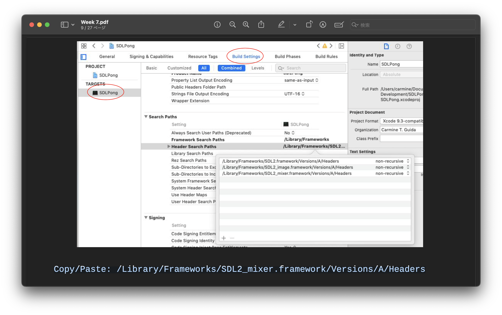

<h2 align=center>Week 07: <em>Part 1</em></h2>

<h1 align=center>Sound Effects</h1>

<h3 align=center>27 Wyvern Moon, Imperial Year MMXXIII<h3>

<p align=center><strong><em>Song of the day</strong>: <a href="https://youtu.be/SRLLHIE8RZU?si=RXmDYewrTPi1OK88"><strong><u>Of All The Gin Joints In The World</u></strong></a> by Fall Out Boy (2005).</em></p>

### Sections

1. [**Audio: Feedback, Environment, and Mood**](#part-1-audio-feedback-environment-and-mood)
2. [**`SDL_mixer`**](#part-2-sdl_mixer)
3. [**Music**](#part-3-music)
3. [**Sound Effects**](#part-3-sound-effects)
 
### Part 1: _Audio: Feedback, Environment, and Mood_

One of the unsung heroes of video game develepment is sound design. What started out as simple beeps and boops in games like [**Pong**](https://youtu.be/e4VRgY3tkh0) and an endlessly repeating background music track in [**Super Mario Bros**](https://youtu.be/-avspZlbOWU?t=13) has evolved into a dynamic and essential part of the game itself. For example, in games like [**Celeste**](https://youtu.be/gXJT9wgu7Wg) the background track of almost every level will dynamically change as you progress through the map, whether it be by growing in intensity or getting calmer. This is, of course, only one example. Many video games with multiple characters will have distinct sound effects for each of them, as can be seen in [**Overwatch**](https://youtu.be/teun_wZ8_LI).

But it can go even deeper than that. Many of us have fond memories of playing rhythm games like [**Dance Dance Revolution**](https://youtu.be/sv7gxqEhcBo?t=68) and [**Cytus**](https://youtu.be/RKP4R_HwyNE)–both of which rely on mechanics entirely based on sound a music. The game [**DubWars**](https://youtu.be/VJFi3gI7j6w)'s gameplay consists entirely of the player having different abilities depending on the music. Sounds design is often an entire class or sets of classes in majors like film and music composition, and for good reason. Of course, we'll only scratch the surface of it in this class, but coming up with clever mechanics based on music can make a game with a simple visual design appear much more complex and polished.

There are plenty of online sources from which you can pull royalty-free [**music**](https://incompetech.filmmusic.io/search/) and [**sound**](https://freesound.org) from, by the way. Don't pay for anything unless you absolutely need/want to!

### Part 2: _`SDL_mixer`_

The library we will be using in this class is called [**`SDL_mixer`**](https://github.com/libsdl-org/SDL_mixer) which, according to its documentation, is:

> ...a sample multi-channel audio mixer library. It supports any number of simultaneously playing channels of 16 bit stereo audio, plus a single channel of music, mixed by the popular FLAC, MikMod MOD, Timidity MIDI, Ogg Vorbis, and SMPEG MP3 libraries.

For both operating systems, using these libraries requires a few simple steps. For:

- **Windows**, copy these two DLLs to the directory your project is in. They are located in: `C:\SDL\SDL2_mixer\lib\x86`:
    - `SDL2_mixer.dll`
    - `smpeg2.dll`
- **MacOS**, copy and paste `/Library/Frameworks/SDL2_mixer.framework/Versions/A/Headers` into the following field on you xCode project:



<sub>**Figure 1**: Setting up `SDL_mixer` libraries. Assumes that you are working with your Pong project, but the steps are the same for any of our OpenGL projects.</sub>

For both operating systems, you'll then need to add the following lines:

```cpp
// Including the audio library
#include <SDL_mixer.h>

const int CD_QUAL_FREQ    = 44100,  // compact disk (CD) quality frequency
          AUDIO_CHAN_AMT  = 2,
          AUDIO_BUFF_SIZE = 4096;

void initialise()
{
    // Initialising both the video AND audio subsystems
    // We did something similar when we talked about video game controllers
    SDL_Init(SDL_INIT_VIDEO | SDL_INIT_AUDIO);

    // Start Audio
    Mix_OpenAudio(
        CD_QUAL_FREQ,        // the frequency to playback audio at (in Hz)
        MIX_DEFAULT_FORMAT,  // audio format
        AUDIO_CHAN_AMT,      // number of channels (1 is mono, 2 is stereo, etc).
        AUDIO_BUFF_SIZE      // audio buffer size in sample FRAMES (total samples divided by channel count)
        );
}
```

<sub>**Code Block 1**: The setup for using audio in our projects. You can find the docs for `Mix_OpenAudio` [**here**](https://wiki.libsdl.org/SDL2_mixer/Mix_OpenAudio).</sub>

### Part 3: _Music_

The first thing to know about `SDL_mixer` is that it acts much in the same way a real-life music and sound mixes does: it has several channels, each dedicated to one audio track. We then control the amplitude levels (i.e. how loud it is) of each of these tracks in order to get the appropriate "mix" for each of these tracks.

For the purposes of this class, we will be only be able to use 1 channel for background music (BGM) mp3 track, and is similar to a texture in the sense that, when we load it, we get a pointer to the data. The code necessary to do so is as follows:

```cpp
const char BGM_FILEPATH[] = "music.mp3";
const int    LOOP_FOREVER = -1;  // -1 means loop forever in Mix_PlayMusic; 0 means play once and loop zero times

Mix_Music *g_music;

void initialise()
{
    // Music initialisation above... 

    // Similar to our custom function load_texture
    g_music = Mix_LoadMUS(BGM_FILEPATH);

    // This will schedule the music object to begin mixing for playback.
    // The first parameter is the pointer to the mp3 we loaded 
    // and second parameter is the number of times to loop.
    Mix_PlayMusic(g_music, LOOP_FOREVER);

    // Set the music to half volume
    // MIX_MAX_VOLUME is a pre-defined constant
    Mix_VolumeMusic(MIX_MAX_VOLUME / 2);

    // Stop the music
    // This probably wouldn't go in initialise
    // Mix_HaltMusic();
}
```

<sub>**Code Block 2**: Note that [**`Mix_LoadMUS`**](https://wiki.libsdl.org/SDL2_mixer/Mix_LoadMUS) should only be used with mp3 files, although other file types are possible.</sub>

### Part 3: _Sound Effects_

Sound effects work much in the same way as our BGM track does, except that we have multiple channels available for these. This makes sense, as your game will likely involve multiple sounds depending on the mechanics that you have set up for it. The key thing to know here is that the sound files _must be **16-bit WAV files**_ in order to be properly loaded into OpenGL, and is done by the following lines of code:

```cpp
const int PLAY_ONCE   =  0,
          NEXT_CHNL   = -1,  // next available channel
          MUTE_VOL    =  0,
          MILS_IN_SEC = 1000,
          ALL_SFX_CHN = -1;

// Declare your sfx globally...
Mix_Chunk *g_bouncing_sfx;

// And then, somewhere else in your code...
void initialise()
{
    g_bouncing_sfx = Mix_LoadWAV("bounce.wav");

    Mix_PlayChannel(
        NEXT_CHNL,       // using the first channel that is not currently in use...
        g_bouncing_sfx,  // ...play this chunk of audio...
        PLAY_ONCE        // ...once.
        );

    // Fade in (from 0 to full volume) over 1 second
    Mix_FadeInChannel(
        NEXT_CHNL,       // using the first channel that is not currently in use...
        g_bouncing_sfx,  // ...fade in this chunk of audio from volume 0 to max volume...
        PLAY_ONCE,       // ...once...
        MILS_IN_SEC      // ...over 1000 miliseconds.
        );

    Mix_Volume(
        ALL_SFX_CHN,        // Set all channels...
        MIX_MAX_VOLUME / 2  // ...to half volume.
        );

    Mix_VolumeChunk(
        g_bouncing_sfx,     // Set the volume of the bounce sound...
        MIX_MAX_VOLUME / 4  // ... to 1/4th.
        );

    // Stop all sound effects
    // Mix_HaltChannel(ALL_SFX_CHN);
}
```

<sub>**Code Block 3**: If you have an audio file that isn't 16-bit WAV format, you can easily convert them using a free audio software tool such as [**Audacity**](https://youtu.be/WEkB6eVhlqs).</sub>

---

The last thing to note is that we need to clean this stuff up once our game is finished, so don't forget to add the following lines to your code:

```cpp
void shutDown()
{
    Mix_FreeChunk(g_bouncing_sfx);
    Mix_FreeMusic(g_music);
    SDL_Quit();
}
```

<sub>**Code Block 4**: Nobody likes a memory leak.</sub>