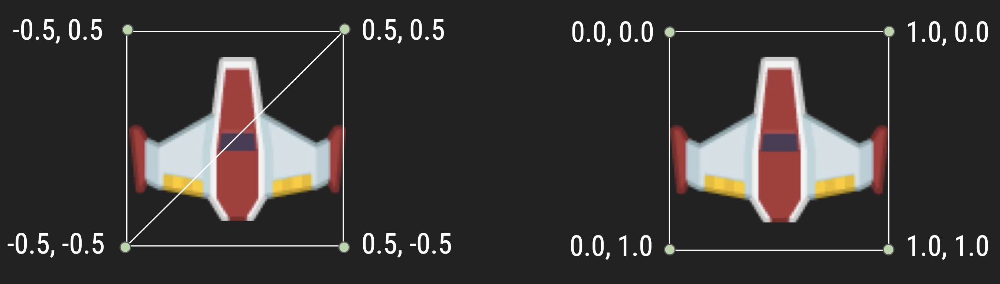
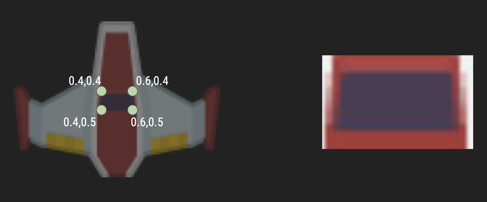
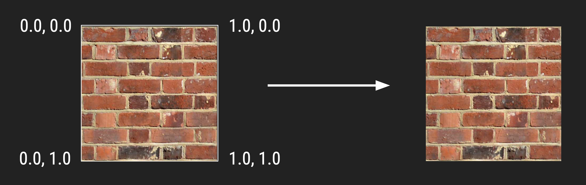
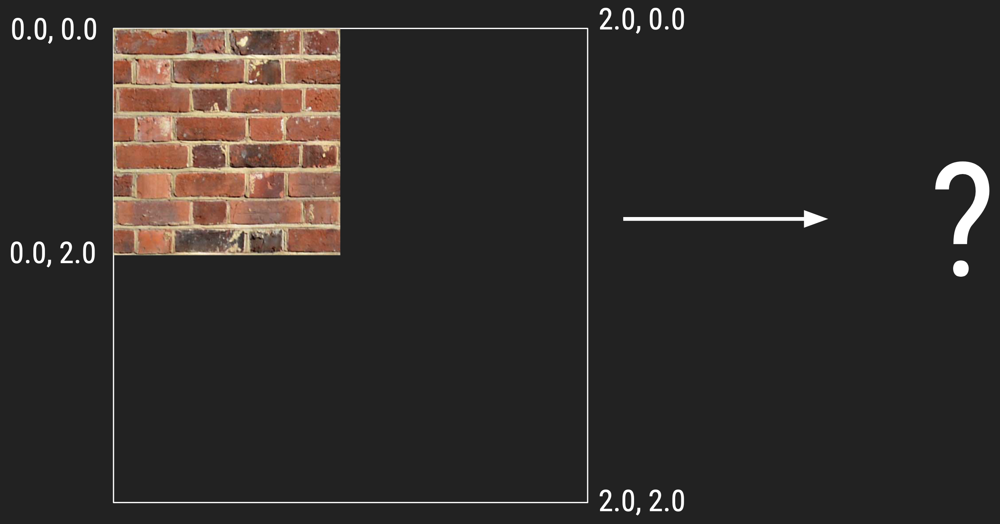
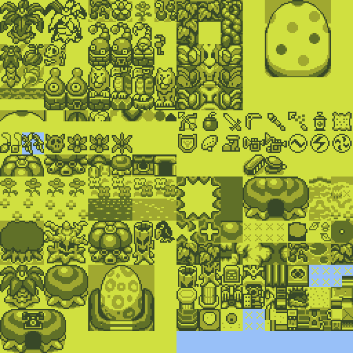
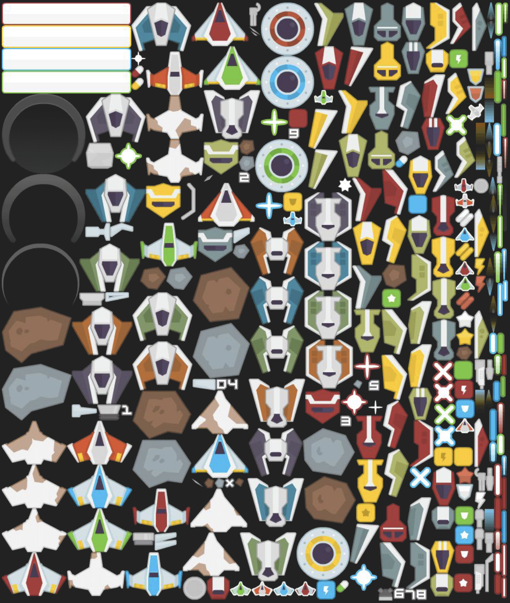
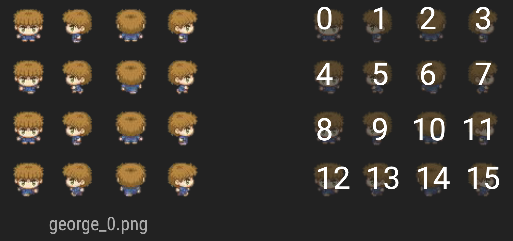
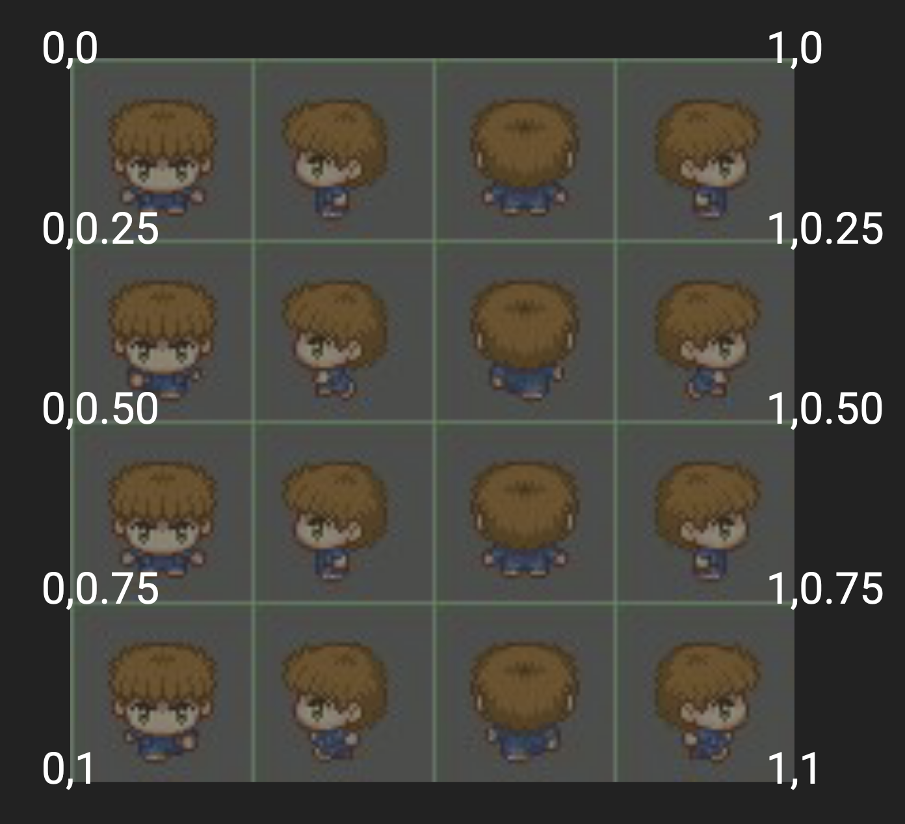
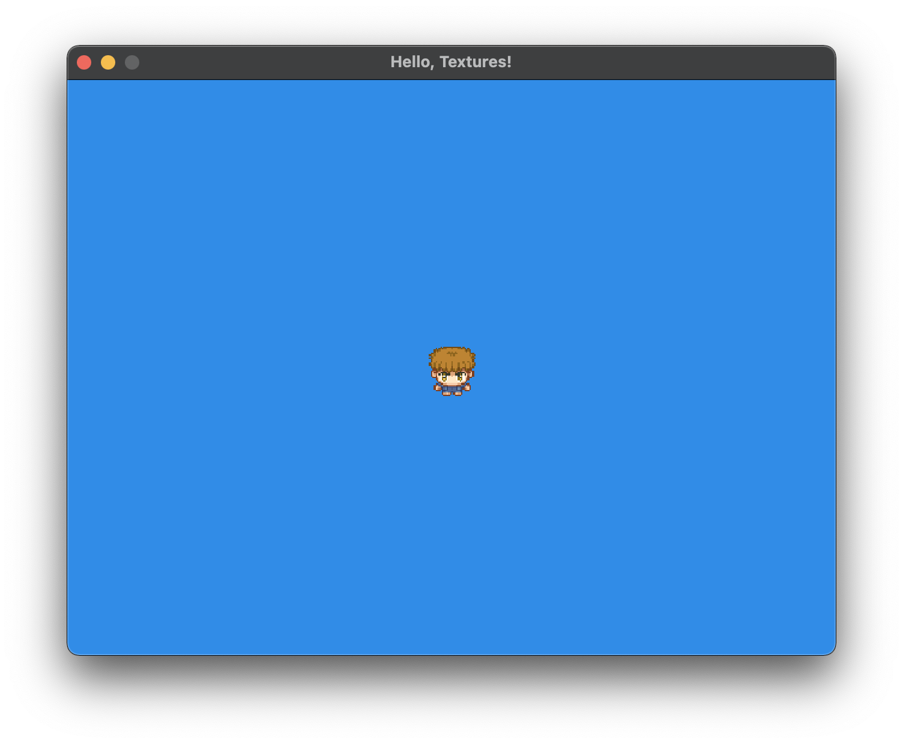

<h2 align=center>Week 05: <em>Part 1</em></h2>

<h1 align=center>Sprite Animation and Text</h1>

<h3 align=center>13 Wyvern Moon, Imperial Year MMXXIII</h3>

<p align=center><strong><em>Song of the day</strong>: <a href="https://youtu.be/BI4zNteRP7E?si=PIHVKHxtjegdF9En"><strong><u>憐れみの讃歌 (Eulogy to Compassion)</u></strong></a> by Kyrie (Aina the End) (2023).</em></p>

### Sections

1. [**A Bit of Review of Textures**](#part-1-a-bit-of-review-of-textures)
2. [**Texture Wrap Mode**](#part-2-texture-wrap-mode)
3. [**Texture Atlases and Sprite Sheets**](#part-3-texture-atlases-and-sprite-sheets)
4. [**Animation**](#part-4-animation)
5. [**Text**](#part-5-text)

### Part 1: _A Bit of Review of Textures_

As you may have realised while completing your first project, having more than one texture can quickly get out of hand. Moreover, if we want to _animate_ our objects on-screen, we would have to create a different texture ID for each individual frame of animation. There is, naturally, a correct way of doing this, and we'll get into it today. Recall that textures follow UV-coordinates:


<sub>**Figure 1**: UV-coordinates superimposed over a texture covering two triangles.</sub>

Recall, too that the way we translate these UV-coordinates to our world's XY-coordinates is via two sets of vertices:



```c++
float vertices[]  = {-0.5, -0.5, 0.5, -0.5, 0.5, 0.5, -0.5, -0.5, 0.5, 0.5, -0.5, 0.5};
float texCoords[] = { 0.0,  1.0, 1.0,  1.0, 1.0, 0.0,  0.0,  1.0, 1.0, 0.0,  0.0, 0.0};
```

<sub>**Figure 2** and **Code Block 1**: UV-coordinates to XY-coordinates.</sub>

Now, something that some of you hinted at recently is the possibility of changing the values inside our `texCoords` array; especially when our sprites are not necessarily a square, the ability to isolate parts of it is especially helpful.



<sub>**Figure 3**: Instead of only using values [0.0, 1.0], we can isolate certain parts of the texture.</sub>

There are bigger implication to our ability to "slice" a texture, and we've reached a point where doing so will allow for a tremendous amount of flexibility.

Let's look at a couple of instances where changing the values in `texCoords` might affect our game, and how we can handle them.

### Part 2: _Texture Wrap Mode_

If our UV- and XY-coordinates match one-to-one, we have it pretty simple. After all, there's no amount of "compensation" we have to do; our corners match perfectly in both coordinate systems:



<sub>**Figure 4**: Wouldn't it be nice if the world was ever this neat?</sub>

This set of bricks looks perfect for a Mario-style worldbuilder. In this case, creating separate objects for _every single brick block_ in the scene would be both exhausting and completely ineffective. So what do we do in situations like these?



```c++
float vertices[] = { -0.5, -0.5, 0.5, -0.5, 0.5, 0.5, -0.5, -0.5, 0.5, 0.5, -0.5, 0.5 };
float texCoords[] = { 0.0, 2.0, 2.0, 2.0, 2.0, 0.0, 0.0, 2.0, 2.0, 0.0, 0.0, 0.0 };
```

<sub>**Figure 5** and **Code Block 2**: What if our object was a 2x2 set of brick blocks?</sub>

The answer to our plight in this case is actually super simple, and it comes in the form of **texture wrap modes**. Of these, four exist in OpenGL:


<sub>**Figure 6**: OpenGL wrapping modes. ([**Source**](https://open.gl/textures))</sub>

Quite simply, this is a matter of adding two more `glTexParameteri()` calls inside our `load_texture()` function:

```c++
// Setting our texture wrapping modes
glTexParameteri(GL_TEXTURE_2D, GL_TEXTURE_WRAP_S, GL_REPEAT); // the last argument can change depending on what you are looking for
glTexParameteri(GL_TEXTURE_2D, GL_TEXTURE_WRAP_T, GL_REPEAT);
```

<sub>**Code Block 3**: Just like with filter modes, this is all that is necessary for wrapping.</sub>

### Part 3: _Texture Atlases and Sprite Sheets_

We've just looked at how to handle textures that are smaller than our objects, but how are we handle objects that are smaller than our textures? It turns out that this is exactly how we will be doing graphics for a number of situations—perhaps for all of them. Introducing the texture atlas, or as it is more commonly known, the sprite sheet:



<sub>**Figure 7**: _Link's Awakening_'s sprite sheet.</sub>

What you see in figure 7 is a single texture. If we were to apply it to our current object, we would indeed get the whole texture onto it, but that is not the goal here. Our goal is **isolate each individual portion of the image and make it its own texture**:


<sub>**Figure 8**: Sprite sheet with texture coordinates superimposed on it.</sub>

This can be applied to something that is perhaps more critical to game development—fonts:


<sub>**Figure 9**: A sprite sheet with sprites that just happen to be characters.</sub>

When picking sprite sheets, it's important to keep that having them be **monospaced**. This simplifies the process significantly, as we'll see soon. In other words, don't pick a spritesheet that looks like this:



<sub>**Figure 10**: It's basically impossible to split this into a uniform grid.</sub>

The reason why grids over sprite sheets are so important is because it makes it easy to programmatically parse and use:




<sub>**Figure 11 and 12**: Different animation frames as a sprite sheet.</sub>

So, how do we program this? Well, using the sprite sheet example in figures 11 and 12, the way we would pick the desired frame would be as follows:

```c++
void draw_sprite_from_texture_atlas(ShaderProgram *program, GLuint texture_id, int index, int rows, int cols)
{
    // Step 1: Calculate the UV location of the indexed frame
    float u_coord = (float) (index % cols) / (float) cols;
    float v_coord = (float) (index / cols) / (float) rows;
    
    // Step 2: Calculate its UV size
    float width = 1.0f / (float) cols;
    float height = 1.0f / (float) rows;
    
    // Step 3: Just as we have done before, match the texture coordinates to the vertices
    float tex_coords[] =
    {
        u_coord, v_coord + height, u_coord + width, v_coord + height, u_coord + width, v_coord,
        u_coord, v_coord + height, u_coord + width, v_coord, u_coord, v_coord
    };
    
    float vertices[] =
    {
        -0.5, -0.5, 0.5, -0.5,  0.5, 0.5,
        -0.5, -0.5, 0.5,  0.5, -0.5, 0.5
    };
    
    // Step 4: And render
    glBindTexture(GL_TEXTURE_2D, texture_id);
    
    glVertexAttribPointer(program->positionAttribute, 2, GL_FLOAT, false, 0, vertices);
    glEnableVertexAttribArray(program->positionAttribute);
    
    glVertexAttribPointer(program->texCoordAttribute, 2, GL_FLOAT, false, 0, tex_coords);
    glEnableVertexAttribArray(program->texCoordAttribute);
    
    glDrawArrays(GL_TRIANGLES, 0, 6);
    
    glDisableVertexAttribArray(program->positionAttribute);
    glDisableVertexAttribArray(program->texCoordAttribute);
}
```

<sub>**Code Block 4**: Basically what we've been doing so far, but a bit more specialised.</sub>

Using this function, our render function becomes much shorter and neater:

```c++
const int SPRITESHEET_DIMENSIONS = 4; // this depends on the spritesheet, obv

void render()
{
    glClear(GL_COLOR_BUFFER_BIT);
  
    program.SetModelMatrix(model_matrix);

    // Here, the 0th sprite is being rendered. Hence, the 0
    draw_sprite_from_texture_atlas(&program, player_texture_id, 0, SPRITESHEET_DIMENSIONS, SPRITESHEET_DIMENSIONS);
    
    SDL_GL_SwapWindow(display_window);
}
```

And behold:



<sub>**Figure 13**: Only one section of our "texture" is being rendered.</sub>

Notice that I added the line `program.SetModelMatrix(model_matrix)` to `render()` from `draw_object()`. If you don't do this, your sprite will not render as it will not have a model matrix to follow. The worst part about this error is that OpenGL doesn't crash because of it, and the warnings that it _does_ give you are not specific at all. So don't forget!

### Part 4: _Animation_

Now, this certainly is closer to what we want, but the whole point of this sprite sheet is for it to simulate a running
motion by flipping through the different frames. This isn't terribly difficult; we simply need to tell OpenGL to choose a different index every X-number of frames:

```c++
const int SPRITESHEET_DIMENSIONS = 4;
const int FRAMES_PER_SECOND = 4;

int *g_animation_indeces = new int[4] {3, 7, 11, 15}; // for George to move to the left
int g_animation_frames = SPRITESHEET_DIMENSIONS;
int g_animation_index = 0;

float g_animation_time = 0.0f;


void update()
{
    /* Some code... */
    
    // Keep track of how much time has passed
    g_animation_time += delta_time;
    float seconds_per_frame = (float) 1 / FRAMES_PER_SECOND;
    
    // If we've reached the beginning of a frame span...
    if (g_animation_time >= seconds_per_frame)
    {
        // Reset the animation time, change the index
        g_animation_time = 0.0f;
        g_animation_index++;
        
        // And reset the index if we've reached the last animation index
        if (g_animation_index >= g_animation_frames)
        {
            g_animation_index = 0;
        }
    }
}
```

<sub>**Code Block 5**: See here that we are keeping track of the indices, the current animation index, and how much time has passed. You can even make `FRAMES_PER_SECOND` to simulate running!</sub>

Of course, this only covers one of the four directions George has been prepared for. Let's take care of that:

```c++
const int LEFT  = 0,
          RIGHT = 1,
          UP    = 2,
          DOWN  = 3;

int *ANIMATION_RIGHT = new int[4] { 3, 7, 11, 15 }; // for George to move to the right
int *ANIMATION_LEFT  = new int[4] { 1, 5, 9,  13 }; // for George to move to the left
int *ANIMATION_UP    = new int[4] { 2, 6, 10, 14 }; // for George to move upwards
int *ANIMATION_DOWN  = new int[4] { 0, 4, 8,  12 }; // for George to move downwards

int **`GEORGE_WALKING_ANIMATIONS` = new int*[4]
{
    ANIMATION_LEFT, ANIMATION_RIGHT, 
    ANIMATION_UP, ANIMATION_DOWN
};

int *g_animation_indices = GEORGE_WALKING_ANIMATIONS[DOWN];  // start George looking down

void process_input()
{
    // some code...

    if (key_state[SDL_SCANCODE_LEFT])
    {
        player_movement.x = -1.0f;
        g_animation_indices = GEORGE_WALKING_ANIMATIONS[LEFT];
    }
    else if (key_state[SDL_SCANCODE_RIGHT])
    {
        player_movement.x = 1.0f;
        g_animation_indices = GEORGE_WALKING_ANIMATIONS[RIGHT];
    }
    
    if (key_state[SDL_SCANCODE_UP])
    {
        player_movement.y = 1.0f;
        g_animation_indices = GEORGE_WALKING_ANIMATIONS[UP];
    }
    else if (key_state[SDL_SCANCODE_DOWN])
    {
        player_movement.y = -1.0f;
        g_animation_indices = GEORGE_WALKING_ANIMATIONS[DOWN];
    }
}
```

<sub>**Code Block 6**: Changing the walking animation direction depending on which button is being pressed. If the idea of creating a list of pointers (`GEORGE_WALKING_ANIMATIONS`) makes you nauseous, you don't have to use it. Manually changing the value of `animation_indices` in `process_input()` is totally fine.</sub>

Finally, we only want George to move when we're pressing down on the arrow keys. This is easily done by checking the length of the `movement` vector:

```c++
if (glm::length(g_player_movement) != 0)
{
    g_animation_time += delta_time;
    float frames_per_second = (float) 1 / SECONDS_PER_FRAME;
    
    if (g_animation_time >= frames_per_second)
    {
        g_animation_time = 0.0f;
        g_animation_index++;
        
        if (g_animation_index >= g_animation_frames)
        {
            g_animation_index = 0;
        }
    }
}
```

<sub>**Code Block 6**: As simple as this.</sub>

#### Part 5: _Text_

When picking out character sets, using those that are located and spaced in an organised way goes a long way when it comes to actually putting them on screen. Take a look at the sprite sheet in figure 9. The fact that the letters are placed in alphabetical order can help us make extracting these specific characters a matter of a simple loop—it also happens to follow ASCII values.

For text, it's actually pretty handy to use C++'s `std::vector` class to store our desired letters. Keep in mind that this class works much like a Python list and has nothing to do with the `gsl::vec` family of classes.

```c++
const int FONTBANK_SIZE = 16;

void DrawText(ShaderProgram *program, GLuint font_texture_id, std::string text, float screen_size, float spacing, glm::vec3 position)
{
    // Scale the size of the fontbank in the UV-plane
    // We will use this for spacing and positioning
    float width = 1.0f / FONTBANK_SIZE;
    float height = 1.0f / FONTBANK_SIZE;

    // Instead of having a single pair of arrays, we'll have a series of pairs—one for each character
    // Don't forget to include <vector>!
    std::vector<float> vertices;
    std::vector<float> texture_coordinates;

    // For every character...
    for (int i = 0; i < text.size(); i++) {
        // 1. Get their index in the spritesheet, as well as their offset (i.e. their position
        //    relative to the whole sentence)
        int spritesheet_index = (int) text[i];  // ascii value of character
        float offset = (screen_size + spacing) * i;
        
        // 2. Using the spritesheet index, we can calculate our U- and V-coordinates
        float u_coordinate = (float) (spritesheet_index % FONTBANK_SIZE) / FONTBANK_SIZE;
        float v_coordinate = (float) (spritesheet_index / FONTBANK_SIZE) / FONTBANK_SIZE;

        // 3. Inset the current pair in both vectors
        vertices.insert(vertices.end(), {
            offset + (-0.5f * screen_size), 0.5f * screen_size,
            offset + (-0.5f * screen_size), -0.5f * screen_size,
            offset + (0.5f * screen_size), 0.5f * screen_size,
            offset + (0.5f * screen_size), -0.5f * screen_size,
            offset + (0.5f * screen_size), 0.5f * screen_size,
            offset + (-0.5f * screen_size), -0.5f * screen_size,
        });

        texture_coordinates.insert(texture_coordinates.end(), {
            u_coordinate, v_coordinate,
            u_coordinate, v_coordinate + height,
            u_coordinate + width, v_coordinate,
            u_coordinate + width, v_coordinate + height,
            u_coordinate + width, v_coordinate,
            u_coordinate, v_coordinate + height,
        });
    }

    // 4. And render all of them using the pairs
    glm::mat4 model_matrix = glm::mat4(1.0f);
    model_matrix = glm::translate(model_matrix, position);
    
    program->SetModelMatrix(model_matrix);
    glUseProgram(program->programID);
    
    glVertexAttribPointer(program->positionAttribute, 2, GL_FLOAT, false, 0, vertices.data());
    glEnableVertexAttribArray(program->positionAttribute);
    glVertexAttribPointer(program->texCoordAttribute, 2, GL_FLOAT, false, 0, texture_coordinates.data());
    glEnableVertexAttribArray(program->texCoordAttribute);
    
    glBindTexture(GL_TEXTURE_2D, font_texture_id);
    glDrawArrays(GL_TRIANGLES, 0, (int) (text.size() * 6));
    
    glDisableVertexAttribArray(program->positionAttribute);
    glDisableVertexAttribArray(program->texCoordAttribute);
}
```

<sub>**Code Block 7**: A trusty text renderer. I know that I provide these pre-made functions, but please make an effort to actually understand them!</sub>
