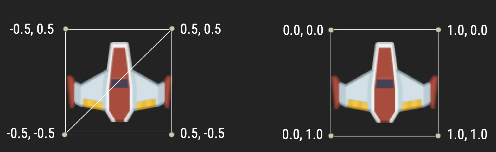

## Lecture 06

# [**Textures**](SDLProject/main.cpp)

### 21 Prairial, Year CCXXX

***Song of the day***: _[****]() by  ()._

### Sections

### Part 1: _Textures_

If you take a look at two of the constants that we use in our `initialise()` function, you will notice a couple of things that are very specific to the type of rendering we've been doing:

```c++
const char V_SHADER_PATH[] = "shaders/vertex.glsl",
           F_SHADER_PATH[] = "shaders/fragment.glsl";
```

These two specific shaders deal with solid colour shading—that is, everything being rendered on the screen will be of a single colour. For our purposes so far, which have been learning about transformation, this has been enough. But now we have reached a point in our understanding of graphic rendering where we can transition from the simplistic world of solid colours and start adding our own custom graphics. Those graphics, when applied to models in OpenGL, are referred to as **textures**.

Adding textures to your objects isn't necessarily difficult, but it does require quite a few steps—as well as a slightly different way of thinking about objects on the screen—to accomplish. Right out of the bat, we will be graduating to a new set of shaders (as promised, we will have a whole lecture on how these work later in the semester):

```c++
const char V_SHADER_PATH[] = "shaders/vertex_textured.glsl",
           F_SHADER_PATH[] = "shaders/fragment_textured.glsl";
```

<sub>**Code Block 1**: The shader files necessary for textured game objects.</sub>

Another thing that will change in `initialise()` is that we'll actually have to _load_ our desired texture (maybe the sprites that make up your protagonist) into your program. In other words, you will be doing something like this:

```c++
#define STB_IMAGE_IMPLEMENTATION

#include "stb_image.h"

const char V_SHADER_PATH[] = "shaders/vertex_textured.glsl",
           F_SHADER_PATH[] = "shaders/fragment_textured.glsl";

const char PLAYER_SPRITE[] = "player.png";

GLuint player_texture_id;

void initialise()
{
    /* Some code here... */

    // Load the shaders for handling textures
    program.Load(V_SHADER_PATH, F_SHADER_PATH);

    // Load our player image
    player_texture_id = load_texture(PLAYER_SPRITE);
}
```

This new function `load_texture()` doesn't actually exist as part of OpenGL—our job is to create it—and that's the bread and butter of this lecture.

### Part 2: _Loading our textures_

By the end of this lecture, your `load_texture()` program will look as follows (each part will be explained individually):

```c++
const int NUMBER_OF_TEXTURES = 1; // to be generated, that is
const GLint LEVEL_OF_DETAIL = 0; // base image level; Level n is the nth mipmap reduction image
const GLint TEXTURE_BORDER = 0; // this value MUST be zero

GLuint load_texture(const char* filepath)
{
    // STEP 1: Loading the image file
    int width, height, number_of_components;
    unsigned char* image = stbi_load(filepath, &width, &height, &number_of_components, STBI_rgb_alpha);
    
    if (image == NULL)
    {
        LOG("Unable to load image. Make sure the path is correct.");
        assert(false);
    }
    
    // STEP 2: Generating and binding a texture ID to our image
    GLuint textureID;
    glGenTextures(NUMBER_OF_TEXTURES, &textureID);
    glBindTexture(GL_TEXTURE_2D, textureID);
    glTexImage2D(GL_TEXTURE_2D, LEVEL_OF_DETAIL, GL_RGBA, width, height, TEXTURE_BORDER, GL_RGBA, GL_UNSIGNED_BYTE, image);
    
    // STEP 3: Setting our texture filter parameters
    glTexParameteri(GL_TEXTURE_2D, GL_TEXTURE_MIN_FILTER, GL_NEAREST);
    glTexParameteri(GL_TEXTURE_2D, GL_TEXTURE_MAG_FILTER, GL_NEAREST);
    
    // STEP 4: Releasing our file from memory and returning our texture id
    stbi_image_free(image);
    
    return textureID;
}
```

<sub>**Code Block 2**: Our completed texture loader. Return to this point after reading this entire section!</sub>

#### STEP 1: Loading the image file

The first step is, I hope, pretty self explanatory. We first instantiate a couple of variables where our image-loading function, `stbi_load()`, will store the dimensions and count of our image, and pass those as arguments to `stbi_load()` in order to get an `image` variable. If this file, for whatever reason, does not load, `stbi_load()` returns `NULL`—which is quite handy for handling these types of eventualities:

```c++
// Try to load the image file
int width, height, number_of_components;
unsigned char* image = stbi_load(filepath, &width, &height, &number_of_components, STBI_rgb_alpha);

// Quit if it fails
if (image == NULL)
{
    LOG("Unable to load image. Make sure the path is correct.");
    assert(false);
}
```

Something to keep in mind is that `stbi_load()` **dynamically allocates memory for `image`**, meaning that we'll have to release that memory later on (see step 4).

#### STEP 2: Generating and binding a texture ID to our image

We then want to take this raw image data saved in `image` onto our video card memory in a form that it can actually use—this is what the actual texture creation process is.

The following two lines will tell OpenGL to generate **one** texture identification value for us:

```c++
GLuint textureID;                               // declaration
glGenTextures(NUMBER_OF_TEXTURES, &textureID);  // assignment
```

<sub>[**Documentation for `glGenTextures`**](https://www.khronos.org/registry/OpenGL-Refpages/gl4/html/glGenTextures.xhtml)</sub>

Next, we tell OpenGL to bind this ID to a 2-dimensional texture:

```c++
glBindTexture(GL_TEXTURE_2D, textureID);
```

<sub>[**Documentation for `glBindTexture`**](https://www.khronos.org/registry/OpenGL-Refpages/gl4/html/glBindTexture.xhtml)</sub>

Here, we're basically telling OpenGL...

> Hey, for the next few commands, use the texture ID `textureID` to target a 2D texture (i.e `GL_TEXTURE_2D`).

Finally, we'll be sending the image to the graphics card by binding our texture ID with our raw image data:

```c++
glTexImage2D(
    GL_TEXTURE_2D, LEVEL_OF_DETAIL, GL_RGBA,
    width, height, 
    TEXTURE_BORDER, GL_RGBA, GL_UNSIGNED_BYTE, 
    image
);
```

<sub>[**Documentation for `glTextImage`**](https://www.khronos.org/registry/OpenGL-Refpages/gl4/html/glTexImage2D.xhtml)</sub>

#### STEP 3: Setting our texture filter parameters

Texture filtering is basically how graphics engines handle extrapolation (and/or interpolation) of pixels in the case that our image needs to be stretched (magnification) or compressed (minification) beyond its intended size. This almost always happens in game, as our sprite data can be, say 1024px-by-1024px in true size, but it most likely will have to be shrunk in order to actually fix the polygons it is intended for.

There are two options here in order to accomplish this:

- [**Linear**](https://en.wikipedia.org/wiki/Texture_filtering#Linear_mipmap_filtering): Ideal for very high-resolution images.
- [**Nearest-Neighbour**](https://en.wikipedia.org/wiki/Texture_filtering#Nearest-neighbor_interpolation): Ideal for pixel art.


<sub>**Figure 1**: Side-by-side comparison of our two different texture filtering modes used on a relatively low-res image. Note that linear mode is **not** the default in OpenGL; I just found this image from another graphics engine documentation site. ([**Source**](https://love2d.org/wiki/FilterMode))</sub>

The two lines that set your desired mode in the case of magnification and minification are the following:

```c++
glTexParameteri(GL_TEXTURE_2D, GL_TEXTURE_MIN_FILTER, GL_NEAREST);
glTexParameteri(GL_TEXTURE_2D, GL_TEXTURE_MAG_FILTER, GL_NEAREST);
```

<sub>[**General documentation for `glTexParameter`**](https://www.khronos.org/registry/OpenGL-Refpages/gl4/html/glTexParameter.xhtml)</sub>

#### STEP 4: Releasing our file from memory and returning our texture id

Do **not** forget to free up the memory you allocated for our image file raw data in step 1; nobody likes a memory leak:

```c++
stbi_image_free(image);

return textureID;
```

### Part 3: _Texture Coordinates_

Back in the good old days of solid colour polygons (literally two days ago), we defined and used the vertices of our triangle as follows:

```c++
float vertices[] =
{
    0.5f, -0.5f,
    0.0f, 0.5f,
    -0.5f, -0.5f
};

glVertexAttribPointer(program.positionAttribute, 2, GL_FLOAT, false, 0, vertices);
```

Well, gone are those good old days. 

Texture coordinates, usually called **UV coordinates**, range not by pixels, but from 0.0 to 1.0. What this means is that regardless of whether your original sprite image was 640px-by-640px or 1024px-by-1024px, we will still consider these coordinates to be from 0.0 to 1.0. Furthermore, harkening back to our first lecture, **all 2D sprites are made of 2 triangles**:

```

    |——————|        |\ \———|
    |      |        | \ \  |
    |      |        |  \ \ |
    |——————|        |———\ \|

————————————————————————————————————
  What you see    What OpenGL is
                actually rendering
```

<sub>**Figure 2**: Every square image is rendered onto two triangle polygons.</sub>

What we need to do then is to match these vertices to the UV coordinates described above.



```c++
float vertices[] = {
    -0.5f, -0.5f, 0.5f, -0.5f, 0.5f, 0.5f,  // triangle 1
    -0.5f, -0.5f, 0.5f, 0.5f, -0.5f, 0.5f   // triangle 2
};

float texture_coordinates[] = {
    0.0f, 1.0f, 1.0f, 1.0f, 1.0f, 0.0f,     // triangle 1
    0.0f, 1.0f, 1.0f, 0.0f, 0.0f, 0.0f,     // triangle 2
};
```

<sub>**Figure 3 and Code Block 3**: Matching the sprite vertices (left; `vertices`) to the UV coordinates (right; `texture_coordinates`).</sub>

---

Taking all of this into account, we can now update `render()` to match our new setup:

```c++
void render() {
    glClear(GL_COLOR_BUFFER_BIT);
    
    program.SetModelMatrix(model_matrix);
    
    // Vertices
    float vertices[] = {
        -0.5f, -0.5f, 0.5f, -0.5f, 0.5f, 0.5f,  // triangle 1
        -0.5f, -0.5f, 0.5f, 0.5f, -0.5f, 0.5f   // triangle 2
    };
    
    glVertexAttribPointer(program.positionAttribute, 2, GL_FLOAT, false, 0, vertices);
    glEnableVertexAttribArray(program.positionAttribute);

    // Textures
    float texture_coordinates[] = {
        0.0f, 1.0f, 1.0f, 1.0f, 1.0f, 0.0f,     // triangle 1
        0.0f, 1.0f, 1.0f, 0.0f, 0.0f, 0.0f,     // triangle 2
    };
    
    glVertexAttribPointer(program.texCoordAttribute, 2, GL_FLOAT, false, 0, texture_coordinates);
    glEnableVertexAttribArray(program.texCoordAttribute);
    
    // Bind texture
    glBindTexture(GL_TEXTURE_2D, player_texture_id);
    glDrawArrays(GL_TRIANGLES, 0, 6); // we are now drawing 2 triangles, so we use 6 instead of 3
    
    // We disable two attribute arrays now
    glDisableVertexAttribArray(program.positionAttribute);
    glDisableVertexAttribArray(program.texCoordAttribute);
    
    SDL_GL_SwapWindow(display_window);
}
```

<sub>**Code Block 4**: A `render()` function worthy of textures.</sub>

### Part 4: _Blending_

We're almost there, I promise.

The last bit we have to worry about is blending. We can think about this as what happens when two textures overlap each other. We need to tell OpenGL how to react to situations like these.

In OpenGL, blending is off by default, so we need to enable it so that our images are transparent. We only need to do this once, so it'll go in our `initialisation()` function. Then, we need to select one of the various blending functions available to us from OpenGL's libraries. We'll go for one of the most common ones, but you can look at OpenGL's official documentation for [**more**](https://learnopengl.com/Advanced-OpenGL/Blending) if you're curious.

```c++
// enable blending
glEnable(GL_BLEND);
glBlendFunc(GL_SRC_ALPHA, GL_ONE_MINUS_SRC_ALPHA);
```

---

If at this point, your images do not load, and you are on...

- **Mac**: Go to "Build Phases" and add your image to the `Copy Files` area. Make sure `"Copy only when installing"` is unchecked!

- **Windows**: Use the File Explorer to copy your images manually into your project's folder.

### Part 5: _Drawing multiple objects_

One of the most common errors I've seen students encounter so far comes when they try to create multiple objects on the screen. Here's a tip: the three lines that actually draw the object on the screen are the following, which exist in the `render()` part of our program:

```c++
program.SetModelMatrix(model_matrix);
glBindTexture(GL_TEXTURE_2D, texture_id);
glDrawArrays(GL_TRIANGLES, 0, 6);
```

Basically, every object will have its own model matrix and its own texture ID, so it might be a good idea to define a function that includes these three lines only. For example:

```c++
void draw_object(glm::mat4 &object_model_matrix, GLuint &object_texture_id)
{
    program.SetModelMatrix(object_model_matrix);
    glBindTexture(GL_TEXTURE_2D, object_texture_id);
    glDrawArrays(GL_TRIANGLES, 0, 6); // we are now drawing 2 triangles, so we use 6 instead of 3
}
```

<sub>**Code Block 5**: A very useful helper function if you're rendering multiple objects.</sub>

So you can just call a single line for every single object that you have in `render()`:

```c++
draw_object(model_matrix, player_texture_id);
```